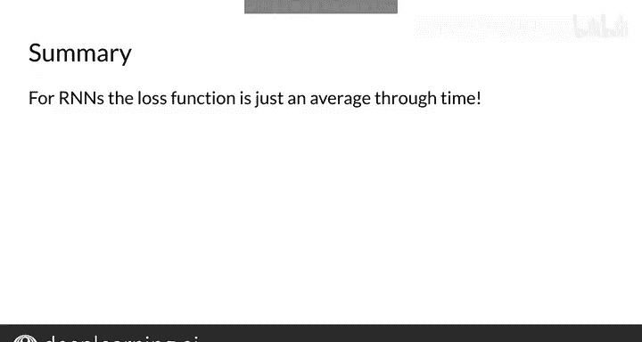

#  117：10_RNN的成本函数 📊

在本节课中，我们将学习循环神经网络（RNN）的成本函数。我们将回顾交叉熵损失，并探讨如何对其进行调整，以使其能够考虑所有时间步的预测结果。

---


## 概述

上一节我们介绍了RNN的基本结构。本节中，我们来看看如何为RNN定义成本函数，以衡量其预测的准确性。

## RNN成本函数详解

观察以下序列模型。输入向量X（洋红色）经过多个隐藏单元（蓝色）处理，最终由三个输出单元（绿色）生成预测。

假设该模型输出一个观测样本属于三个不同类别的概率。

对于一个单独的（X, Y）样本对，可以使用交叉熵函数计算损失。其中K是类别数量，每个真实标签Y_j的值为1或0。

因此，要计算单个观测样本的损失，需要检查预测输出Ŷ中每个类别的概率，并将其与真实的Y值（0或1）进行比较。

普通RNN具有类似的结构，在每个时间步t，网络通过计算以下两个公式来输出向量Ŷ：

```python
# 前向传播核心步骤（示意）
a_t = g(W_aa * a_{t-1} + W_ax * x_t + b_a)
y_hat_t = g(W_ya * a_t + b_y)
```

在这种情况下，交叉熵损失的计算公式如下所示。该公式与之前展示的公式的唯一区别在于，它对时间步t进行了求和，并除以总时间步数T。

**公式：**
`L = - (1/T) * Σ_{t=1}^{T} Σ_{j=1}^{K} [ Y_{t,j} * log(Ŷ_{t,j}) ]`

这实质上是在时间维度上对交叉熵损失函数取平均值。

要获得整个模型的成本，与往常一样，必须对训练集、开发集或测试集中的每个样本求和。

现在你知道了，要计算RNN模型中单个样本的损失，只需在时间维度上取平均值即可。

接下来，我将与大家分享一些实现注意事项以及更复杂的RNN架构。

---

## 实现要点

我们已经了解了如何通过对所有K个类别和所有T个时间步进行求和来修改成本函数，然后除以总步数以获得每个时间步的平均成本。



我们将在下一个视频中进一步探讨如何实现这些模型。

---

## 总结

本节课中，我们一起学习了如何为循环神经网络定义成本函数。关键点在于，RNN的损失是每个时间步上标准交叉熵损失的平均值。这确保了模型在所有时间步上的预测性能都能被有效地评估和优化。