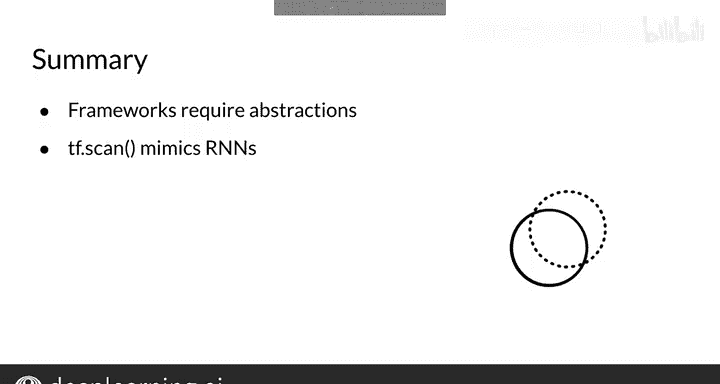

#  118：实现注意事项 🧠💻


在本节课中，我们将学习如何实现循环神经网络（RNN）。我们将重点介绍一个名为 `scan` 的函数抽象，它类似于RNN的抽象表示，并能实现更快的计算。理解这一概念对于在深度学习框架中高效实现RNN至关重要。

## 什么是Scan函数及其实现方式？

上一节我们介绍了RNN的基本概念，本节中我们来看看如何具体实现它。核心在于理解 `scan` 函数。

`scan` 函数的设计目的是：接收一个函数 `FN`，并将其应用到列表 `Ls` 中的所有元素上，顺序是从头到尾。`Initializer` 是一个可选变量，可用于 `FN` 的首次计算。

在RNN的上下文中，`FN` 等价于前向传播函数 `F_W`。列表 `Ls` 包含所有时间步的输入 `x^<t>`，而 `initializer` 则是初始隐藏状态 `h^<0>`。

以下是 `scan` 函数在TensorFlow中实现RNN前向传播的基本逻辑：

```python
def scan(FN, Ls, initializer):
    hidden_state = initializer  # 初始化隐藏状态
    predictions = []            # 存储预测值的列表

    for x in Ls:                # 遍历输入序列的每个时间步
        # 调用FN，参数为当前输入x和上一个隐藏状态
        hidden_state, prediction = FN(x, hidden_state)
        predictions.append(prediction)  # 存储当前预测

    return predictions, hidden_state  # 返回所有预测和最终隐藏状态
```

这个函数首先将隐藏状态初始化为 `h^<0>`，并将存储预测值的列表设为空。然后，对于列表中的每一个输入 `x`，它调用函数 `FN`，参数是 `x` 和上一个隐藏状态的值。这个 `for` 循环计算了RNN的每一个时间步，并将预测值存储在隐藏状态中。最后，函数返回预测列表和最后一个隐藏状态。

## 为何需要Scan函数？

你可能会认为这个函数是多余的，因为它本质上就是一个遍历RNN每个时间步的 `for` 循环。然而，像TensorFlow这样的深度学习框架需要这类抽象，以便执行并行计算并在GPU上运行。

我向你展示了TensorFlow中如何定义 `scan` 函数来模拟RNN的工作方式。了解这类抽象对于深度学习框架是必要的，因为它们使得框架能够利用GPU进行并行计算。

## 总结



本节课中我们一起学习了RNN实现中的一个关键抽象——`scan` 函数。我们了解了它的工作原理、在代码中的实现逻辑，以及它对于在GPU上实现高效并行计算的重要性。掌握这一概念将帮助你在实际应用中更有效地构建和优化循环神经网络模型。