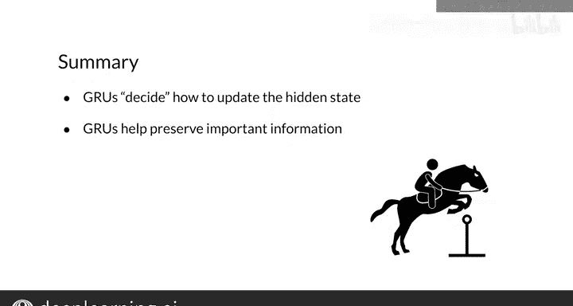

#  119：门控循环单元（GRU）🚪

在本节课中，我们将要学习门控循环单元（GRU）。这是一种比标准循环神经网络（RNN）更复杂的模型，专门设计用于处理长序列数据，并有效缓解信息消失的问题。

## 概述

到目前为止，我们已经熟悉了标准RNN，它是一种强大的架构。但其局限性在于，对于长单词序列，信息往往会逐渐消失。然而，存在更复杂的模型可以处理长序列，例如门控循环单元。接下来，我将向您介绍门控循环单元（简称GRU），并与标准RNN进行比较。

## GRU的核心思想

GRU的一个重要区别在于，其工作方式允许相关信息即使在长序列中也能保留在隐藏状态中。例如，使用GRU，您将能够训练一个模型来处理句子“ans are really interesting, blank are everywhere”，并轻松预测单词“they”来填充空白。因为GRU将学会在隐藏状态中保留关于主语的信息（在本例中，主语是复数还是单数）。

GRU通过计算**相关门**和**更新门**来实现这一点，我将在接下来展示。

## GRU的结构与计算

您可以将GRU视为具有额外计算的标准RNN。它们在每个时间步接受两个输入：时间T的变量`x`和从前一个单元传递来的隐藏状态`h`。

GRU中进行的头两个计算是相关门`Γ_r`和更新门`Γ_u`。这些门计算S型激活函数，因此它们的结果是一个被压缩到0和1之间的值向量。

**相关门公式：**
`Γ_r = σ(W_r * [h^(t-1), x^t] + b_r)`

**更新门公式：**
`Γ_u = σ(W_u * [h^(t-1), x^t] + b_u)`

GRU中的更新门和相关门是最重要的计算，它们的输出有助于确定前一个隐藏状态中的哪些信息是相关的，以及哪些值应该用当前信息更新。

计算相关门后，会找到一个隐藏状态的候选值`h'`。其计算参数包括前一个隐藏状态乘以相关门的结果以及当前时间的变量`x`。

**候选隐藏状态公式：**
`h' = tanh(W * [Γ_r ⊙ h^(t-1), x^t] + b)`

这个值存储了所有可能覆盖前一个隐藏状态中所含信息的候选信息。

之后，使用前一个隐藏状态、候选隐藏状态和更新门的信息来计算隐藏状态的新值。更新门决定了前一个隐藏状态中的信息有多少将被覆盖。

**当前隐藏状态公式：**
`h^t = Γ_u ⊙ h' + (1 - Γ_u) ⊙ h^(t-1)`

最后，使用当前隐藏状态计算预测值`ŷ`。

**预测输出公式：**
`ŷ^t = softmax(W_y * h^t + b_y)`

## GRU与标准RNN的对比

回想一下，像这样的标准RNN计算一个激活函数，其参数是前一个隐藏状态和当前变量`x`，以得到当前隐藏状态。利用当前隐藏状态，再计算另一个激活函数以得到当前预测`ŷ`。

这种架构在每个时间步都更新隐藏状态，因此对于长序列，信息往往会消失。这就是所谓的**梯度消失问题**的原因之一。

另一方面，GRU的计算操作明显更多，这可能导致更长的处理时间和内存使用。相关门和更新门决定了前一个隐藏状态中的哪些信息是相关的，以及哪些信息应该被更新。候选隐藏状态存储了可用于覆盖从前一个隐藏状态传递来的信息。然后计算当前隐藏状态，并更新来自上一个隐藏状态的部分信息。最后使用更新后的隐藏状态进行预测。

所有这些计算都允许网络学习保留何种信息以及何时覆盖它。

## GRU的优势与应用

我刚刚演示了GRU如何在每个时间步决定覆盖隐藏状态中的哪些信息。GRU中的相关门和更新门允许模型为更长的单词序列在隐藏状态中保留某些值。这对于许多自然语言处理任务非常有用。

GRU是流行的长短期记忆网络（LSTM）的简化版本，您将在后续的专项课程中遇到它。

## 总结

本节课中，我们一起学习了门控循环单元（GRU）。您现在知道，GRU与简单RNN非常相似，不同之处在于它们有两个门，允许您更新状态中的信息，并告诉您每个输入在下一个时间步的相关性。在下一个视频中，我们将讨论双向和深度RNN。