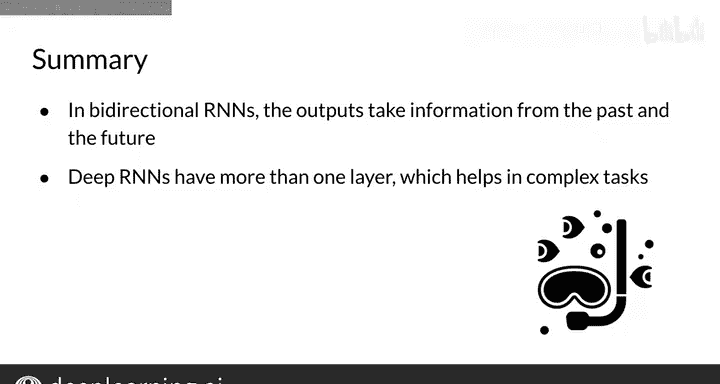

#  120：深度与双向RNN 🧠

在本节课中，我们将要学习两种更强大的循环神经网络变体：**深度RNN**和**双向RNN**。我们将了解它们的工作原理、数学公式，以及它们如何帮助模型捕捉更复杂的序列依赖关系。

---

## 深度循环神经网络

上一节我们介绍了基础的RNN结构。本节中我们来看看如何通过堆叠多个RNN层来构建深度循环神经网络。

深度RNN之所以有用，是因为它们能够捕捉浅层RNN无法捕获的依赖关系。深度RNN的结构类似于常规的深度神经网络，它有一个接收输入序列`X`的层，以及多个额外的隐藏层。

以下是构建深度RNN的核心公式。对于普通的深度RNN，我们使用以下两个方程：

**对于第 `l` 层在时间步 `t` 的激活值：**
`a^{[l]<t>} = g(W_a^{[l]} [a^{[l]<t-1>}, a^{[l-1]<t>}] + b_a^{[l]})`

**对于第 `l` 层在时间步 `t` 的预测输出：**
`y^{[l]<t>} = g(W_y^{[l]} a^{[l]<t>} + b_y^{[l]})`

这些方程与你之前见过的公式相同，但信息流动的方式有所不同。首先，你计算当前层的隐藏状态，然后获取激活值并将这些值传递给下一个隐藏层，并重复此过程。换句话说，你首先在时间上传播信息，然后在网络中深入，对每一层重复此过程，直到获得预测结果。

---

## 双向循环神经网络

理解了深度结构后，我们来看看另一种强大的变体——双向RNN。它通过从序列的两个方向获取信息来提升模型性能。

为了说明双向RNN的重要性，请看以下例子：
> “我非常努力地想联系上______。就在我快要放弃时，路易丝终于回电话了。”

作为一个聪明人，你无需费力就能填上空白。一个从序列开始到结束传播信息的RNN也能做出预测。它会将空白前的单词作为输入，并尽力预测缺失的单词。然而，由于“路易丝”直到下一句开头才出现，模型将不得不在“她”、“他”和“他们”之间猜测。

双向RNN的工作方式与简单RNN大致相同。它们接收输入序列`X`并生成预测`Y_hat`。在我之前展示的RNN中，信息从序列的开头流向结尾。但是，你可以有另一种架构，让信息从结尾流向开头。想象一下从未来流向现在。当信息双向流动时，那就是一个双向RNN。

需要知道的是，这是一个**无环图**。这意味着信息在两个方向上独立流动，因此从左到右的计算完全独立于从右到左的计算。

为了在双向RNN中获得时间步`t`的预测`y_hat`，你必须从两个方向开始传播信息。当你计算出一个时间步的两个隐藏状态后，就可以得到该时间步的预测`Y_hat`。

以下是使用的公式（与单向或普通RNN使用的公式相同，但这次**拼接**了两个隐藏状态）：
`y^{<t>} = g(W_y [\overrightarrow{a}^{<t>}, \overleftarrow{a}^{<t>}] + b_y)`

在你计算出两个方向的所有隐藏状态后，就可以得到所有剩余的预测。

---

## 总结与回顾

本节课中我们一起学习了两种有趣且有用的RNN变体。

*   **双向RNN**：在时间上同时从未来和过去传播信息，能够利用整个序列的上下文，从而在某些任务（如填空）上表现更佳。
*   **深度RNN**：通过堆叠多个RNN层，可以帮助你解决比浅层神经网络更复杂的任务。

这两种架构都是你已经见过的普通RNN模型中衍生出的相对简单的组合。因此，理解它们的数学原理并不是一个巨大的概念飞跃。

恭喜你完成本周的学习！你已经了解了RNN、门控循环单元、双向RNN和深度RNN。在练习中，你将有机会实际操作RNN，并了解它们是如何具体实现的。祝你好运！🚀