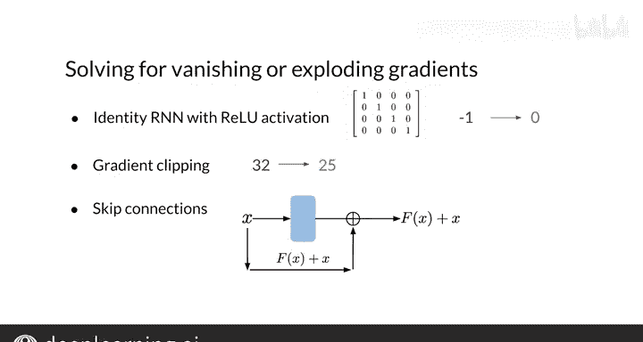

#  123：RNN 与梯度消失 🧠

在本节课中，我们将要学习循环神经网络（RNN）在训练过程中可能遇到的一个核心问题：梯度消失与梯度爆炸。我们将探讨其成因，并简要介绍几种应对策略，为后续学习更强大的长短期记忆网络（LSTM）打下基础。

## 传统RNN的优缺点

上一节我们介绍了RNN的基本工作原理。现在，我们来总结一下它的优缺点。

**优点：**
*   **捕捉短期依赖**：普通（或“朴素”）RNN通过回忆临近过去的信息来建模序列，这使其能在一定程度上捕捉序列中的依赖关系。
*   **相对轻量**：与其他序列模型相比，RNN结构相对简单，占用的存储空间和内存更少。

**缺点：**
*   **难以捕捉长期依赖**：RNN的架构使其难以有效捕捉序列中相隔较远的元素之间的依赖关系。
*   **梯度问题**：RNN容易受到梯度消失和梯度爆炸的影响，这两种问题都可能导致模型训练失败。

## 梯度问题的成因：随时间反向传播

要理解梯度问题，我们需要了解RNN如何通过“随时间反向传播”来更新权重。这听起来复杂，但其本质就是多次应用链式法则。

RNN从序列的第一个词（最左侧的隐藏状态）开始，将信息逐步传播到序列末尾。计算过程如下：
1.  首先计算第一个词的隐藏状态值。
2.  然后，结合第一步的计算信息和序列中的第二个词，计算新的隐藏状态值。
3.  接着，结合前两步的信息和第三个词，继续计算。
4.  此过程持续进行，直到序列末尾。在最后一步，计算包含了序列中所有词的信息，RNN据此预测下一个词。

需要注意的是，在RNN中，第一步计算的信息对最终输出的影响非常微弱。你可以看到，代表第一步信息的“橙色部分”随着每个新步骤的加入而不断减小。相应地，第一步的计算对损失函数的影响也很小。

在计算权重 `W_H` 的梯度时（权重 `W_X` 同理），梯度取决于序列中每一步的计算。具体而言，梯度与一系列隐藏状态偏导数的乘积之和成正比。

这个关系可以通过链式法则推导得出，但我们更应关注其背后的含义。求和内部的项（偏导数的乘积）代表了第 `k` 个隐藏状态对梯度的贡献。对于每个 `k`，这个乘积序列的长度正比于该步骤 `k` 与计算损失的最终步骤 `T` 之间的距离。

因此，当你观察那些距离损失计算点很远的隐藏状态时，其偏导数的乘积会变得越来越长。例如，一个距离步骤 `T` 有10步之遥的隐藏状态对梯度的贡献，需要计算10个项的乘积。

**关键问题在于：**
*   如果这些偏导数的值**小于1**，那么随着距离损失计算点越来越远，该隐藏状态对梯度的贡献将趋近于**0**。这就是**梯度消失**。
*   如果这些偏导数的值**大于1**，那么贡献将趋向于**无穷大**。这就是**梯度爆炸**。

梯度消失会导致RNN忽略序列早期步骤计算的值，而梯度爆炸则会在训练期间导致收敛问题。

## 应对梯度问题的策略

既然我们已经了解了梯度消失和爆炸的可怕之处，现在来讨论一些解决方案。本周课程的重点是介绍专门为解决此问题而设计的模型（LSTM），因此这里只做简要概述。

以下是几种应对策略：

**应对梯度消失：**
*   **恒等初始化与ReLU激活**：将权重初始化为**恒等矩阵**（主对角线为1，其余为0），并使用ReLU激活函数。这种方法本质上是在复制先前的隐藏状态，并加入当前输入的信息，同时将负值替换为零。它鼓励网络在矩阵乘法中保持接近1的值，这种方法被称为**恒等RNN**。但请注意，恒等RNN方法主要针对梯度消失问题，因为ReLU在正值区的导数恒为1。

**应对梯度爆炸：**
*   **梯度裁剪**：为了控制梯度值呈指数级增长，可以进行梯度裁剪。具体操作是选择一个阈值（例如25），任何梯度值超过此阈值时，都会被裁剪到该阈值。这限制了梯度的大小。

**通用策略：**
*   **残差连接**：残差连接提供了到更早层的直接连接。它有效地跳过了激活函数，并将初始输入 `x` 的值加到输出上，即 `F(x) + x`。这样，早期层的激活对损失函数的影响更大。

## 总结

本节课我们一起学习了RNN的核心挑战：梯度消失与梯度爆炸。我们了解了这个问题是如何通过“随时间反向传播”中长链的偏导数乘积产生的，并简要探讨了恒等初始化、梯度裁剪和残差连接等应对策略。

现在你已经理解了RNN为何会存在梯度消失问题。接下来，我将向你展示一个更强大的解决方案：长短期记忆网络（LSTM）。让我们进入下一个视频。