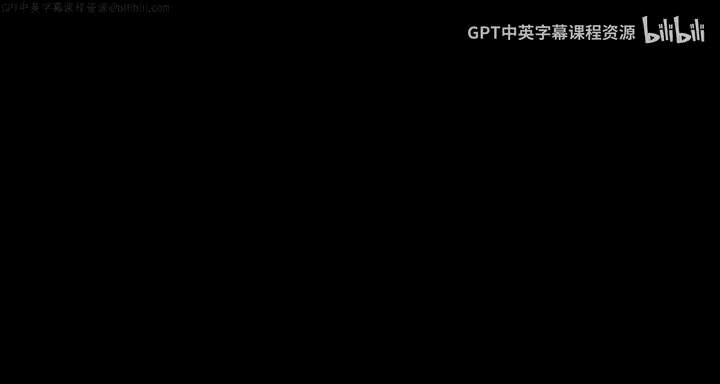
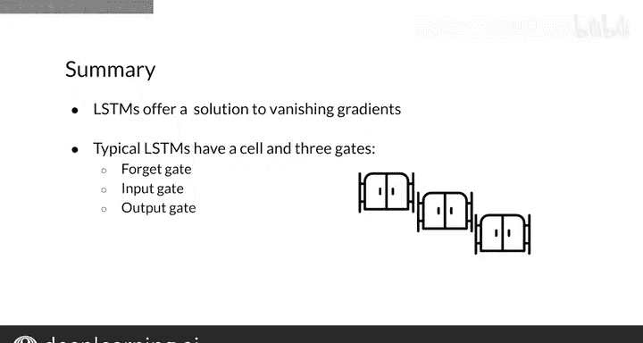

#  124：LSTM介绍 🧠

在本节课中，我们将学习长短期记忆网络（LSTM），这是一种专门设计用于处理序列数据的循环神经网络变体。我们将了解LSTM的基本架构、核心组件及其在现实世界中的应用。

---

## 概述

LSTM是解决梯度消失问题的最著名方案。它是一种特殊的循环神经网络，通过学习何时记住和何时遗忘信息来处理整个数据序列，其功能与GRU类似。

## LSTM的基本架构

LSTM本质上由细胞状态和隐藏状态组成。细胞状态可视为网络的记忆，而隐藏状态则用于在训练期间执行计算以决定进行哪些更改。LSTM包含多个门，这些门负责在网络中转换状态。

细胞状态通过这些门传递，跟踪输入信息。每个门在决定传递多少信息以及保留多少信息方面都发挥着作用。这一系列门允许梯度流动，避免了梯度消失或爆炸的风险。

## 类比理解

为了更直观地理解这一概念，我们可以将其与一个熟悉的场景进行类比。

想象你接到最好朋友的电话。当手机响起时，你可能正在思考与朋友无关的各种事情。接听电话后，你会暂时搁置那些无关的想法，同时保留与你们两人相关的任何信息。随着朋友告诉你他打电话的原因，你会思考其他可能相关的话题。

利用朋友的输入和你脑海中任何相关的信息，你开始与他交谈。然后，你们以这种方式继续对话，直到挂断电话。通话结束时，你将拥有对话中最相关信息的记忆。

这就是LSTM的工作原理：它使用多个门不断更新细胞状态和隐藏状态，以便相关信息在网络中传递并用于产生输出。

## LSTM的核心组件

以下是LSTM单元的基本解剖结构及其各部分的功能。

LSTM将信息存储在细胞状态和隐藏状态中，分别用 **C** 和 **H** 表示。与普通RNN一样，LSTM也有输入 **x** 和输出 **y**。在LSTM中，单个单元内执行多个计算，信息首先通过三个不同的门流动。

首先，细胞状态通过遗忘门。在这一步中，输入和先前的隐藏状态用于决定细胞状态中哪些信息不再重要并将其丢弃。

接着，输入门用于决定输入和先前隐藏状态中哪些信息是相关的，并将其添加到细胞状态中。

最后，输出门确定从细胞状态中提取哪些信息存储在隐藏状态中，并用于在给定时间步构建输出。

## LSTM的应用

在深入探讨数学原理之前，我们先讨论LSTM的一些应用。

正如你可能猜到的，LSTM非常适用于构建语言模型，涵盖从预测电子邮件下一个字符到构建能够记住较长对话的聊天机器人等多种用例。

LSTM也可用于音乐创作，考虑到音乐是由长序列的音符构建而成，类似于文本使用长序列的单词，这种方法非常合理。

其他酷炫的应用包括自动图像标注和语音识别。

在克服传统RNN问题的过程中，LSTM已成为一种极其流行的工具，具有广泛的用途，并以一些令人兴奋的方式推动了自然语言处理的发展，我将在本周晚些时候详细讨论这些内容。

## 总结

本节课中我们一起学习了LSTM的基本概念。LSTM是解决梯度消失问题的一种方案，典型的LSTM包含细胞状态和隐藏状态以及三个门：遗忘门、输入门和输出门。

现在你已从高层次理解了LSTM，但LSTM计算背后的具体数学原理是什么呢？我将在下一个视频中向你展示。