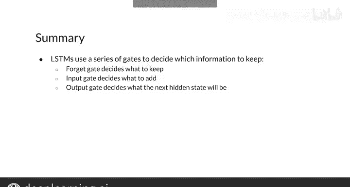

#  125：LSTM架构详解 🧠

在本节课中，我们将深入学习长短期记忆网络（LSTM）的内部架构和计算过程。LSTM是一种特殊的循环神经网络，能够有效处理序列数据中的长期依赖问题。

---

## LSTM的核心组件

回忆之前的内容，一个典型的LSTM单元包含一个**细胞状态**、一个**隐藏状态**，以及输入`x`和输出`y`。你可以将细胞状态视为网络的记忆，它会根据输入和前一时刻的隐藏状态信息进行更新。

LSTM中的**门控机制**决定了哪些信息被保留或添加，并在每一步选择输出。通常有三个门：

*   **遗忘门**：决定从上一个细胞状态中保留或丢弃哪些信息。
*   **输入门**：从当前输入和前一隐藏状态中选择相关信息。
*   **输出门**：决定细胞状态中的哪些信息被用作输出，并存储在隐藏状态中。

---

## 门控机制的计算

对于这三个门，我们需要对输入和前一状态应用带有不同可训练参数的**Sigmoid激活函数**。

以下是门控计算的通用形式：
`gate = sigmoid(W * [h_prev, x] + b)`

使用Sigmoid函数确保了门的输出值在0到1之间。在实践中，每个门对应的向量值通常非常接近0或1。值为0意味着门关闭，信息无法通过；值为1则允许信息自由流动。

---

## 候选细胞状态

LSTM内部的另一个重要计算是**候选细胞状态**。为了得到它，你需要对来自前一隐藏状态和当前输入的信息进行变换。

在大多数实现中，通常使用**双曲正切激活函数**：
`candidate = tanh(W_c * [h_prev, x] + b_c)`

它将来自前一隐藏状态和当前输入的信息压缩到-1到1之间。这种非线性变换在过去被广泛使用，因为它能提升训练性能。当然，你也可以尝试其他激活函数并测试其效果。

---

## 更新细胞状态与隐藏状态

有了遗忘门、输入门和候选细胞状态，我们就可以更新细胞状态了。

新的细胞状态计算如下：
`c_new = forget_gate * c_prev + input_gate * candidate`

它将通过输入门的候选细胞状态信息，与通过遗忘门的上一细胞状态信息相加，从而得到新的细胞状态。

最后，我们可以计算用于在给定步骤产生输出的新隐藏状态。

新的隐藏状态计算如下：
`h_new = output_gate * tanh(c_new)`

请注意，这里新的细胞状态首先会经过一个双曲正切激活函数。不过，有些LSTM架构会忽略这一步，直接将新的细胞状态通过输出门。

---

## 本节总结

本节课我们一起学习了LSTM的核心架构。LSTM通过三个门控机制来决定网络中传递哪些信息：

*   **遗忘门**决定保留什么。
*   **输入门**决定从上一隐藏状态和当前输入中添加什么。
*   **输出门**决定下一个隐藏状态和当前步骤的输出。

你现在已经理解了LSTM背后的基本原理。在本周的编程练习中，你将亲手实现LSTM。在下一个视频中，我将展示如何使用LSTM来解决一个真实的自然语言处理任务。让我们进入下一个视频。