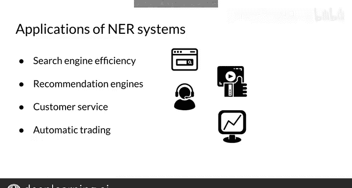

#  126：命名实体识别介绍 🏷️

在本节课中，我们将要学习命名实体识别。这是一种在自然语言处理中用于快速扫描文本、定位并提取特定类型信息的重要技术。许多NLP系统都包含NER组件。

## 什么是命名实体识别？

命名实体识别是一种快速、高效地扫描文本以寻找特定信息的方法。NER系统能够从文本中定位并提取出命名实体。

命名实体可以是任何事物，从一个地点、一个组织，到一个人名。它们甚至可以是时间和日期。

## 命名实体的类别标签

上一节我们介绍了NER的基本概念，本节中我们来看看NER系统所使用的具体类别标签，这些标签与你本周的编程作业相关。

以下是你在NER任务中可能会遇到的一些类别示例：

*   **地理实体**：例如“泰国”。
*   **组织**：例如“谷歌”。
*   **地缘政治实体**：例如“印度”。
*   **时间指示器**：例如“十二月”。
*   **人造物**：例如“这座古埃及雕像”。
*   **人物**：例如“巴拉克·奥巴马”。

正如你所见，命名实体可以捕捉和识别各种类型的事物。

## NER系统如何工作？

了解了类别之后，我们来看看NER系统是如何运作的。假设你有下面这个句子：

> “莎朗上周五飞往迈阿密。”

一个命名实体识别系统会提取并分类其中的实体：
*   “莎朗”被分类为**人名**。
*   “迈阿密”被分类为**地理实体**。
*   “周五”被分类为**时间指示器**。

你会注意到，在这个例子中，“the”和“to”等词没有被标记为任何实体类别，它们被分类为“O”，代表填充词或非实体词。

你或许已经能看出这对于内容分类是多么有用。在需要从大量文本中搜索特定词语（例如“曼哈顿”和“布鲁克林”，或“丰田”和“斯巴鲁”）的场景下，NER能迅速派上用场。

## 命名实体识别的实际应用

NER系统在现实世界中有许多应用。我提到过它们能快速扫描文档以寻找特定事物，因此可以想象NER如何优化搜索引擎的效率。

以下是NER的一些具体应用场景：

*   **优化搜索引擎**：NER模型可以一次性扫描数百万个网站，并存储其识别出的实体。然后，你的搜索查询中的标签只需与网站标签进行匹配即可。
*   **内容推荐**：同样的概念可以扩展到推荐系统。标签可以从你的历史记录中提取，并与相似用户的历史记录进行比较，从而推荐你可能想查看的内容。
*   **客户服务匹配**：这也适用于将客户匹配到合适的客服人员。其工作原理类似于电话树系统，系统会提示你提供一些关于你需求的信息。例如，如果你使用一个应用程序与你的汽车保险公司沟通，你可能会提供一些语音或文字信息，如“我需要添加另一辆车”或“我的车被一只巨大的飞鼠毁了”。系统会根据这些信息将你匹配到相应的客服人员。
*   **自动化交易**：另一个有趣的用例是自动化交易。例如，你可以构建一个网络爬虫来获取包含某些CEO、股票或加密货币名称的新闻文章，然后将这些文章输入到一个情感分类系统中，并据此进行交易。

NER系统在深度学习领域有许多应用，以上只是其中一个潜在的价值创造示例。

## 总结

本节课中，我们一起学习了命名实体识别。你现在知道了NER是什么，以及它在许多领域中的应用。看到这项技术被广泛应用，确实非常有趣。

在下一个视频中，你将亲手实现你自己的NER系统。