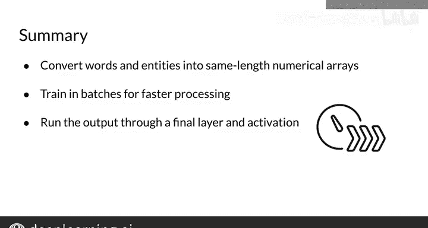

#  127：命名实体识别（NER）训练数据处理 🏷️


在本节课中，我们将学习如何为命名实体识别（NER）系统准备训练数据。我们将涵盖从原始文本到数字数组的完整转换流程，包括数据批处理生成器的创建，以便高效地训练模型。

---

## 数据转换步骤

上一节我们介绍了NER的基本概念，本节中我们来看看如何将文本和标签转换为模型可处理的数字格式。以下是核心步骤：

首先，为每个实体类别分配一个唯一的数字编号。

例如：
*   人名（Personal Name）可能对应数字 **1**
*   地理位置（Geographical Location）可能对应数字 **2**
*   时间指示器（Time Indicator）可能对应数字 **3**

接下来，为句子中的每个单词分配一个数字，该数字对应其所属的实体类别。

以句子“Sharon flew to Miami last Friday”为例，经过标记化（tokenization）和标签分配后，你会得到如下对应的数字序列：

```
Sharon (人名) -> 1
flew (非实体) -> 0
to (非实体) -> 0
Miami (地理位置) -> 2
last (时间) -> 3
Friday (时间) -> 3
```

这里的 **0** 对应“O”类别，表示填充词或未被识别的单词。请注意，你在此处看到的数字是随机的，它们是在你处理数据时被分配的。

从这一点出发，每个句子序列都被转换成一个数字数组，其中的每个数字都对应标签化单词的索引。

因此，从一个如下所示的标签化句子，你将把它转换成一个数值数组。

## 处理序列长度与填充

在处理数据集时，你需要将词汇表中的每个单词表示为一个数字，正如你刚才所见。这为你提供了数值数组。

但如果数组的长度不同，你需要处理这个问题。为了解决这个问题，你可以将序列长度设置为一个固定值，并添加一个通用的填充标记（pad token）来填充所有空白位置。

你将在作业中实现这一点。但不用担心，这是一个相对简单的过程，我会确切地展示如何操作。

## 创建数据生成器与模型输入

为了训练这个命名实体识别系统，你首先需要为每个输入及其对应的标签创建一个张量，正如之前所见。

然后，创建一个数据生成器（data generator）以批次（batch）的形式输出它们。批次大小可以是任何你想要的数值，但通常你会希望批次大小是2的幂，例如 **64**、**128**、**256**、**512** 等。这样做将显著加快你的处理速度。

如果你对“创建数据生成器”这个词感到不安，请不要担心。后续会有更多相关内容。

## 模型架构与预测

在生成批次数据后，将它们输入到一个LSTM单元中。

你将把LSTM的输出传递到一个密集层（Dense Layer）或全连接层（Fully Connected Layer）。

然后，在K个可能的类别上使用对数Softmax（Log Softmax）进行预测，其中K对应于可能输出的数量。在这里使用对数Softmax而不是普通的Softmax很重要，因为对数Softmax能提供更好的数值性能和梯度优化。

让我们看一下这个过程的示意图：

1.  **输入层**：包含你在处理数据时创建的数组。
2.  **LSTM层**：输入数据经过带有系列激活函数和逐元素操作的LSTM层。
3.  **密集层**：将LSTM的输出通过一个最终的密集层，这是对输入向量的线性操作。
4.  **输出层**：计算LogSoftmax以获得相应的输出。

以下是在本周作业中实现这些层时可能的样子。对于你的密集层，你需要传入刚刚创建的标签数组的维度。

## 核心任务总结

现在，你已经准备好完成一些重要的任务了，包括：
*   带标记填充的数值数组转换
*   使用批次训练以加速处理
*   将你的模型通过最终的密集层和激活函数运行

自本课程开始以来，你已经走了很长的路，只剩下一点点了。

---



## 课程总结

本节课中，我们一起学习了如何从头开始训练一个NER系统。我们详细介绍了将文本和实体标签转换为数字数组、处理变长序列、创建批处理数据生成器，以及模型的基本前向传播流程。在下一个视频中，我将向你展示如何评估你的系统。