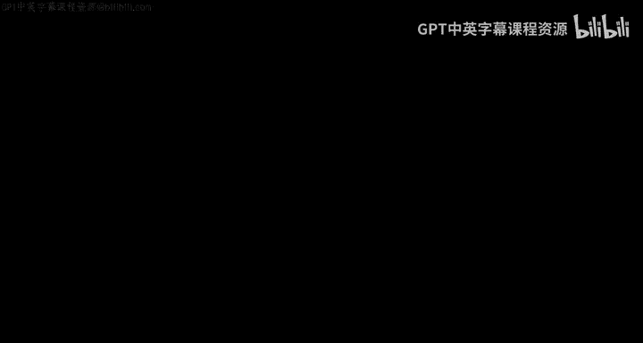
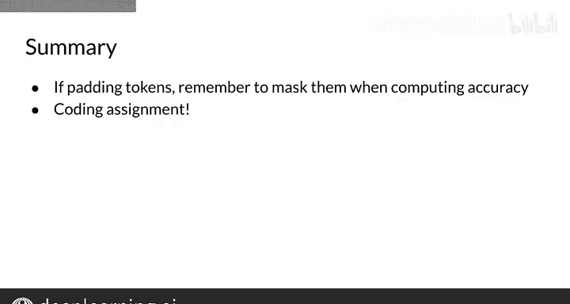

#  128：21_计算准确率 🎯



在本节课中，我们将学习如何评估一个已训练好的命名实体识别系统。我们将介绍从获取模型预测到最终计算准确率的完整流程。

## 概述

上一节我们介绍了NER模型的训练过程。本节中，我们来看看如何评估模型的性能。评估的核心在于将测试集输入模型，获取预测结果，并将其与真实标签进行比较。

## 评估步骤

以下是评估NER模型准确率的主要步骤。

1.  **获取预测**：首先，将测试集数据输入到已训练好的模型中，以获取模型的预测输出。
2.  **计算Argmax**：接着，对预测输出应用`argmax`函数，找出每个位置上概率最大的类别索引，从而得到具体的预测标签。
3.  **处理填充**：由于输入序列通常经过填充以达到统一长度，需要识别并屏蔽这些填充标记，确保它们不参与准确率计算。
4.  **计算准确率**：最后，将模型预测的标签与测试集的真实标签进行比较，计算模型预测正确的比例。

## 核心操作详解

现在，我们来详细看看每个步骤在代码中如何实现。

### 1. 获取模型预测

将预处理好的测试集数据输入模型，模型会输出每个位置上各个类别的预测概率。

```python
# 假设 model 是已训练好的模型，test_data 是测试集输入
predictions = model.predict(test_data)
```

### 2. 计算Argmax

使用`argmax`函数从预测概率中找出最大值的索引，即模型预测的类别。`axis`参数用于指定在哪个维度上执行此操作，这取决于你的数据维度。

```python
# 假设 predictions 的形状为 (样本数, 序列长度, 类别数)
pred_labels = np.argmax(predictions, axis=-1)
```

### 3. 屏蔽填充标记

在序列处理中，我们通常使用一个特殊的填充标记来统一序列长度。在计算准确率时，需要创建一个掩码来忽略这些填充位置。

```python
# 假设 pad_token 是填充标记的ID
# test_data 是原始输入数据
mask = test_data != pad_token
```

### 4. 计算准确率

准确率的计算方法是：统计所有非填充位置上预测正确的标记数量，然后除以所有非填充标记的总数。

```python
# 假设 true_labels 是真实的标签
correct_predictions = (pred_labels == true_labels) & mask
accuracy = np.sum(correct_predictions) / np.sum(mask)
```

## 总结



本节课中我们一起学习了如何评估NER模型的性能。关键步骤包括：在测试集上进行预测、通过`argmax`获取预测标签、屏蔽填充标记以避免干扰，最后通过比较预测与真实标签来计算准确率。掌握这个流程后，你现在已经准备好完成相关的编程作业了。祝你好运，并享受编码的乐趣！😊