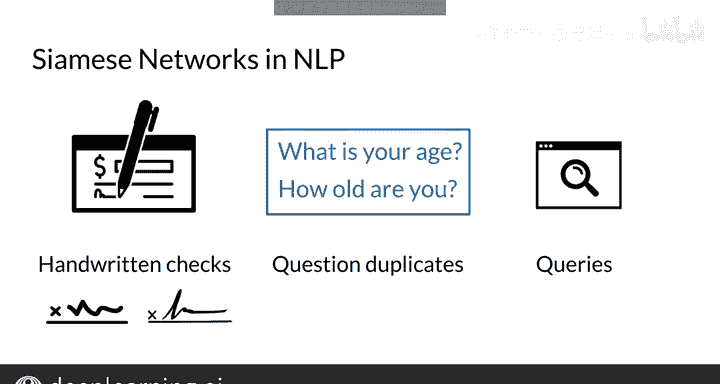

#  131：孪生网络 🤖

在本节课中，我们将学习一种特殊的神经网络架构——孪生网络。这是一种由两个完全相同的神经网络组成，并在末端合并的模型。我们将探讨其工作原理、在自然语言处理中的应用，以及如何用它来比较文本序列的语义。

---


## 孪生网络简介

上一节我们提到了神经网络的基本概念，本节中我们来看看孪生网络的具体结构。

孪生网络是一种由两个结构相同、参数共享的神经网络组成的架构。这两个网络并行处理两个不同的输入，最终通过一个合并层（如计算距离或相似度）产生一个输出。

其核心思想可以表示为以下流程：
```
输入A → 神经网络f → 向量表示v_A
输入B → 神经网络f → 向量表示v_B
合并层：计算 d = distance(v_A, v_B) 或 s = similarity(v_A, v_B)
```

这种架构在自然语言处理中有许多应用。在接下来的内容中，你将看到可以使用它的不同场景。

---

## 为何需要比较语义？

考虑以下两个问题：
*   How old are you?（你多大了？）
*   What is your age?（你的年龄是多少？）

你可以看到这两个问题没有任何相同的单词，但它们表达的意思完全相同。

另一方面，请看以下两个问题：
*   Where are you from?（你来自哪里？）
*   Where are you going?（你要去哪里？）

你可以看到前三个单词完全相同，但最后一个单词彻底改变了每个问题的含义。

这个例子表明，比较语义并不像单纯比较单词那么简单。接下来，你将看到如何使用孪生网络来比较单词序列的含义，并识别重复问题，这是Stack Overflow或Quora等平台核心的、非常重要的NLP应用。

在这些平台允许你发布新问题之前，它们需要确保你的问题没有被其他人发布过。

---

## 从分类到比较

现在，以这句话为例：“I am happy because I am learning.”（我很高兴，因为我在学习。）在情感分析和二元分类的背景下考虑它。

在训练分类算法时，你需要发现哪些特征使该陈述具有积极或消极的情感。

而对于孪生网络，你的目标是识别什么使你的输入相似，什么使它们不同。请看这两个问题：“What is your age?”和“How old are you?”。

当你构建一个孪生模型时，你试图识别这两个问题之间的差异或相似性。你通过计算一个单一的相似度分数来实现这一点，该分数代表两个问题之间的关系。基于该分数与阈值的比较，你可以预测这两个问题是相同还是不同。

---

## 孪生网络的应用

以下是孪生网络在NLP中的一些主要应用场景：

*   **笔迹与签名验证**：通过判断两个签名是否相同，用于支票等文件的笔迹认证。
*   **识别重复问题**：用于Quora或Stack Overflow等平台，识别用户提出的问题是否与已有问题重复。
*   **搜索引擎查询**：用于预测一个新的搜索查询是否与已执行过的查询相似。

这些只是少数例子，孪生网络在NLP中还有更多应用。



---

## 总结

本节课中，我们一起学习了孪生网络。我们了解到它是一种由两个相同子网络组成的架构，用于比较两个输入的相似性，而非直接进行分类。我们探讨了比较语义的复杂性，并介绍了该模型在验证、去重和搜索等NLP任务中的重要应用。

在下一个视频中，我将带你深入了解这类模型所使用的具体架构，并展示如何将其应用于文本处理。我们下个视频见。