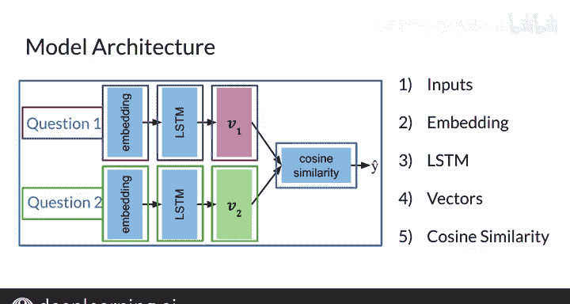

#  132：25_架构 🏗️

在本节课中，我们将学习一种特殊的神经网络架构——孪生网络。我们将了解其核心结构、工作原理以及如何通过余弦相似度来比较两个输入。

---

## 孪生网络架构概述

孪生网络是一种特殊的架构。它包含两个完全相同的子网络，这两个子网络最终合并，以产生一个最终输出或相似度得分。我们可以将这两个子网络视为“姐妹网络”，它们共同协作来生成一个相似度分数。

以下是孪生网络的一个模型架构示例。请注意，这里展示的架构只是一个例子，并非所有孪生网络都设计为包含LSTM层。

## 架构详解

在左侧，有两个输入，分别代表问题1和问题2。每个问题都会经过以下处理流程：首先被转换为词嵌入向量，然后通过一个LSTM层来建模问题的含义。

每个LSTM层都会输出一个向量。因此，在这个架构中，有两个完全相同的子网络：一个用于处理问题1，另一个用于处理问题2。

这里有一个重要的注意事项：这两个子网络共享完全相同的参数。也就是说，每个子网络学习到的参数是完全一样的。因此，实际上你只需要训练一组权重，而不是两组。

## 计算相似度

得到两个输出向量后，每个向量对应一个问题，接下来需要计算它们之间的余弦相似度。

余弦相似度是衡量两个向量之间相似程度的一个指标。当两个向量大致指向相同方向时，它们之间夹角的余弦值接近1。当两个向量指向相反方向时，余弦值接近-1。如果你对这个概念不熟悉，不必担心。现在你只需要知道，余弦相似度可以告诉你两个向量有多相似。在这个场景下，它告诉你两个问题有多相似。

因此，余弦相似度给出了孪生网络的预测值，这里用变量 **y_hat** 表示，其值域在-1到1之间。

## 判断逻辑

如果 **y_hat** 小于或等于某个阈值 **τ**，那么你会判定输入的两个问题是不同的。如果 **y_hat** 大于 **τ**，那么你会判定它们是相同的。

阈值 **τ** 是一个需要你根据实际情况选择的参数。它决定了你希望多高的余弦相似度才被视为两个问题相似。阈值越高，意味着只有非常相似的句子才会被判定为相似。

## 处理流程总结

如果将这个过程视为从输入到输出的一系列步骤，可以总结如下：

1.  从孪生网络的模型架构开始，它由两个相同的子网络构成。
2.  输入是两个问题，分别馈入每个子网络。
3.  每个问题被转换为词嵌入，并通过LSTM层。
4.  取每个子网络的输出，使用余弦相似度进行比较，得到预测值 **y_hat**。

---

## 成本函数简介

在了解了模型架构之后，我们将在下一节开始讨论可以用于此类架构的不同成本函数。

---

## 本节课总结

本节课我们一起学习了孪生网络的基本架构。我们了解到它由两个参数共享的相同子网络组成，用于处理两个输入。通过计算两个子网络输出向量的余弦相似度，我们可以得到一个介于-1和1之间的相似度得分 **y_hat**。最后，通过设定一个阈值 **τ**，我们可以根据 **y_hat** 来判断两个输入是否相似。