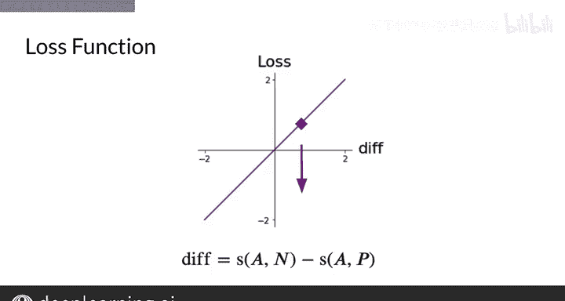

#  133：26_成本函数 🧮

在本节课中，我们将学习用于孪生网络（Siamese Network）的成本函数，即三元组损失（Triplet Loss）。我们将了解其工作原理、构成要素以及如何通过它来训练模型，使其能够有效区分相似与不相似的文本。

---

## 概述

上一节我们介绍了孪生网络的基本结构，它用于预测两个问题是否相似。本节中，我们来看看如何通过一个特定的成本函数——三元组损失——来训练这个网络，使其学习到有意义的文本表示。

## 三元组损失函数

我将展示一个可用于孪生网络的简单损失函数。首先，回顾一下孪生网络的整体结构，它使你能够预测两个问题是否相似。通过网络的输出，你可以计算预测值 `y_hat`，它代表了两个问题之间的相似度。

现在，我将介绍用于孪生网络的损失函数。让我们从第一个问题“How old are you?”开始，我将其称为**锚点（Anchor）**。我们将用这个锚点来与其他两个问题进行比较。

相对于锚点，其他与锚点含义相同的问题被称为**正例（Positive）**，而与锚点含义不同的问题则被称为**负例（Negative）**。

需要注意的是，在检测问题重复性的上下文中，“正”和“负”指的是问题是否与锚点相似，而不是指情感上的积极或消极。

因此，问题“What is your age?”相对于锚点被视为正例，因为“How old are you?”和“What is your age?”含义相同。而问题“Where are you from?”则被视为负例，因为它与锚点问题的含义不同。

## 余弦相似度

以下是两个向量之间余弦相似度的定义公式：

`相似度 = (A · B) / (||A|| * ||B||)`

这个相似度函数记为 `S`。为了训练你的模型，你将使用相似度函数来比较每个子网络输出的向量。

对于这个例子，你需要计算锚点 `A` 和正例 `P` 之间的相似度 `S(A, P)`，以及锚点 `A` 和负例 `N` 之间的相似度 `S(A, N)`。

相似度的值域在 `-1` 到 `1` 之间。对于完全不同的向量，相似度接近 `-1`；对于几乎相同的向量，相似度接近 `1`。

因此，对于一个训练良好的模型，你希望看到锚点和正例之间的相似度接近 `1`。同样地，当比较锚点和负例时，一个成功的模型应该产生接近 `-1` 的相似度。

## 构建损失函数

为了开始构建损失函数，你从锚点与负例的相似度 `S(A, N)` 中减去锚点与正例的相似度 `S(A, P)`，来计算这个差值。

`差值 = S(A, N) - S(A, P)`

这样你就得到了一个损失函数，它允许你判断模型是否大致按照你的期望工作，即发现锚点和正例相似，而锚点和负例不同。

随着差值沿X轴变大或变小，损失值沿Y轴相应地变大或变小。因此，在训练中最小化损失，实际上就是在最小化这个差值。

在下一个视频中，我将介绍三元组（Triplets）的概念。

---

## 总结

本节课中，我们一起学习了孪生网络的核心成本函数——三元组损失。我们定义了锚点、正例和负例，并利用余弦相似度来衡量它们之间的关系。通过构建 `S(A, N) - S(A, P)` 的差值作为损失，我们引导模型学习区分相似与不相似的文本对，这是训练高效语义匹配模型的关键一步。