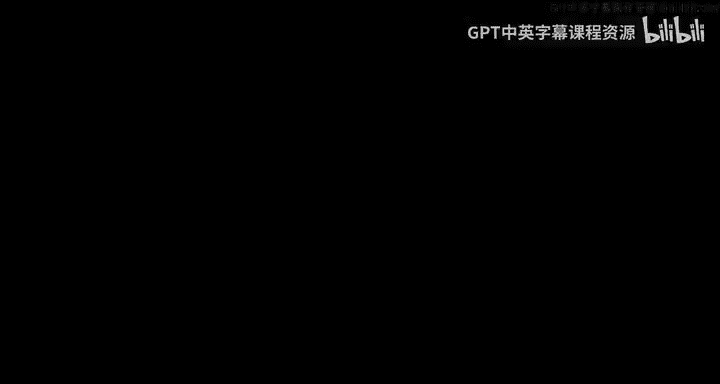
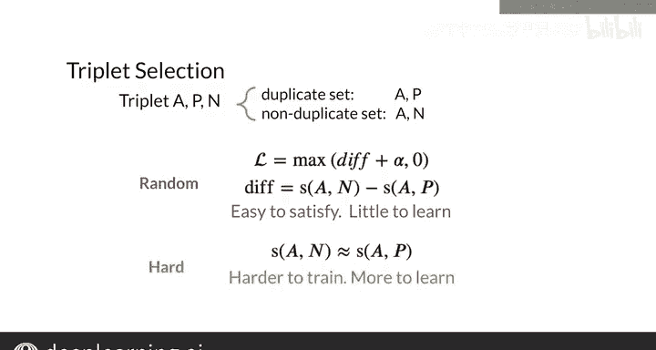

#  134：三元组损失 🎯

## 概述

在本节课中，我们将要学习一种用于训练语义相似度模型的特殊技术——三元组损失。我们将了解如何构建由锚点、正例和负例组成的三元组，并利用它们来训练模型，使其能够准确判断两个输入是否具有相同的含义。

---

## 三元组与损失函数

上一节我们介绍了模型的目标是判断两个输入是否等价。本节中我们来看看如何通过构建三元组来训练模型。

三元组由三个部分组成：
*   **锚点**：一个基准输入。
*   **正例**：一个与锚点含义相同的输入。
*   **负例**：一个与锚点含义不同的输入。

三元组损失函数的核心思想是：**最小化锚点与负例之间的相似度，同时最大化锚点与正例之间的相似度**。

用公式可以表示为，我们希望：
`相似度(锚点, 正例) - 相似度(锚点, 负例)` 这个差值尽可能大。

一个简单的损失函数可以直接基于这个差值来构建。然而，这个简单的函数存在一个问题：当差值小于0时，损失会变为负值，这可能导致模型过早停止学习。

---

## 引入边界值

我们不希望模型仅仅满足于将正负例区分开，而是希望它能以一定的“自信度”进行区分。为此，我们引入一个边界值 `alpha`。

新的损失函数要求：`相似度(锚点, 正例) - 相似度(锚点, 负例) + alpha >= 0`。

这意味着，即使锚点与正例的相似度已经大于锚点与负例的相似度，只要它们的差值没有超过边界值 `alpha`，模型仍然会收到损失信号，需要继续学习以拉开这个差距。`alpha` 是一个超参数，你可以根据需要调整它。

以下是三元组损失函数的最终形式，我们将在编程作业中实现它：
`损失 = max(相似度(A, N) - 相似度(A, P) + alpha, 0)`

> **注意**：在本次课程中，我们使用**余弦相似度**作为相似度度量。你也可以使用其他度量方式（如欧氏距离），但需注意距离与相似度是相反的概念：距离越小，相似度越高。

---

## 三元组的选择策略

我们已经了解了损失函数如何工作。接下来，我们看看如何为训练选择有效的三元组。

以下是选择三元组的两个基本步骤：
1.  从训练集中选择一对已知为同义的问题，分别作为锚点和正例。
2.  选择一个已知与锚点含义不同的问题，作为负例。

如果随机选择三元组，很多三元组的损失可能接近零，模型无法从中学习。为了提高训练效率，我们应该选择那些对模型更具挑战性的三元组，即**困难三元组**。

困难三元组是指：锚点与负例的相似度非常接近（但仍小于）锚点与正例的相似度。面对这样的三元组，模型必须努力调整其权重，才能正确地区分它们。通过专注于困难三元组，我们可以让训练过程更高效地集中在模型表现不佳的案例上。

---

## 总结

本节课中我们一起学习了三元组损失的核心概念。我们首先了解了锚点、正例和负例如何构成一个训练样本。接着，我们探讨了如何设计损失函数来迫使模型拉开正负例与锚点的相似度差距，并引入了边界值 `alpha` 来确保模型学习的充分性。最后，我们讨论了选择困难三元组的重要性，这能引导模型专注于最具挑战性的样本，从而更有效地提升性能。在接下来的课程中，我们将看到这些概念如何整合成一个完整的模型训练流程。