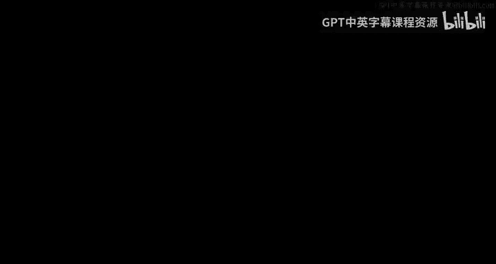
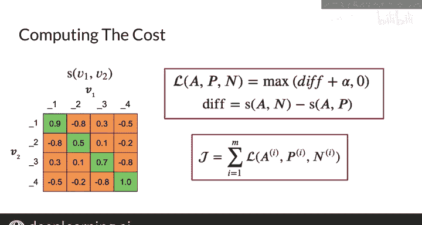

#  135：计算成本I 💰

在本节课中，我们将学习如何为连体网络构建成本函数，并了解如何通过梯度下降来优化它。我们将从准备数据和批次开始，逐步理解模型如何计算向量间的相似度，并最终形成用于训练的成本。

---

## 准备数据与批次

上一节我们介绍了连体网络的基本结构，本节中我们来看看如何为模型准备输入数据。

以下是构建批次的一个示例，其中包含四对意思相同的问题（即重复对）：

*   What is your age 与 How old are you
*   Can you see me 与 Are you seeing me
*   Where are thou 与 Where are you
*   When is the game 与 What time is the game

这里，批次大小 **B** 为 4。一个重要的细节是：在每一行中，左右两列的问题是互为重复的。但在任何一列中，上下行之间的问题则互不重复。

---

## 模型处理与向量输出

准备好批次后，接下来我们将数据输入模型。

第一个批次的问题会通过模型，得到一个输出矩阵 **V1**。其维度为 **B 行 × D_model 列**，其中 **D_model** 是嵌入层的维度（本例中为5）。这意味着每个问题都被转换成了一个5维的向量。

同理，第二个批次的问题会通过相同的模型（共享权重），得到另一个输出矩阵 **V2**。**V1** 中的每一行向量都与 **V2** 中对应行的向量是重复对，但 **V1** 内部各行向量之间互不重复，**V2** 内部也是如此。

---

## 计算相似度矩阵

现在，我们需要结合连体网络的两个分支，计算 **V1** 和 **V2** 中所有向量组合之间的相似度。

对于这个批次大小为4的例子，我们会得到一个4×4的相似度矩阵。该矩阵的**对角线**元素是关键，它们代表了所有**正例**（即重复问题对）的相似度。通常，这些值会高于非对角线上的值，这表明模型能正确识别重复对。

矩阵的**非对角线**区域（右上和左下）则代表了所有**负例**（即非重复问题对）的相似度。大多数情况下，这些值会低于对角线上的值。相似度的范围在-1到1之间，但并没有规定大于0就一定是重复对。一个训练良好的模型，其核心表现是能让重复对的相似度**相对高于**非重复对。

通过这种方式构建批次，我们无需在输入数据中特意准备负例，模型可以直接从现有批次中学习区分正负样本，这大大简化了数据准备工作。

---

## 构建成本函数

基于得到的相似度矩阵，我们已经可以构建成本函数。

一种直接的方法是使用你已经熟悉的三元组损失函数，其公式如下：

**Loss = max( sim(A, N) - sim(A, P) + α, 0 )**

其中，**A** 是锚点样本，**P** 是正样本，**N** 是负样本，**α** 是间隔参数。

整个连体网络的总体成本将是训练集上所有单个损失的总和。然而，还有更多先进的技术可以显著提升模型性能，我们将在下一节中介绍。

---

## 总结

本节课中，我们一起学习了如何为连体网络计算成本。我们从准备包含重复对的批次数据开始，观察模型如何将其转换为向量，并通过计算相似度矩阵来得到正例和负例的评分。最后，我们介绍了如何基于这些相似度，使用三元组损失函数来构建初步的成本函数，为模型的优化训练奠定了基础。