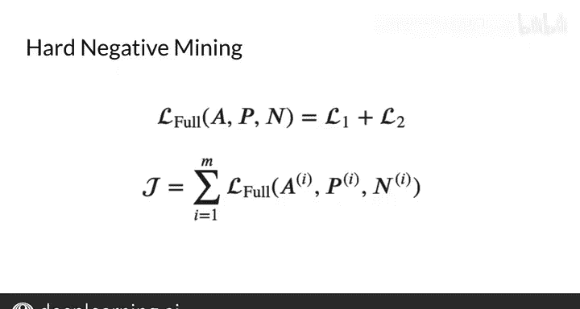

#  136：计算成本 II 💰

在本节课中，我们将深入探讨如何计算孪生网络的整体成本。我们将定义成本矩阵中的对角线与非对角线元素，并利用这些概念来改进损失函数，从而提升模型的性能。

---

在上一节视频中，我们简要提到了成本矩阵中的对角线与非对角线元素。

现在，我们将正式定义这些术语，并利用它们来计算整体成本。让我们开始吧。

之前，我们将训练数据组织成了两个特定的批次。

每个批次内部都不包含重复的问题。

我们将这些批次分别输入到孪生网络的两个子网络中，为每个问题生成了一个向量输出，其维度为 `1 x D_model`。这里的 `D_model` 是嵌入维度，等于矩阵的列数。在本例中，这个值是 5。

单个批次的 V1 向量被堆叠在一起。在本例中，批次大小就是这个矩阵的行数，即 4。

你同样可以看到一个类似的 V2 向量批次。

最后一步是通过计算 V1 向量和 V2 向量所有可能组合之间的相似度，来合并孪生网络的两个分支。

对于这个批次大小为 4 的例子，最后一步将生成一个如下所示的相似度矩阵。

这个矩阵有一些重要的属性。绿色对角线上的相似度值对应着重复问题的相似度。对于一个训练良好的模型，这些值应该大于非对角线上的值，这反映了网络能为重复问题生成相似的向量输出。

右上角和左下角的橙色值则对应着非重复问题的相似度。

现在，有趣的部分来了。你可以利用这些非对角线信息来修改损失函数，从而显著提升模型的性能。

为此，我将引入两个概念。

第一个概念是**平均负例相似度**。

它指的是每一行中所有非对角线值的平均值。

请注意，非对角线元素仍然可以是正数，所以当我提到“平均负例”时，我指的是负例相似度的平均值，而不是矩阵中负数的平均值。

例如，第一行的平均负例相似度就是该行所有非对角线值的平均值（即 -0.8、0.3 和 -0.5 的平均值），不包括对角线上的值 0.9。

你可以通过修改损失函数来利用平均负例相似度，以帮助加速训练，我稍后会展示。

下一个概念是**最接近负例**。

如前所述，由于三元组损失函数的定义方式，你需要选择所谓的“困难三元组”进行训练。这意味着在训练时，你希望选择那些负例的余弦相似度与正例相似度非常接近的三元组。

这迫使你的模型去学习区分这些示例，并最终通过训练将这些相似度值进一步拉开。

为此，你需要在输出矩阵的每一行中搜索“最接近负例”。也就是说，找到那个最接近（但仍小于）该行对角线值的非对角线值。

以第一行为例，对角线上的值是 0.9。那么，在这种情况下，最接近的非对角线元素就是 0.3。

这意味着，这个相似度为 0.3 的负例，能为你的模型提供最大的学习机会。

为了运用这些新概念，让我们回顾一下三元组损失的定义：`max( sim(A, N) - sim(A, P) + α, 0 )`。同时，我们用变量 `diff` 来表示两个相似度之间的差值。

这里我们只是写出了 `diff` 的定义。

为了最小化损失，你希望 `diff + α` 小于或等于 0。

现在，我将引入两个新的损失函数。

以下是第一个损失函数 `Loss1` 的定义：

`Loss1 = max( mean_negative - sim(A, P) + α, 0 )`

三元组损失公式与 `Loss1` 之间的变化，在于将 `sim(A, N)` 替换为了 `mean_negative`。这有助于在训练期间通过减少噪声来加速模型收敛。

它通过基于多个观测值的平均值进行训练，而不是基于每个非对角线示例进行训练，从而减少了噪声。

那么，为什么取多个观测值的平均值通常能减少噪声呢？我们将噪声定义为一个来自均值为 0 的分布的小值。换句话说，多个噪声值的平均值通常趋近于 0。因此，如果我们取多个示例的平均值，这就有抵消各个观测值中个体噪声的效果。

接下来是第二个损失函数 `Loss2` 的定义：

`Loss2 = max( closest_negative - sim(A, P) + α, 0 )`

这次公式的差异在于，将 `sim(A, N)` 替换为了 `closest_negative`。这通过削弱被替换掉的、原本更负的 `sim(A, N)` 的影响，有助于创造一个稍大的惩罚。

你可以将“最接近负例”理解为，找到那个能使两个余弦相似度之间差值最小的负例。如果你将这个小的差值加上 α，那么你就能在该行所有其他示例中产生最大的损失。通过将训练重点放在产生更高损失值的示例上，你迫使模型更多地更新其权重，从而从这些更困难的示例中学习。

然后，你可以定义**完整损失**为 `Loss1` 和 `Loss2` 的总和：

`Total Loss = Loss1 + Loss2`

你将在作业中使用这个新的完整损失作为改进的三元组损失。

你的孪生网络的**整体成本**，将是训练集上所有这些个体损失的总和。

---

在本节课中，我们一起学习了如何利用成本矩阵中的非对角线信息来改进损失函数。我们引入了“平均负例相似度”和“最接近负例”两个核心概念，并基于它们构建了 `Loss1` 和 `Loss2`，最终组合成更有效的完整损失函数，用于优化孪生网络的训练。

在下一个视频中，你将在“单样本学习”中应用这个成本函数。单样本学习是一种非常有效的技术，可以在比较支票或其他任何类型输入的真实性时，为你节省大量时间。