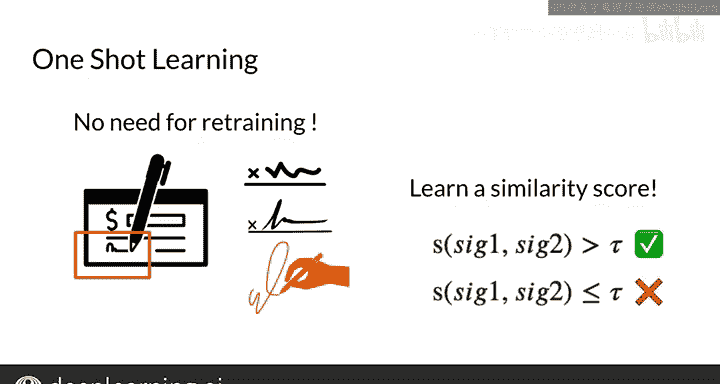

#  137：30_一次性学习 🎯

## 概述

在本节课中，我们将要学习一种名为“一次性学习”的技术。一次性学习旨在解决传统分类模型在面对新类别时，需要大量数据重新训练的难题。通过学习一个“相似度函数”，模型能够仅凭一个示例就判断新输入是否属于某个已知类别。这在签名验证、人脸识别等场景中非常有用。

---

## 从分类到一次性学习

上一节我们介绍了传统的多类别分类方法。本节中我们来看看一次性学习如何解决其局限性。

假设你正在尝试鉴定一首诗的作者是否为卢卡斯。传统方法有两种：一是将所有卢卡斯的诗放入数据集，将问题转化为预测K+1个类别（K个其他作者加上卢卡斯）；二是将卢卡斯的一首诗与另一首诗进行比较，这正是“一次性学习”的思路。

为了理解分类与一次性学习的区别，首先考虑基于K个可能类别来识别或分类签名的情况。

你可能会使用某种在K个类别上训练的分类模型，通常在最后使用softmax函数来寻找最大概率。在识别时，将输入的签名分类到对应的类别中。如果你的签名列表很少变动，这种方法很好。

但是，如果你需要分类一个新的签名呢？每次发生这种情况都重新训练模型的成本会很高。此外，除非你拥有大量这个新签名的示例，否则模型训练效果不会很好。

在一次性学习中，你需要能够仅凭一个示例就反复识别这个签名。你可以通过学习一个“相似度函数”来实现这一点。然后，你可以测试一个相似度分数是否超过某个阈值，以判断两个签名是否相同。

因此，问题从“确定属于哪个类别”转变为“衡量两个类别之间的相似度”。这非常有用，例如在银行场景中。每次出现新签名时，你不可能为了将签名分类到K个可能的输出而重新训练整个系统。相反，你只需学习一个相似度函数，用于计算相似度分数，进而识别两个签名是否相同。

你已经使用余弦相似度作为相似度函数做过类似的事情。如果结果大于某个阈值τ，你就判定输入是相同的。在比较签名的情况下，如果相似度小于或等于τ，则签名不同。

以下是实现这一思路的关键步骤：

1.  **定义相似度函数**：该函数接收两个输入，并输出一个表示其相似程度的分数。
2.  **设定阈值**：确定一个阈值τ，用于判断两个输入是否属于同一类别。
3.  **进行比对**：将新输入与已知的单个示例进行比对，根据相似度分数和阈值做出判断。

---

## 总结与展望

本节课中我们一起学习了“一次性学习”的核心概念。它通过将问题从多类别分类转化为相似度比较，使得模型能够仅凭一个示例就能有效识别新类别，避免了数据收集和模型重新训练的巨大开销。

一次性学习利用了孪生网络。在下一节视频中，我将向你展示如何训练和测试你的孪生网络。