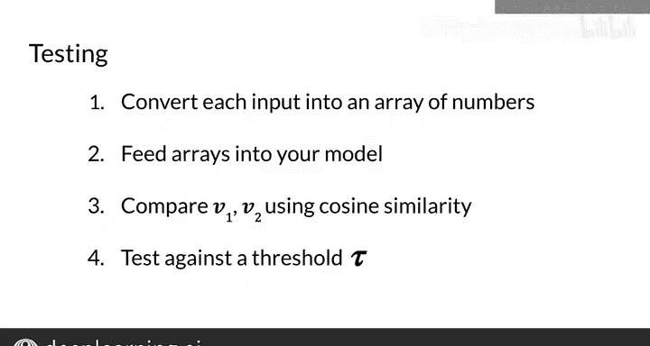

#  138：训练与测试 🧠

在本节课中，我们将学习如何为孪生网络准备数据集，以及如何训练和测试该模型。我们将使用一个关于问题对的数据集，目标是判断两个问题是否为重复问题。

---

## 数据集概览 📊

我们将使用“问题重复数据集”来完成本周的编程练习。该数据集的结构如下：它包含一系列问题对，并为每个问题对标注了一个布尔值，表示它们是否为重复问题。

例如：
*   问题1：“What is your age?” 与 问题2：“How old are you?” 的 `is_duplicate` 为 `True`，因为这两个问题是重复的。
*   问题1：“Where are you from?” 与 问题2：“Where are you going?” 的 `is_duplicate` 为 `False`，因为它们不是重复的。

这个数据集为模型提供了大量可供学习的样本。

---

## 数据预处理与批处理 🔄

上一节我们介绍了数据集的基本结构，本节中我们来看看如何为模型训练准备数据批次。

首先，你需要对数据进行预处理，将其组织成批次大小为 `B` 的批次。每个批次中的对应问题是重复的。

例如，批次1中的第一个问题“What is your age?”与批次2中的第一个问题“How old are you?”是重复的。批次1中的第二个问题与批次2中的第二个问题也是重复的，依此类推。

但需要注意的是，**同一个批次内部没有重复问题**。如果我们称批次1的第一个问题为 `Q1_A`，批次2的第一个问题为 `Q2_A`，那么 `Q1_A` 和 `Q2_A` 是重复的。同样，批次1的第二个问题 `Q1_B` 和批次2的第二个问题 `Q2_B` 是重复的。然而，`Q1_A` 和 `Q1_B` 不是重复的，`Q2_A` 和 `Q2_B` 也不是重复的。

你将学习如何以这种方式准备批次，确保同一批次内没有问题重复。

---

## 孪生网络模型架构 🤖

准备好输入批次后，你将使用这些输入为每个批次获取输出向量。然后，你可以计算每对输出向量之间的余弦相似度。

以下是你在作业中将实现的孪生模型结构：
1.  创建一个子网络。
2.  复制该子网络，形成两个并行且结构完全相同的分支。
3.  在每个子网络中，输入经过嵌入层和LSTM层，得到输出向量 `V1` 和 `V2`。
4.  使用 `V1` 和 `V2` 计算余弦相似度。

一个重要的细节是：**两个子网络的学习参数完全相同**。因此，你实际上只训练一套权重，而不是两套。

---

## 模型测试与预测 🎯

了解如何训练模型后，我们来看看如何测试它。在测试模型时，你将使用“一次性学习”方法，目标是计算两个输入问题之间的相似度得分。

以下是测试步骤：
1.  将每个输入问题转换为数字数组。
2.  将这些数组输入你的模型。
3.  使用余弦相似度比较两个子网络的输出 `V1` 和 `V2`，得到一个相似度得分。
4.  将该得分与一个阈值 `τ` 进行比较。
5.  如果余弦相似度大于 `τ`，则将这两个问题分类为重复问题。

请注意，损失函数中的边界值 `α` 和此处的阈值 `τ` 都是可调整的超参数。

---

## 总结 ✨

本节课中我们一起学习了：
*   如何为孪生网络准备“问题重复数据集”。
*   如何组织数据批次，确保批次间对应问题重复而批次内问题不重复。
*   孪生网络的结构，其核心是两个共享权重的相同子网络。
*   如何使用余弦相似度和阈值 `τ` 来测试模型并判断问题是否重复。

在本周的编程练习中，你将应用孪生网络来识别问题是否为重复问题。具体来说，你将使用核心问题重复数据集，并有望获得很高的准确率。