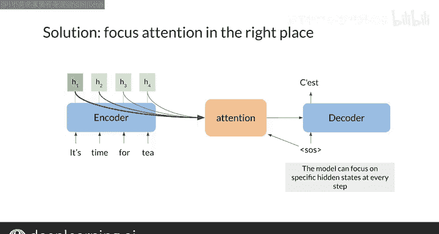

#  142：序列到序列模型 🧠➡️🗣️

在本节课中，我们将学习神经机器翻译的基础知识。我们将探讨其核心架构——序列到序列模型，并了解该模型在翻译过程中如何“关注”特定的词语。我们还将分析传统模型的局限性，并引入“注意力机制”这一关键概念作为解决方案。

***

## 概述：神经机器翻译与序列到序列模型

神经机器翻译使用编码器和解码器将一种语言翻译成另一种语言。例如，将英语“It’s time to go”翻译成法语“C’est l’heure de partir”。实现这一功能的核心是序列到序列模型。

***

## 序列到序列模型详解

上一节我们介绍了神经机器翻译的基本目标，本节中我们来看看实现它的核心架构——序列到序列模型。

该模型由谷歌在2014年提出，在当时是一项突破。其核心思想是将一个可变长度的序列（如单词序列）映射到一个固定长度的记忆向量中，这个向量编码了整个句子的含义。例如，一段长度可变的文本可以被编码成一个固定维度（如300维）的向量。这个特性使其成为机器翻译的强大工具。

序列到序列模型有两个主要优势：
1.  输入和输出的序列长度无需匹配，这在翻译任务中非常理想。
2.  模型通常使用LSTM或GRU单元，这有助于解决深度网络中常见的梯度消失和梯度爆炸问题。

***

## 编码器与解码器的工作流程

了解了模型的基本原理后，我们来深入看看它的两个核心组件：编码器和解码器是如何协同工作的。

在序列到序列模型中，编码器接收单词标记作为输入，并返回其最终的隐藏状态作为输出。解码器则利用这个隐藏状态来生成目标语言的翻译句子。

以下是编码器和解码器的具体结构：

**编码器结构：**
编码器通常包含一个嵌入层和一个或多个LSTM层。
*   **嵌入层**：将单词标记转换为向量，作为LSTM的输入。
*   **LSTM模块**：在输入序列的每一步，LSTM接收来自嵌入层的输入以及前一步的隐藏状态。编码器返回最后一步的隐藏状态（例如 `H_4`），这个状态包含了整个句子的信息，编码了其整体含义。

**解码器工作流程：**
解码器结构类似，也包含嵌入层和LSTM层。它的工作方式是使用上一步的输出单词作为下一步的输入单词，并将LSTM的隐藏状态传递给下一步。
1.  输入序列以一个“序列开始”标记（`<SOS>`）开始。
2.  第一步解码器输出最可能的下一个单词，例如“C’est”。
3.  然后将“C’est”作为输入单词用于下一步，并重复此过程以生成句子的其余部分：“l’heure”, “de”, “partir”。

***

## 传统模型的局限性与注意力机制的引入

上一节我们介绍了编码器-解码器的工作流程，本节中我们来看看传统序列到序列模型的一个主要缺陷及其解决方案。

传统模型的一个主要限制被称为“信息瓶颈”。由于它使用固定长度的记忆向量（即编码器的最终隐藏状态）来传递信息，长序列会带来问题。无论输入序列包含多少信息，能够从编码器传递到解码器的信息量是固定的。

这导致了一个问题：当输入序列很长时，模型难以将所有信息压缩到一个固定大小的向量中，这会限制解码器做出准确预测的能力，从而导致模型性能随序列长度增加而下降。

一种解决思路是让解码器能够访问编码器每一步的隐藏状态，而不是仅仅依赖最终的那个压缩向量。但这会带来内存和上下文处理上的新问题。

那么，如何构建一个既能高效利用时间和内存，又能从长序列中做出准确预测的模型呢？如果模型能在解码的每一步有选择地“聚焦”于输入序列中最重要的词语，这就成为可能。

你可以将此视为为模型增加一个新的处理层，在本课程中，这个层被称为**注意力机制**。通过为模型提供每个输入词语的特定信息，你就能赋予它在解码过程的每一步将“注意力”集中在正确位置的能力。

***

## 总结

本节课中我们一起学习了神经机器翻译的基础。我们了解了序列到序列模型的架构，包括编码器和解码器如何协作。我们探讨了传统模型在处理长序列时的“信息瓶颈”问题，并引入了“注意力机制”作为关键的解决方案，它使模型能够在翻译时动态地关注输入序列的相关部分。在接下来的课程中，你将更深入地理解这个新层的工作原理和原因。