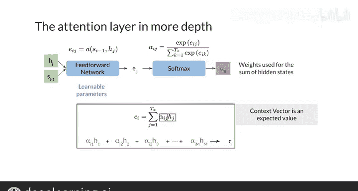

#  143：带注意力的序列到序列模型 🧠

## 概述

在本节课中，我们将要学习注意力机制这一核心概念。注意力机制允许模型在进行预测时，有选择地“关注”输入序列中的特定部分，从而显著提升模型（尤其是在处理长序列时）的性能。我们将从动机出发，逐步解析其工作原理，并通过一个简单的实现来加深理解。

---

## 注意力机制的动机与效果

上一节我们介绍了传统序列到序列模型的局限性。本节中我们来看看注意力机制是如何解决这些问题的。

注意力机制由Zmetry Baanu、Gang Chohou和Yohua Benio在一篇里程碑式的论文中提出。作者开发此方法是为了解决序列到序列模型在翻译长句子时能力下降的问题。

虽然注意力最初是为机器翻译开发的，但它已成功应用于许多其他领域。在深入细节之前，我们先看看它的效果有多惊人。

以下是Baanu论文中不同模型性能的对比，使用BLEU分数（一种你将在后续学习的性能指标，分数越高表示翻译越准确）。

虚线显示了双向序列到序列模型在输入句子长度增加时的得分。数字13和50表示训练模型时使用的最大序列长度。

序列到序列模型在处理10到20个词的句子时表现良好，但超过这个长度后性能会下降。这是因为序列到序列模型必须将整个输入序列的含义存储在一个单一的向量中。

论文中开发的模型（RNNsearch-13和RNNsearch-50）使用了带注意力的双向编码器和解码器。首先，这些模型在所有句子长度上的表现都优于传统的序列到序列模型。其次，RNNsearch-50模型的性能基本不随句子长度增加而下降。

这是因为模型能够专注于特定的输入部分来预测输出翻译中的单词，而不必记忆整个输入句子。

---

## 注意力机制的工作原理

现在，我们来探讨注意力背后的动机及其工作原理。

传统的序列到序列模型使用编码器的最终隐藏状态作为解码器的初始隐藏状态。这迫使编码器将整个输入序列的含义存储在这一个隐藏状态中。

改进的思路是，不只用最终的隐藏状态，而是将所有隐藏状态都传递给解码器。然而，这很快就会变得低效，因为你必须在内存中保留每个输入步骤的隐藏状态。

为了解决这个问题，可以将隐藏状态组合成一个向量，通常称为**上下文向量**。

最简单的操作是逐点相加。由于隐藏向量大小相同，你可以将这些向量按元素相加，生成另一个相同大小的向量。

但此时解码器获得了每一步的信息，而实际上它可能只需要前几个输入步骤的信息来生成第一个单词。这与使用LSTM或GRU的最后一个隐藏状态差别不大。

解决方案是：在逐点相加之前，给某些编码器向量分配比其他向量更大的权重。对下一个解码器输出更重要的单词将获得更大的权重。这样，上下文向量就包含了关于最重要单词的更多信息，而其他单词的信息则较少。

---

## 权重如何计算？

那么，这些权重是如何计算的呢？为了确定每个步骤中哪些输入词是重要的，我们需要一个衡量标准。

解码器的前一个隐藏状态（记为 **`s_{i-1}`**）包含了输出翻译中前几个单词的信息。这意味着你可以将解码器状态与每个编码器状态进行比较，以直观地确定最重要的输入。

解码器可以设置权重，使其专注于对下一个预测最重要的输入词。这决定了模型应该“注意”输入序列的哪些部分。

---

## 深入注意力层

现在，让我们步入注意力层，具体看看权重和上下文向量是如何计算的。

注意力层的目标是返回一个包含编码器状态相关信息的上下文向量。

以下是计算步骤：

第一步是计算对齐分数 **`e_{ij}`**。这个分数衡量了位置 `j` 附近的输入与预期输出位置 `i` 的匹配程度。匹配度越高，分数越高。

这通过一个前馈神经网络完成，该网络以编码器和解码器的隐藏状态作为输入。前馈网络的权重与序列到序列模型的其他部分一同学习。

然后，这些分数通过 **`softmax`** 函数转换为范围在0到1之间的权重。这意味着权重可以被视为一个概率分布，其总和为1。

最后，每个编码器状态乘以其各自的权重，然后求和，形成一个上下文向量。

由于权重是一个概率分布，这相当于计算单词对齐的期望值。

---

## 实现简单的注意力操作

接下来，你将通过实现Baanu论文中注意力操作的一个简化版本，来更好地理解这一切是如何运作的。

（注：此处为概念性描述，具体代码实现需根据框架编写，核心公式如下：）

**对齐分数计算**（简化版，例如使用点积）：
`e_{ij} = s_{i-1} · h_j`
其中 `s_{i-1}` 是解码器上一个隐藏状态，`h_j` 是编码器第 `j` 个隐藏状态。

**权重计算**：
`α_{ij} = softmax(e_{i})`  # 对 `j` 维度进行softmax

**上下文向量生成**：
`c_i = Σ_j (α_{ij} * h_j)`

---

## 总结

本节课中，我们一起学习了注意力机制。我们了解了它如何解决传统序列到序列模型处理长序列的瓶颈，通过允许解码器在每一步有选择地聚焦于输入序列的不同部分。我们剖析了其核心计算步骤：计算对齐分数、通过softmax生成权重、以及加权求和生成上下文向量。注意力机制是提升序列模型性能的关键技术，为后续学习更复杂的模型（如Transformer）奠定了基础。

在下一个视频中，我们将定义**键（Keys）、查询（Queries）和值（Values）**，并展示如何在注意力中使用它们。😊