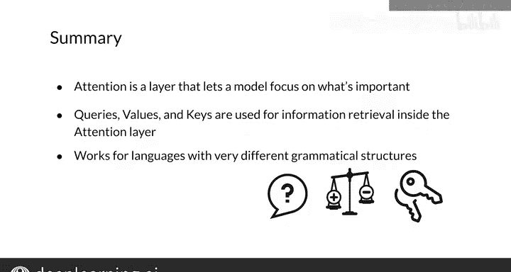

#  144：查询、键、值与注意力 🧠

在本节课中，我们将学习注意力机制中的核心概念：查询、键和值。我们将了解它们如何从信息检索的概念中衍生出来，并构成一种高效且强大的注意力形式。这种注意力是现代Transformer模型的基础，也是本周作业中你将使用的关键组件。

## 从信息检索到注意力 🔍

上一节我们介绍了注意力机制的基本思想。本节中，我们来看看一种基于信息检索理念的注意力形式。

查询、键和值是你在本视频中将用于注意力的术语。我将为你定义它们，并展示它们如何被使用。

原始的注意力论文发表于2014年。自那以后，出现了多种注意力的变体，其中一些模型不依赖于循环神经网络。例如，2017年的论文《Attention Is All You Need》引入了Transformer模型，以及一种基于信息检索、使用查询、键和值的注意力形式。这是一种高效且强大的注意力形式，你将在本周的作业中使用它。

## 查询、键与值的概念 📚

在概念上，你可以将键和值视为一个查找表。查询与一个键相匹配，然后返回与该键关联的值。

例如，如果我们在法语和英语之间进行翻译，查询“well”与键“time”匹配，因此我们希望获得“time”对应的值。

在实践中，查询、键和值都由向量表示，例如嵌入向量。因此，你不会得到精确的匹配，但模型可以学习源语言和目标语言之间哪些词最相似。

## 注意力计算过程 ⚙️

上一节我们了解了查询、键和值的概念。本节中，我们来看看它们如何通过数学计算生成注意力向量。

词之间的相似性被称为对齐。键向量用于计算对齐分数，这些分数衡量查询与键的匹配程度。然后，这些对齐分数被转换为权重，用于对值向量进行加权求和。这个值向量的加权和作为注意力向量返回。

这个过程可以使用缩放点积注意力来执行。每个步骤的查询被打包成一个矩阵 **Q**，因此可以同时为每个查询计算注意力。键和值也被打包成矩阵 **K** 和 **V**。这些矩阵是注意力函数的输入，如左侧图表和右侧数学公式所示。

首先，查询矩阵和键矩阵相乘，得到对齐分数矩阵。然后，这些分数通过键向量维度 **d_k** 的平方根进行缩放。这种缩放提高了较大模型尺寸下的模型性能，可被视为一种正则化常数。

接下来，使用softmax函数将缩放后的分数转换为权重，使得每个查询的权重之和为一。最后，权重矩阵与值矩阵相乘，得到每个查询的注意力向量。

你可以将键和值视为相同。因此，当你将softmax输出与 **V** 相乘时，你是在对初始输入进行线性组合，然后将其馈送到解码器。

与原始的注意力形式不同，缩放点积注意力仅包含两次矩阵乘法，而不包含神经网络。由于矩阵乘法在现代深度学习框架中得到了高度优化，这种形式的注意力计算速度要快得多。但这也意味着源语言和目标语言之间的对齐必须在其他地方学习。

## 对齐的学习与应用 🌐

上一节我们介绍了注意力计算过程。本节中，我们深入探讨对齐的概念及其重要性。

通常，对齐在注意力层之前的输入嵌入或其他线性层中学习。对齐权重形成一个矩阵，其中行是查询（目标词），列是键（源词）。该矩阵中的每个条目都是对应查询-键对的权重。

具有相似含义的词对，例如“T”和“T”，将比不相关的词（如“T”和“time”）具有更大的权重。通过训练，模型学习哪些词具有相似的含义，并将该信息编码在查询和键向量中。

像这样学习对齐对于在具有不同语法结构的语言之间进行翻译是有益的。由于注意力同时查看整个输入和目标句子，并根据词对计算对齐，因此无论词序如何，权重都会被适当地分配。

以下是两个例句及其对齐关系的说明：

*   英语例句：The agreement on the European Economic Area was signed in August 1992.
*   法语例句：L’accord sur la zone économique européenne a été signé en août 1992.

你可以看到“zone”和“area”在不同的位置，但具有相同的含义。模型已经学会了适当地对齐它们，使得解码器能够专注于适当的输入词，尽管词序不同。

## 总结与预告 📝

本节课中我们一起学习了注意力机制中查询、键和值的核心概念。

我向你介绍了注意力层的目的。你看到了它与信息检索的关系。我还向你展示了它即使在结构非常不同的语言之间也能很好地工作。

在下一视频中，我将讨论神经机器翻译，并向你展示该系统的设置是什么样的。我将向你展示数据集是什么样的，以及预处理数据集所需的步骤。

你现在已经了解了键、查询和值是什么。这些很重要，因为如果你阅读研究论文，可能会遇到这些术语，并且你将理解它们。在下一个视频中，我将讨论机器翻译的设置。