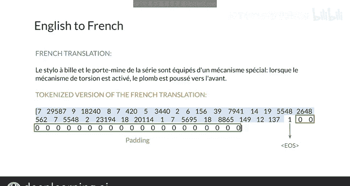

#  145：机器翻译的设置 🛠️


在本节课中，我们将学习神经网络机器翻译的基本设置。你将了解单词如何被表示，数据集的结构是怎样的，以及在实现系统时需要注意的关键事项。

---

## 单词表示与数据集结构

上一节我们介绍了机器翻译的基本概念，本节中我们来看看单词在神经网络机器翻译中是如何被表示的。

你将看到数据集的具体示例。在实现系统时，你需要跟踪几个关键事项，例如哪些单词对应哪些索引。

以下是输入数据的示例：

*   **英语序列**：`Im hungry.`
*   **对应法语翻译**：`J'ai faim.`

以及另一个示例：

*   **英语序列**：`I watched the soccer game.`
*   **对应法语翻译**：`J'ai regardé le match de football.`

你将拥有大量这样的输入对。需要知道的是，目前最先进的模型通常使用预训练的词向量。但在基础实现中，第一步是使用**独热编码**来表示单词。

通常，你需要维护两个字典来跟踪映射关系：

*   **word_to_index**：将单词映射到索引的字典。
*   **index_to_word**：将索引映射回单词的字典。

对于任何输入，你都需要将其转换为索引序列。反之，当模型做出预测后，你需要将索引序列转换回单词。

此外，你通常会使用一个**序列结束标记**，并用零填充你的标记向量，使其长度与批次中最长的序列匹配。

---

## 数据预处理示例

现在，让我们通过一个具体例子来理解数据预处理的过程。

这是一个英语句子及其分词后的版本：

```
原始句子：Both groups are needed.
分词后索引：[4546, 234, 12, 345]
```

可以看到，单词“Both”对应的索引是4546。在初始分词之后，你需要添加序列结束标记。如下图所示，EOS标记的索引是1。

```
添加EOS后：[4546, 234, 12, 345, 1]
```

接着，用零填充该序列，使其长度与批次中最长的序列一致。

现在，我们来看这个句子的法语翻译及其分词版本：

```
法语翻译：Les deux groupes sont nécessaires.
分词后索引：[876, 54, 321, 65, 1, 0, 0, ...]
```



请注意，这里的索引1同样代表句子结束标记，其后也跟随着一系列用于填充的零。

---

## 总结与下一步

本节课中，我们一起学习了机器翻译的基本设置。你现在知道了如何表示单词、如何初始化模型以及如何构建数据集的结构。

掌握了这些知识后，你就可以开始训练你的模型了。在下一个视频中，我将向你展示具体如何进行操作。