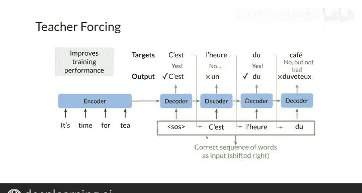

#  146：吴恩达《自然语言处理》P146 - 6. 教师强制 👨‍🏫

在本节课中，我们将要学习如何训练神经机器翻译系统。我们将重点介绍一个名为“教师强制”的核心概念，并探讨其优势。

---

## 概述


神经机器翻译模型通过编码器-解码器架构工作。训练这类模型时，一个关键的挑战在于如何有效地引导解码器生成正确的序列。本节将详细解释“教师强制”技术，它通过使用真实的目标词作为解码器的输入，而非模型自身的预测输出，来显著提升训练效率和模型稳定性。

---

## 训练神经机器翻译模型

上一节我们介绍了神经机器翻译的基本架构。本节中，我们来看看如何具体训练这个模型。

在训练过程中，一个直观的想法是将解码器每一步的输出序列与真实的目标序列进行比较，以计算损失。具体而言，我们会计算每一步的交叉熵损失，然后将所有步骤的损失相加，得到总损失。

**公式：总损失 = Σ 交叉熵损失(解码器输出ᵢ, 目标词ᵢ)**

然而，在实践中，这种方法在训练初期效果不佳。

---

## 训练初期的问题

问题在于，在训练的早期阶段，模型非常“幼稚”。它可能在序列的一开始就做出错误的预测。这个错误会像滚雪球一样累积，因为模型会将错误的输出作为下一步的输入，导致生成的序列与目标序列的偏差越来越大。

幻灯片中的例子说明了这个问题：模型可能将“team”（团队）错误地翻译成一个与“fluffy”（毛茸茸的）相似的词，而这两个词的含义天差地别。

---

## 教师强制：解决方案

为了避免上述问题，我们可以使用一种名为“教师强制”的技术。其核心思想是：在训练解码器时，不使用它上一步的预测输出作为当前步的输入，而是直接使用真实的目标词（即“地面真实值”）作为输入。

**代码示意（伪代码）：**
```
# 非教师强制（标准方式）
decoder_input = previous_decoder_output

# 教师强制
decoder_input = true_target_word_from_previous_step
```

这样，即使模型在某一步做出了错误的预测，在下一步的训练中，它仍然会接收到正确的输入信息。这防止了错误在序列中传播，使得训练过程更加稳定和高效。

---

## 教师强制的优势与变体

教师强制技术能极大地加快训练速度。它就像一个老师在手把手地纠正学生的每一步错误，确保学习方向正确。

这种方法还有一些变体。例如，可以采用“课程学习”策略：在训练初期完全使用教师强制，随着模型能力提升，逐渐减少使用真实目标词的频率，并增加使用模型自身预测输出的比例，让模型慢慢学会独立生成序列。

以下是教师强制的主要优势列表：

*   **训练更稳定**：防止错误累积，模型收敛更快。
*   **效率更高**：减少了需要训练至收敛的迭代次数。
*   **学习更准确**：为解码器提供了清晰、正确的学习信号。

---

## 总结



本节课中，我们一起学习了神经机器翻译模型训练中的一个重要技术——教师强制。我们首先指出了在训练初期直接使用模型预测作为后续输入会导致错误传播的问题。接着，我们深入探讨了教师强制的工作原理，即使用真实的目标序列词来指导解码器的每一步训练，从而显著提升训练效率和模型性能。最后，我们还简要介绍了其变体“课程学习”。掌握教师强制技术，将为训练更强大的序列生成模型提供有力工具。