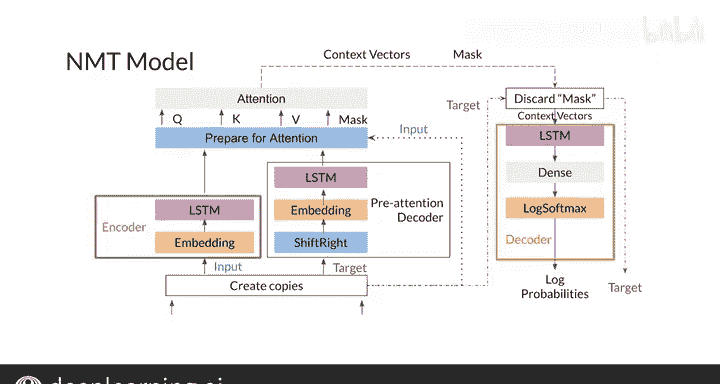

#  147：带注意力的神经机器翻译模型 🧠➡️🗣️


在本节课中，我们将学习如何从零开始构建一个带注意力机制的神经机器翻译模型。我们将详细拆解模型的每个组成部分，包括编码器、解码器以及注意力机制的工作原理，并了解它们是如何协同工作来完成翻译任务的。

---

## 模型架构概述

上一节我们介绍了神经机器翻译的基本概念，本节中我们来看看一个具体的、可实现的模型架构。这个模型与你之前见过的类似，包含三个核心部分：

*   **编码器**：处理输入的源语言序列。
*   **解码器**：负责生成目标语言的翻译。
*   **注意力机制**：帮助解码器在生成每个词时，聚焦于输入序列中相关的部分。

回忆一下，解码器需要将其隐藏状态传递给注意力机制以获取上下文向量。为了更清晰地实现这一流程，我们将使用两个解码器：一个**注意力前解码器**用于提供隐藏状态（作为查询），一个**注意力后解码器**用于接收上下文向量并最终生成翻译。

修改后的模型概览如下：
1.  编码器和注意力前解码器分别接收输入序列和目标序列。
2.  注意力前解码器中的目标序列会**向右移位**，这是实现“教师强迫”训练技巧的方式。
3.  从编码器和注意力前解码器中，我们获取每一步的隐藏状态，并将它们作为注意力机制的输入。其中，编码器的隐藏状态作为**键**和**值**，解码器的隐藏状态作为**查询**。
4.  注意力机制利用这些值计算**上下文向量**。
5.  最后，注意力后解码器使用这些上下文向量作为输入，来预测输出序列。

---

## 模型组件详解

现在，让我们更仔细地审视模型的每一个环节。

### 输入准备

第一步是创建输入标记和目标标记的两个副本，因为它们在模型的不同位置都会被用到。
*   一个输入标记的副本送入**编码器**，被转换为后续用作键和值的向量。
*   一个目标标记的副本送入**注意力前解码器**。

> 注意：编码器和注意力前解码器的计算可以**并行**进行，因为它们彼此不依赖。

### 注意力前解码器与移位

在注意力前解码器内部，我们需要对目标序列进行预处理：
*   将序列中的每个标记**向右移动一位**。
*   在序列开头添加一个**句子起始标记**。

这样做的目的是，在训练时（使用教师强迫），让解码器在预测第 `t` 个词时，使用第 `t-1` 个真实词作为输入。

### 嵌入与LSTM层

在编码器和注意力前解码器中，输入和目标标记在进入LSTM层之前，会先经过一个**嵌入层**。嵌入层将离散的标记转换为连续的向量表示。

```python
# 伪代码示例：嵌入与LSTM
embedded_input = EmbeddingLayer(input_tokens)
hidden_states, final_state = LSTM(embedded_input)
```

### 准备注意力层的输入

获得查询、键和值向量后，需要为注意力层做准备。这里需要使用输入标记的副本来创建一个**填充掩码**。这个掩码帮助注意力层识别并忽略输入序列中的填充符，确保模型只关注实际内容。

### 注意力层

现在，一切准备就绪，可以进入核心的注意力计算。我们将查询、键、值以及掩码传递给注意力层。

```python
# 伪代码示例：缩放点积注意力
context_vector, attention_weights = ScaledDotProductAttention(queries, keys, values, mask)
```

注意力层输出两个结果：
1.  **上下文向量**：包含了当前解码步骤应关注的输入信息。
2.  **更新后的掩码**。

### 注意力后解码器与输出

在进入最终的解码器之前，我们丢弃掩码。然后，将上下文向量传递给**注意力后解码器**。该解码器通常由一个LSTM层、一个全连接层和一个Log Softmax层组成。

```python
# 伪代码示例：注意力后解码
decoder_output = LSTM(context_vector)
logits = DenseLayer(decoder_output)
log_probs = LogSoftmax(logits)
```

最终，模型返回每个目标词位置的**对数概率**，以及在最初准备阶段创建的目标标记副本。

---



## 总结

本节课中，我们一起学习了构建一个带注意力机制的神经机器翻译模型的完整流程。我们从模型总览开始，逐步深入了解了编码器、双解码器设计、序列移位、嵌入、LSTM以及注意力机制的具体作用与数据流向。这个架构清晰地展示了如何将输入序列的信息，通过注意力机制动态地引导翻译的生成过程。

你现已掌握了NMT实现的基本框架。如果仍有部分细节不甚清晰，也无需担心，本周的编程练习将提供更具体的实践机会。在下一视频中，我们将讨论如何评估你的翻译系统。