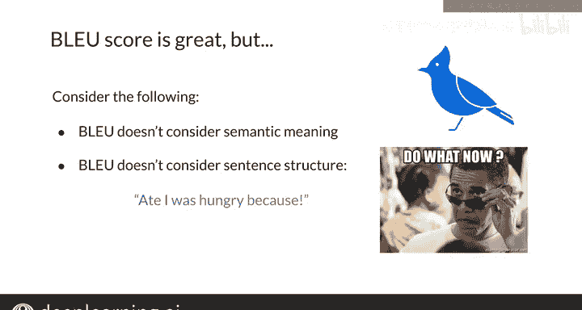

#  148：BLEU分数评估法 🎯

在本节课中，我们将学习如何评估机器翻译模型的质量。我们将重点介绍一个专门为此任务设计的核心评估指标——BLEU分数，并探讨其工作原理、计算方法以及需要注意的局限性。

---

## 模型评估的重要性

在构建并训练好模型之后，评估其机器翻译的性能至关重要。为此，研究者们设计了一些专门的评估指标。本节课程将向您展示BLEU分数，以及它在评估机器翻译模型时存在的一些问题。

## 什么是BLEU分数？ 🤔

BLEU（双语评估替补，Bilingual Evaluation Understudy）是一种专门为评估自然语言处理中最具挑战性的任务（包括机器翻译）而设计的算法。它通过将机器翻译的候选文本与一个或多个参考翻译（通常是人工翻译）进行比较，来评估机器翻译文本的质量。**BLEU分数越接近1，表示模型越好；越接近0，则越差。**

那么，BLEU分数具体是什么？它为何如此重要？

## 如何计算BLEU分数？ 🧮

要获得BLEU分数，需要计算候选翻译的精确度，方法是将候选翻译的n-gram与参考翻译进行比较。为了演示，我们以一元语法（unigram）为例。

假设您的模型生成了一个候选翻译序列：`I I M I`。
同时，您有两个参考翻译：
1.  `Yuunice said I am hungry`
2.  `he said I am hungry`

计算基础BLEU分数的方法是：统计候选翻译中有多少个单词出现在任意一个参考翻译中，然后将这个计数除以候选翻译的总单词数。这可以看作是一种精确度指标。

以下是计算过程：
1.  遍历候选翻译的所有单词。第一个单词是 `I`，它出现在两个参考翻译中，因此计数加1。
2.  下一个单词又是 `I`，已知它出现在两个参考翻译中，计数再加1。
3.  接着是单词 `M`，它也出现在两个参考翻译中，计数加1。
4.  最后又是单词 `I`，出现在参考翻译中，计数再加1。

最终，将总计数（4）除以候选翻译的单词数（4），得到BLEU分数为1。

这很奇怪，对吧？一个与参考翻译相差甚远的翻译竟然得到了满分。使用这种基础的BLEU分数，一个总是输出常见单词的模型会表现得“很好”。

## 改进的BLEU分数计算法

接下来，我们尝试一个改进版本，它能更好地估计模型的性能。

在改进版的BLEU分数计算中，当您在参考翻译中找到一个与候选词匹配的单词后，在后续匹配中，该单词在参考翻译中将不再被考虑。换句话说，**参考翻译中的单词在被匹配后会被“消耗”掉**。

让我们从头开始计算：
1.  候选翻译的第一个单词是 `I`，它出现在两个参考翻译中。计数加1，并将两个参考翻译中的 `I` 单词标记为已消耗。
2.  下一个候选单词又是 `I`，但由于参考翻译中的 `I` 已被上一个匹配消耗，现在参考翻译中没有可匹配的 `I` 了，因此计数不变。
3.  接着是单词 `M`，它出现在参考翻译中。计数加1，并消耗掉参考翻译中的 `M`。
4.  最后一个候选单词是 `I`，参考翻译中已无剩余的 `I` 可供匹配，因此计数不变。

最终，计数为2，除以候选翻译总单词数4，得到BLEU分数为 `2/4 = 0.5`。

正如您所注意到的，这个版本的BLEU分数比基础版本更合理。

## BLEU分数的局限性 ⚠️

然而，就像生活中的任何事情一样，使用BLEU分数作为评估指标也存在一些需要注意的地方。

首先，**它不考虑单词的语义**。其次，**它也不考虑句子的结构**。想象一下得到这样一个翻译：`A I was hungry, because.` 如果参考句子是 `I ate because I was hungry`，按照BLEU的计算方式，这可能得到一个很高的分数。

BLEU分数是机器翻译领域应用最广泛的评估指标，但在使用它之前，您应该了解这些缺点。

---

## 总结

本节课中，我们一起学习了如何使用BLEU分数来评估您的机器翻译模型。我也向您展示了这个指标存在的一些问题，因为它不关心语义和句子结构。在接下来的视频中，您将看到另一个用于机器翻译的评估指标，那个指标或许能更好地估计您模型的性能。