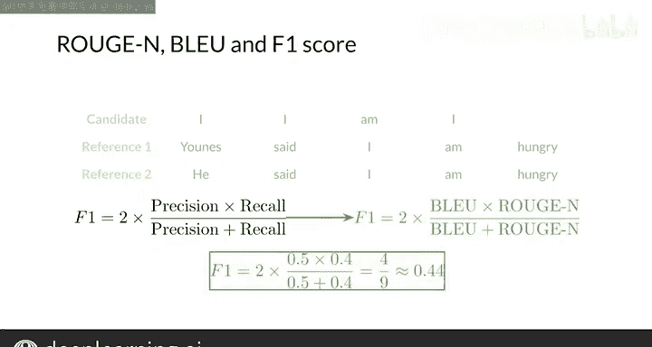

#  149：ROUGE-N 分数 🧮

在本节课中，我们将学习 ROUGE 分数，这是另一种用于评估机器翻译系统性能的指标。我们将重点介绍 ROUGE-N 分数的计算方法，并将其与之前学过的 BLEU 分数进行对比，最后探讨如何结合两者得到一个更全面的评估指标。

---

上一节我们介绍了 BLEU 分数及其修正版本，并指出了它因忽略语义和句子结构而存在的一些缺点。本节中，我们来看看 ROUGE 分数。

现在我将向你介绍一个名为 ROUGE 的指标家族。ROUGE 代表“面向召回率的摘要评估研究”，这个名字很长，但直接表明它默认更侧重于召回率。这意味着 ROUGE 关注的是人工创建的参考译文中，有多少内容出现在了候选翻译中。相比之下，BLEU 更侧重于精确率，因为它需要计算候选翻译中有多少词出现在参考译文中。ROUGE 最初是为评估机器摘要文本质量而开发的，但对于评估机器翻译质量也很有帮助。它的工作原理是将机器生成的候选翻译与人工提供的参考翻译进行比较。

ROUGE 分数有很多版本，这里我将向你展示名为 ROUGE-N 的版本。

对于 ROUGE-N 分数，你需要计算候选翻译与参考翻译之间 N 元语法（N-gram）的重叠次数，这与计算 BLEU 分数的过程有些相似。

为了看清这两个指标的区别，我将通过一个例子展示 ROUGE-N 如何基于一元语法（unigram）进行计算。

以下是计算仅基于召回率的基本版 ROUGE-N 分数的步骤：

1.  计算参考译文与候选译文之间匹配的单词数量。
2.  将该匹配数量除以参考译文的总单词数。
3.  如果你有多个参考译文，则需要用每个参考译文分别计算一个 ROUGE-N 分数，然后取其中的最大值。

现在，让我们通过之前为 BLEU 分数看过的例子来走一遍流程。

你的候选翻译包含单词 “I” 两次、单词 “am” 一次和单词 “I” 又一次，总共四个单词。你还有一个参考译文 “Eunice said I am hungry”，以及另一个略有不同的参考译文 “He said I am hungry”。每个参考译文总共有五个单词。

你需要计算参考译文与候选翻译之间的匹配次数，类似于为 BLEU 分数所做的操作。让我们从第一个参考译文开始。

单词 “Eunice” 与候选翻译中的任何一元语法都不匹配，因此计数不增加。单词 “said” 也不匹配候选翻译中的任何单词。单词 “I” 有多个匹配项，但你只需要第一个匹配项。对于这个匹配，你只给计数加一。单词 “am” 在候选翻译中有一个匹配项，因此增加你的计数。现在，第一个参考译文的最后一个单词 “hungry” 与候选翻译中的任何单词都不匹配，所以你的计数不增加。

如果你对第二个参考译文重复此过程，会得到计数等于 2。

最后，你将计数除以每个参考译文的单词数，并取最大值。对于这个例子，最大值等于 0.4。

这个基本版本的 ROUGE-N 分数是基于召回率的，而你在之前课程中看到的 BLEU 分数是基于精确率的。

但为什么不将两者结合起来得到一个像 F1 分数那样的指标呢？

回想一下你在机器学习入门课程中学到的，F1 分数由以下公式给出：

`F1 = 2 * (精确率 * 召回率) / (精确率 + 召回率)`

如果你用修正版的 BLEU 分数替换精确率，用 ROUGE-N 分数替换召回率，就会得到以下公式。对于这个例子，你有一个 BLEU 分数等于 0.5（这是之前课程中得到的），还有一个之前计算出的 ROUGE-N 分数等于 0.4。利用这些值，你将得到一个 F1 分数等于 4/9，约等于 0.44。

你现在已经看到了如何计算修正版 BLEU 分数和简单的 ROUGE-N 分数来评估你的模型。你可以将这些指标视作精确率和召回率。因此，你可以同时使用两者来得到一个 F1 分数，这可能更好地评估你的机器翻译模型的性能。在许多应用中，你会看到同时报告 F 分数以及 BLEU 和 ROUGE-N 指标。

然而，你必须注意，到目前为止你看到的所有评估指标都没有考虑句子结构和语义，它们只计算候选翻译和参考译文之间匹配的 N 元语法。

---

本节课中，我们一起学习了 ROUGE-N 分数的概念和计算方法。我们了解到 ROUGE 指标更侧重于召回率，与侧重精确率的 BLEU 指标形成互补。通过将两者结合为 F1 分数，我们可以获得一个更平衡的模型性能评估视角。但请记住，这些基于 N 元语法匹配的指标仍有其局限性，它们无法捕捉语言的深层语义和结构信息。