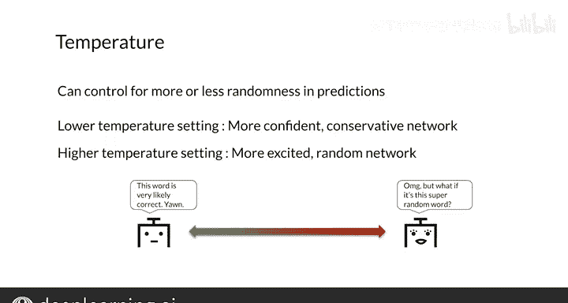

#  150：采样与解码 🧠


在本节课中，我们将学习两种从序列模型（如机器翻译模型）的预测结果中构建完整句子的方法：贪婪解码和随机采样。我们还将探讨一个控制采样随机性的重要超参数——温度。

---

## 模型输出回顾

上一节我们介绍了序列模型的基本结构。现在，我们来看看如何从模型的预测中生成最终的句子序列。

首先，快速回顾一下模型的输出过程。解码器每一步的输出会经过一个全连接层和一个Softmax（或Log Softmax）操作。因此，每一步的输出都是目标词汇表中所有单词和符号的一个**概率分布**。

模型的最终输出取决于你如何利用每一步的这个概率分布来选择单词。

---

## 贪婪解码 🔍

贪婪解码是最简单的解码方法。它在每一步都选择**概率最高的单词**作为输出。

以下是其核心逻辑的伪代码表示：
```python
output_sequence = []
for step in decoding_steps:
    # 获取当前步所有单词的概率分布
    prob_distribution = model.predict(current_state)
    # 选择概率最高的单词
    chosen_word = argmax(prob_distribution)
    output_sequence.append(chosen_word)
```

然而，这种方法存在局限性。虽然每一步都选择了局部最优（概率最高）的单词，但这**不一定能生成全局最优的句子序列**。

例如，模型可能会输出“I am M M M …”这样重复的序列，而不是正确的“I am hungry”。对于短序列，贪婪解码可能表现尚可。但当需要考虑后续多个单词时，仅关注当前步的最高概率可能会导致整体结果不佳。

---

## 随机采样 🎲

为了解决贪婪解码的局限性，我们可以采用随机采样。这种方法不是简单地选取最高概率词，而是**根据概率分布进行随机抽样**来选择下一个词。

随机采样的核心思想是：每个词被选中的机会与其概率成正比。这能带来更多样化的输出。

但纯粹的随机采样可能**过于随机**，导致输出不连贯或毫无意义。一个改进方法是，在抽样时给予高概率词更高的权重，同时降低低概率词被选中的机会。

---

## 温度参数 🌡️

在采样过程中，**温度**是一个关键的超参数，用于控制输出的随机性程度。温度值通常在0到1之间。

*   **低温度（接近0）**：降低随机性。模型会更“自信”地选择高概率词，输出更确定、更保守，但也可能更乏味。
*   **高温度（接近1）**：增加随机性。概率分布被“平滑”，低概率词有更多机会被选中。输出会更富有创造性、更多样，但也可能包含更多错误或不合理之处。

你可以将温度理解为调整模型“冒险精神”的旋钮。需要可靠、安全的输出时，调低温度；需要创意或多样化结果时，调高温度。

温度调整的公式通常如下（对Softmax前的logits进行操作）：
```
scaled_logits = logits / temperature
probabilities = softmax(scaled_logits)
```

---

## 本节总结



本节课我们一起学习了两种从序列模型生成文本的方法：

1.  **贪婪解码**：每一步选择概率最高的词。方法简单直接，但可能无法得到整体最优的序列。
2.  **随机采样**：根据概率分布随机选择下一个词。能产生更多样化的输出，但可能过于随机。

我们还介绍了**温度**这个重要参数，它像是一个控制采样随机性程度的“调温器”，帮助我们在输出的“保守确定性”和“创意随机性”之间取得平衡。

然而，这两种基础方法有时产生的输出可能不够理想或过于随机。在接下来的课程中，我们将学习两种更高级的采样与解码策略（如集束搜索），它们通常能产生质量更高的结果。