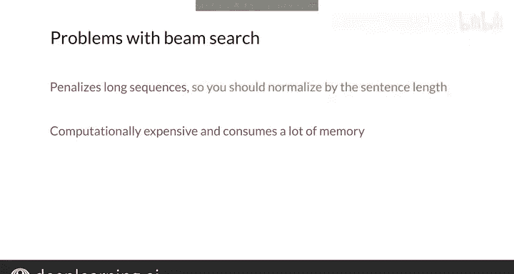

#  151：束搜索 (Beam Search) 🔍

在本节课中，我们将学习一种在序列生成任务（如机器翻译）中，用于寻找更优输出序列的算法——束搜索。我们将了解为什么简单的“贪心”方法可能不够好，以及束搜索如何通过考虑多个候选序列来改进结果。

---

## 概述

之前介绍的方法（如贪心解码）在生成序列时，每一步只选择当前概率最高的词。这种方法可能无法得到整体概率最高的完整句子。束搜索通过在每个时间步保留多个（B个）最有可能的序列候选，来寻找更好的输出序列。

## 为什么需要束搜索？

直接在每个时间步选择概率最高的词（贪心解码）并不理想。因为**整体概率最高的翻译序列，并不一定由每一步概率最高的词组成**。例如，序列开头的选择可能会影响后续生成，导致最终结果不佳。

理论上，如果有无限的计算能力，可以计算所有可能输出句子的概率并选择最佳的一个。但在现实中，我们使用束搜索来近似这个目标。

## 束搜索的工作原理

束搜索试图通过在每个时间步基于条件概率保留一定数量的最佳序列，来找到最可能的输出句子。这个数量由**束宽**参数控制。

为了避免计算所有可能序列的概率，我们引入参数 **B**（束宽）。在每一步，只保留 **B** 个概率最高的序列，丢弃其他所有序列。生成过程持续进行，直到所有 **B** 个最可能的句子都以句子结束标记结尾。

> **有趣的事实**：贪心解码是束搜索的一个特例，即束宽 **B = 1**。

### 束搜索步骤示例

为了说明这个方法，我们假设一个小词汇表，包含词语：`I`, `am`, `hungry`, `<EOS>`（句子结束标记）。并设束宽 **B = 2**。

与其他方法一样，束搜索以句子开始标记 `<SOS>` 开始。

1.  **第一步**：模型输出第一个词的概率分布。假设：
    *   `I` 的概率是 0.5
    *   `am` 的概率是 0.4
    *   `hungry` 的概率是 0.1
    *   `<EOS>` 的概率是 0.0

    由于束宽为2，我们保留两个最高概率的词：`I` 和 `am`。此时有两个候选序列：`[I]` 和 `[am]`。

2.  **第二步**：对于上一步保留的每个序列，计算所有可能下一个词的条件概率。
    *   给定序列 `[I]`，模型返回：
        *   `am` 的概率是 0.5
        *   `hungry` 的概率是 0.3
    *   给定序列 `[am]`，模型返回：
        *   `I` 的概率是 0.7
        *   `hungry` 的概率是 0.2

    接下来，计算完整序列的联合概率（将上一步序列的概率与当前条件概率相乘）：
    *   序列 `[I, am]` 的概率：`0.5 * 0.5 = 0.25`
    *   序列 `[I, hungry]` 的概率：`0.5 * 0.3 = 0.15`
    *   序列 `[am, I]` 的概率：`0.4 * 0.7 = 0.28`
    *   序列 `[am, hungry]` 的概率：`0.4 * 0.2 = 0.08`

    在第二步结束时，我们有四个可能的序列。但由于束宽 B=2，我们只保留概率最高的两个序列：`[am, I]` (0.28) 和 `[I, am]` (0.25)。丢弃 `[I, hungry]` 和 `[am, hungry]`。

3.  **后续步骤**：对保留的序列 `[am, I]` 和 `[I, am]` 重复上述过程。使用 `I` 作为 `[am, I]` 的输入，使用 `am` 作为 `[I, am]` 的输入，获取下一个词的条件概率，计算新的联合概率，并再次选择最好的两个序列。

这个过程持续进行，直到模型为所有 **B** 个最可能的序列预测出句子结束标记 `<EOS>`。最终，选择概率最大的序列作为输出。

## 模型如何参与束搜索？

要获得每一步的条件概率，必须使用你的序列生成模型。目前，我们主要关注模型的解码器部分。

*   在序列开始时，使用解码器输出词汇表中每个词的概率向量。这相当于计算给定 `<SOS>` 标记后每个词的条件概率。
*   然后，从模型输出中选择概率最高的 **B** 个词，丢弃其他可能性。
*   之后，对于上一步保留的每个序列，都需要运行模型一次，以计算给定该序列条件下，词汇表中所有词的条件概率。
*   接着计算新序列的联合概率，并保留 **B** 个最可能的序列。
*   重复此过程，直到所有 **B** 个最可能的序列都生成 `<EOS>` 标记。

> **注意**：在第一步之后（此时序列不只包含 `<SOS>` 标记），每一步都需要运行模型 **B** 次。

## 束搜索的优缺点

基础的束搜索版本有一些缺点。

*   **对长序列的惩罚**：序列的概率是多个条件概率的乘积。更长的序列会乘上更多的概率值（均小于1），因此其联合概率天然倾向于更小。为了避免这个问题，可以对每个序列的概率按其词数进行归一化（例如，使用平均对数概率）。
*   **计算与内存成本**：束搜索需要存储 **B** 个最可能的序列，并为每个序列计算条件概率。因此，当束宽 **B** 较大时，该方法计算成本较高且消耗大量内存。

## 总结

本节课我们一起学习了束搜索算法。它是一种通过在每个生成步骤保留多个候选序列，来寻找整体更优输出序列的搜索技术。我们了解了其工作原理、具体步骤、如何与模型结合使用，以及它的优缺点。束搜索是序列生成任务中一个经典且强大的工具。

---

现在你掌握了一个可以加入工具箱的新工具。束搜索已被广泛使用了相当长的时间，并且至今仍被大量使用。在下一个视频中，我将向你介绍另一种可以使用的技术——基于最小风险训练。