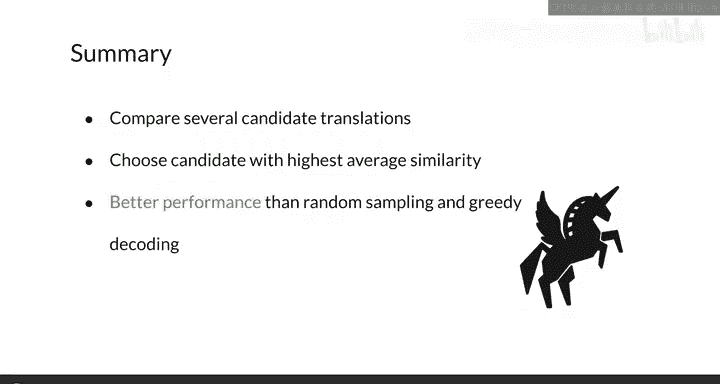

#  152：最小贝叶斯风险解码 🎯

在本节课中，我们将学习评估神经翻译系统的最后一种技术——最小贝叶斯风险解码。这是一种简单但效果出色的方法，尤其在与随机采样等技术对比时表现优异。

## 从随机采样到改进思路 🔄

上一节我们介绍了随机采样解码方法及其存在的问题。本节中，我们来看看如何通过一个简单的扩展来显著提升解码质量。

如果我们在随机采样的基础上更进一步，例如生成30个样本并让它们相互比较，解码效果将得到明显改善。

## 最小贝叶斯风险解码核心概念 🧠

最小贝叶斯风险解码需要比较多个候选翻译。其实现相当直接：
1.  首先生成多个随机样本。
2.  然后使用相似度分数或损失函数比较每对样本。Rouge分数是一个不错的选择。
3.  最后选择具有最高平均相似度或最低损失的样本。

通过此方法得到的翻译最接近所有候选翻译。一些作者认为，这个过程可以看作是在所有候选翻译之间寻找共识。

## 核心公式与目标 🎯

如果决定使用Rouge分数作为比较每对候选翻译的相似度度量，MR可以总结为以下公式：

**目标：找到候选翻译 E，使其与所有其他候选翻译 E‘ 的平均Rouge分数最大化。**

## 实现步骤详解 ⚙️

MR相对容易实现，你需要准备多个候选翻译并选择一种比较方式。为了清晰起见，让我们更详细地了解一个实现过程。

以下是在一组四个候选翻译上使用Rouge实现MR的步骤：

1.  计算第一个候选翻译 C₁ 与第二个候选翻译 C₂ 之间的Rouge分数。
2.  计算 C₁ 与第三个候选翻译 C₃ 的Rouge分数。
3.  计算 C₁ 与第四个候选翻译 C₄ 的Rouge分数。
4.  使用这三个Rouge分数计算平均Rouge分数 R₁。
5.  对集合中的其他三个候选翻译重复此过程，计算各自的平均Rouge分数。
6.  最后，选择具有最高平均Rouge分数的候选翻译。

## 方法总结与展望 📚

本节课中，我们一起学习了最小贝叶斯风险解码。MR方法获取多个翻译候选，让它们相互比较，然后选择平均相似度最高的一个。与束搜索类似，此方法能提供比随机采样和贪婪解码更符合上下文的准确翻译。

恭喜完成本周学习！你现在已经知道如何实现神经机器翻译系统以及如何评估它。下周，我将介绍一种最先进的模型——Transformer，它同样采用编码器-解码器架构。