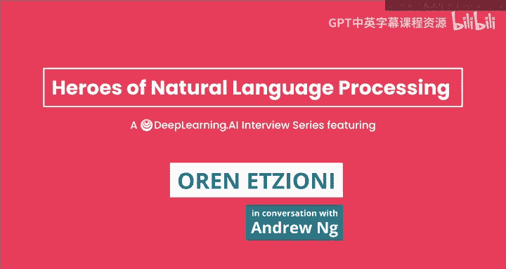
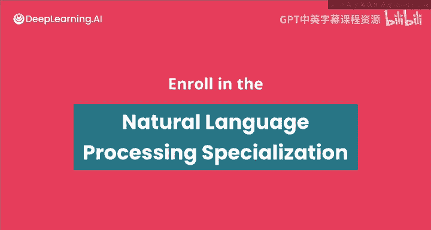

#  154：吴恩达《自然语言处理》P154 - 与Oren Etzioni的对话 🎙️



## 概述

在本节课中，我们将跟随吴恩达（Andrew Ng）与自然语言处理领域的知名人物奥伦·埃齐奥尼（Oren Etzioni）的对话，了解他进入AI领域的个人故事、在信息抽取方面的开创性工作、他领导的艾伦人工智能研究所（AI2）的使命，以及他对NLP技术发展、创业、学术与工业界选择、AI监管和职业发展的深刻见解。

***

## 奥伦·埃齐奥尼的AI之路 🚀

上一节我们介绍了本次对话的嘉宾。本节中，我们来看看奥伦·埃齐奥尼是如何开启他的AI生涯的。

奥伦·埃齐奥尼在高中时阅读了《哥德尔、埃舍尔、巴赫》一书，这让他对“智能的本质是什么”以及“如何构建具有类人能力的智能机器”这类基础科学问题产生了浓厚兴趣。这成为了他进入AI领域的起点。

在进入大学前，他开始学习Lisp编程语言，并发现编写Lisp代码充满乐趣。进入哈佛大学后，他决定学习计算机科学，认为这是通往AI的道路。

***

## 开放信息抽取的开创性工作 💡

上一节我们了解了奥伦进入AI领域的契机。本节中，我们来看看他在信息抽取领域的先驱性工作。

信息抽取旨在将句子映射为更结构化的信息。例如，将句子“Google acquired YouTube”映射为一个数据库元组：`(acquisition, Google, YouTube)`。

早期的信息抽取研究范围非常狭窄，通常只针对特定类型的事件（如并购、恐怖袭击）。奥伦的团队提出了“开放信息抽取”的想法，目标是**从网络上的任何句子中提取信息**，从而将海量的网络文本转化为一个强大而全面的知识库。

为了实现这个目标，他们必须极大地推广当时的技术。传统的信息抽取是机器学习技术，但需要针对特定关系（如“收购”、“研讨会地点”）的大量标注训练样本。而自然语言中可能表达数十万种不同的谓词关系，这需要海量的标注数据。

他们通过创建一种更具**无监督**风味的新技术来解决这个问题。其核心洞察是：句子表达关系的方式存在某些**语言不变性**和规律性。例如，动词通常是关系类型的强指示器。

**公式/核心概念示例**：
*   **输入句子**: `Joe married Betty.`
*   **抽取的关系**: `(marry, Joe, Betty)`
*   **模式**: `[Subject] [Verb_indicating_relation] [Object].`

他们意识到，无论主题是什么，人们表达信息活动的方式都有某些固定的模式。这一发现在多种语言中都得到了验证，为学习算法提供了非常强的信号。

***

## AI for Common Good：语义学者与COVID-19开放研究数据集 🌍

上一节我们探讨了开放信息抽取的技术突破。本节中，我们转向奥伦目前的工作，看看AI如何用于公益。

艾伦人工智能研究所（AI2）的使命是“**AI for the common good**”（AI造福大众）。他们思考如何利用AI，特别是NLP，让世界变得更美好。“语义学者”（Semantic Scholar）项目便是为此而生。

科学出版物的数量呈指数级增长，形成了“**科学出版的摩尔定律**”。即使是最勤奋的研究者也无法阅读所有相关文献。“语义学者”旨在利用AI帮助科学家和公众筛选海量论文。

以下是“语义学者”利用AI提供帮助的几个方面：
*   **自动生成概要**：为论文生成单行总结（TL;DR），帮助用户快速判断是否值得深入阅读。
*   **自动提取图表**：使用计算机视觉技术从PDF中自动定位并提取图表和表格，方便快速浏览核心信息。

2020年3月，COVID-19疫情初期，白宫联系了AI2，希望他们能利用快速处理论文集合的工具，整理所有相关论文（包括已发表和预印本），并以机器可读的形式提供，供AI系统、信息检索和搜索引擎使用。

AI2迅速联合了陈·扎克伯格基金会、微软、乔治城大学等机构，创建了 **CORD-19（COVID-19开放研究数据集）**。该数据集包含了超过20万篇论文，并每日更新，旨在捕捉关于新冠病毒的快速增长的文献，以便更迅速地回答相关问题。

***

## 给NLP创业者的建议与数据洞察 💼

上一节我们看到了AI在应对全球挑战中的实际应用。本节中，我们听听奥伦对NLP创业者的建议。

奥伦基于他创立AI公司的经验指出，一个关键问题是：**你的数据从哪里来？** 这不仅仅是需要大量数据，通常还需要大量**标注**。

他建议创业者深入思考：我的数据集是什么？数据从哪里来？标签从哪里来？他以自己最成功的公司Farecast（一家预测机票价格波动的公司，后被微软收购）为例。该公司拥有**万亿级**的标注数据点。

他们是如何获得这么多标签的呢？因为数据是**时序数据**。如果在12月1日预测某航班票价一周后会涨，只需等待一周即可验证预测是否正确。**时间的流逝自动为数据生成了标签**。这种观察使他们能够标注万亿数据点，从而做出非常强大的预测。

这与当前NLP的成功有深刻联系。像ELMo、BERT、RoBERTa、GPT-3这样的语言模型之所以成功，也利用了语言的**内在顺序性**。它们通过预测被掩盖的词来进行训练，而**文本语料库本身也是自标注的**。

**代码/核心概念示例（简化版掩码语言建模）**：
```python
# 原始句子: "The cat sat on the mat."
# 掩码后句子: "The cat [MASK] on the mat."
# 模型任务: 预测[MASK]位置最可能的词（如“sat”）。
# 标签来源: 原始句子中对应的词“sat”即为标签。
```

***

## NLP的未来：模型规模、效率与绿色AI 🔮

上一节我们讨论了数据在AI中的核心地位。本节中，我们探讨NLP模型发展的未来趋势。

对于模型规模不断增大的趋势，奥伦承认自己曾预测其会趋于平缓，但事实证明他错了，因为性能仍在随规模提升。他认为，在性能出现显著平台期之前，模型规模和数据量可能会继续增长。

同时，任何计算机科学领域的发展规律通常是：先构建尽可能大的模型（某种程度上是“暴力”方法），然后再从各个角度进行优化，包括**数据效率、数据选择策略**以及**计算效率**。他认为我们将看到两者并行发展。

一个很好的类比是国际象棋程序：最初需要专用芯片和超级计算机，如今在笔记本电脑上就有更强的程序。这不仅是摩尔定律的功劳，也归功于更好的算法。与此同时，我们也扩展到了更复杂的游戏（如围棋）。

对于资源有限的研究者，奥伦指出，在**小型数据集**上仍有大量突破性研究可做。计算历史表明，昨天的超级计算机就是今天的智能手机。他希望这些惊人的巨型模型有一天也能在智能手表上运行。

艾伦人工智能研究所也在推动 **“绿色AI”** 研究，倡导在发布结果时考虑**成本**和**效率**。例如，用1000美元或仅10个训练样本能构建的最佳模型是什么？他们探讨 **“盒子里的NLP”** ，即仅用笔记本电脑或手机能获得的最佳NLP能力。这在隐私、网络连接或电池续航受限的场景下至关重要。

***

## 学术与工业界：如何选择职业道路 🧭

上一节我们展望了NLP技术的未来。本节中，我们转向个人职业发展，看看奥伦对选择学术或工业界道路的建议。

奥伦用了一个极客术语来回答：这取决于你试图**优化**什么。
*   如果你想优化**报酬**，或者追求一种像赛车或扑克游戏那样令人兴奋的肾上腺素激增的感觉，那么初创企业和私营部门自然具有吸引力。
*   如果你想最大化**自由**——提出自己问题的能力、不受干扰地深入思考基本智力问题的能力，那么学术界是无可替代的。

在他的职业生涯中，不同阶段侧重不同。在CMU读研究生时，他可以花数月时间深入钻研一个问题，这是学术上的亮点。而在创业时，组建团队、奋力拼搏、体验自己亲手打造的事物的过山车式旅程，则是另一种难以置信的感受。

***

## 关于AI监管与偏见问题的思考 ⚖️

上一节我们探讨了职业选择。本节中，我们进入一个更宏观且重要的话题：AI监管。

针对NLP模型从互联网文本中学习到不良偏见的问题，奥伦认为这是当前NLP领域一个非常棘手的问题。

他的核心观点是：**应监管具体应用，而非基础研究**。NLP是一项广泛的技术，容易产生偏见，但需要监管的是这种偏见在**特定应用**中的表现。

例如，如果构建的简历筛选应用表现出对男性优于女性的偏见，这显然是有问题的、非法的。应该对此类应用进行审计并禁止偏见出现。但他非常不希望基于这些观念去监管NLP的基础研究。

他强调了 **“审计权”** 的重要性。与其像欧盟某些提案那样要求模型提供“解释权”（这对于复杂的深度学习模型可能产生难以理解或不准确的解释），不如坚持**审计权**。监管机构或第三方（如ACLU、学术界）应有权访问模型，审计其行为，检查是否存在偏见。这样可以依靠思想市场和不同机构（如记者、非营利组织）之间的互动来相互制衡，这种局面更为稳健。

***

## 给NLP新手的职业建议 🎯

上一节我们讨论了AI治理的重要议题。在本节最后，我们听听奥伦给希望进入或深耕NLP领域的人的建议。

以下是奥伦给出的职业发展步骤：
1.  **打好基础**：确保掌握统计学、计算机科学和机器学习的基本原理。这是至关重要的，因为技术的“月度风味”（如当前的Transformer）变化很快，扎实的基础能让你适应变化。
2.  **利用在线课程**：在线课程极其成功、成本效益高且易于获取，是下一步学习的绝佳途径。
3.  **亲自动手实践**：在学习了课程之后，**没有比亲自实践更好的方法了**。选择一个真实的问题和一个数据集，自己动手做。你可能会发现你感兴趣的问题比你预期的更容易，或者你可能会发现某些概念理解得不够好，或者问题比看起来更难，这可能会引导你产生新的发明或想法。

***

## 总结



本节课中，我们一起学习了奥伦·埃齐奥尼的AI生涯历程，了解了他在开放信息抽取方面的开创性工作，以及他通过“语义学者”和CORD-19项目践行“AI for Common Good”的理念。我们还探讨了他对NLP创业（关注数据来源）、技术未来（规模与效率并存）、职业选择（明确优化目标）、AI监管（聚焦应用审计）以及给初学者的宝贵建议（夯实基础、利用课程、动手实践）。希望这些见解能激励和指导正在NLP道路上探索的学习者和从业者。