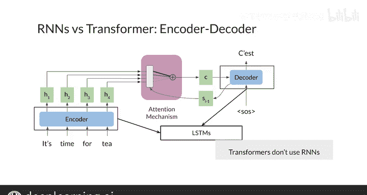

#  156：Transformer与RNN的比较 🧠

在本节课中，我们将学习Transformer模型。这是一个完全基于注意力机制的模型，由Google开发，旨在解决循环神经网络（RNN）存在的一些问题。首先，我们会了解RNN面临的具体挑战，从而理解为何需要Transformer模型。接着，我们将对Transformer模型进行一个具体的概述。

## RNN的局限性 ⏳

上一节我们介绍了课程目标，本节中我们来看看传统神经网络架构，特别是RNN，在机器翻译等任务中存在的问题。

在神经机器翻译中，通常使用RNN架构将一种语言（例如英语）翻译成另一种语言（例如法语）。使用RNN时，你必须按顺序步骤对输入进行编码。你需要从输入的开头开始，在每一步进行计算，直到处理完整个句子。此时，你才能开始遵循类似的顺序过程来解码信息。

正如这里所示，你必须按顺序处理输入中的每一个单词，从第一个词开始，然后是第二个词，一个接一个。翻译过程同样也是顺序进行的。因此，这种架构没有太多并行计算的空间。输入句子中的单词越多，处理该句子所需的时间就越长。

在一个更通用的序列到序列架构中，为了将信息从第一个单词传播到最后的输出，模型必须经过 **T** 个顺序步骤。其中，**T** 是一个整数，代表模型处理一个示例句子输入所需的时间步数。例如，如果你输入一个由五个单词组成的句子，那么模型将需要五个时间步来编码该句子，此时 **T = 5**。

正如本专项课程早期内容所回顾的，对于长序列，信息容易在网络中丢失，并且会出现梯度消失问题。LSTM和GRU在一定程度上缓解了这些问题，但即使是这些架构，在处理非常长的序列时，由于信息瓶颈的存在，其性能也会下降，正如我们在上周课程中所见。

总结一下，RNN架构存在信息丢失和梯度消失的问题。

## 注意力机制与Transformer的引入 💡

上一节我们探讨了RNN的瓶颈，本节中我们来看看注意力机制如何提供解决方案，并引出纯粹的注意力模型——Transformer。

在上一周的课程中，我们了解到在模型中引入注意力机制是解决这些问题的一种方法。你已经看到并实现了一个带有注意力机制的序列到序列架构，类似于此处描述的模型。回想一下，你的编码器和解码器依赖于LSTM，但你也可以使用GRU或普通的RNN。

相比之下，Transformer**仅依赖于注意力机制**，不需要使用循环网络。在Transformer中，注意力就是全部所需。当然，通常也会包含一些线性和非线性变换，但核心思想就是如此。

现在你理解了为什么RNN可能很慢，并且在处理长上下文时存在重大问题。这些正是Transformer可以发挥作用的情况。

以下是RNN与Transformer的核心对比：
*   **RNN**：处理依赖顺序计算，难以并行化，存在长程依赖问题。
*   **Transformer**：处理依赖**注意力机制**，易于并行化，能有效捕捉长程依赖。

## 总结 📝

本节课中我们一起学习了Transformer模型出现的背景。我们首先分析了基于RNN的序列模型在处理长序列时面临的主要挑战：**顺序计算导致的低效率**和**长程依赖导致的信息丢失/梯度消失**。接着，我们了解到注意力机制是解决这些问题的关键，而Transformer模型则完全摒弃了循环结构，**纯粹依靠注意力机制**来构建，为高效处理序列数据提供了新的强大工具。

接下来，我们将进入下一个视频，对Transformer模型进行更具体的概述。