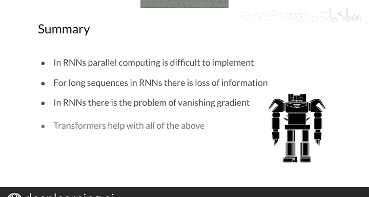

#  157：17_Transformer概述 🧠


在本节课中，我们将要学习Transformer模型的核心概念与整体架构。Transformer是当今大型语言模型的基石，理解其工作原理对于掌握现代自然语言处理技术至关重要。

## 概述

Transformer模型由Google研究人员于2017年提出，并迅速成为大型语言模型（如BERT、T5、GPT-3）的标准架构。它彻底改变了自然语言处理领域。其核心论文《Attention Is All You Need》是本课程后续所有模型的基础。本节将为您提供一个简要的架构概览，后续课程会深入每个组件。

## Transformer核心：缩放点积注意力

Transformer模型的核心是**缩放点积注意力**机制。该机制计算高效，仅由矩阵乘法操作构成。

**公式**：`Attention(Q, K, V) = softmax(QK^T / sqrt(d_k)) V`

其中，`Q`代表查询（Query），`K`代表键（Key），`V`代表值（Value），`d_k`是键向量的维度。这种机制允许模型在处理序列时，关注输入中不同部分的信息。

## 多头注意力层

在Transformer中，缩放点积注意力被扩展为**多头注意力层**。该层并行运行多个注意力机制，并对输入的查询、键和值进行多次线性变换。这些线性变换的参数是可学习的。

**代码描述**：
```python
# 伪代码示意
multihead_output = MultiHeadAttention(query, key, value, num_heads)
```

上一节我们介绍了核心的注意力机制，本节中我们来看看如何将其组合成更强大的模块。

## 编码器结构

Transformer编码器以多头注意力模块开始，该模块对输入序列执行**自注意力**操作，即序列中的每个词都会关注序列中的所有其他词。

以下是编码器一个层（Block）的主要组成部分：
*   一个多头注意力模块。
*   一个残差连接与层归一化步骤。
*   一个前馈神经网络层。
*   另一个残差连接与层归一化步骤。

整个编码器层会重复堆叠多次。通过自注意力层，编码器为每个输入词生成一个包含上下文信息的表示。

## 解码器结构

解码器的构造与编码器类似，也包含多头注意力模块、残差连接和归一化层。

以下是解码器的关键特点：
*   第一个注意力模块是**掩码多头注意力**，确保每个位置只能关注它之前的位置，防止信息向左流动（即防止看到“未来”的信息）。
*   第二个注意力模块接收编码器的输出，允许解码器关注输入序列中的所有项。
*   整个解码器层同样会重复堆叠多次。

## 位置编码

由于Transformer不使用循环神经网络（RNN），而词序对任何语言都至关重要，因此模型需要一种方法来理解单词在序列中的位置。这就是**位置编码**的作用。

位置编码可以是学习得到的，也可以是固定的。它的值会被加到词嵌入向量中，这样每个输入词都包含了其顺序位置的信息。

**公式示例（正弦位置编码）**：
`PE(pos, 2i) = sin(pos / 10000^(2i/d_model))`
`PE(pos, 2i+1) = cos(pos / 10000^(2i/d_model))`

## 完整架构与优势

将以上部分组合起来，就构成了完整的Transformer模型架构。

*   左侧，输入句子首先被嵌入，并加上位置编码，然后送入由多个编码器层堆叠而成的编码器。
*   右侧，解码器接收右移一位的目标输出句子以及编码器的输出。
*   解码器的输出通过一个线性层和Softmax激活函数，转化为输出词的概率分布。

与RNN模型相比，这种架构易于并行化，因此可以在多个GPU上进行更高效的训练。它也能扩展到越来越大的数据集上学习多项任务。

## 与RNN的对比

RNN因其顺序结构存在一些问题。对于RNN，很难充分利用并行计算的优势。对于长序列，重要信息可能会在网络中丢失，并出现梯度消失问题。

幸运的是，Transformer的出现解决了RNN的这些缺点。Transformer是RNN的优秀替代方案，帮助克服了NLP乃至许多处理序列数据领域中的这些问题。

## 总结



本节课中我们一起学习了Transformer模型的整体架构。我们了解到，Transformer基于高效的多头自注意力机制，通过编码器-解码器结构以及关键的位置编码，克服了传统RNN模型在并行化和长程依赖上的不足，从而成为现代自然语言处理的基石。现在您可以理解为何Transformer如此备受瞩目，它确实非常有用。在下一视频中，我们将探讨Transformer的一些具体应用。