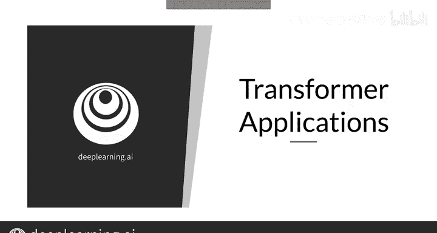
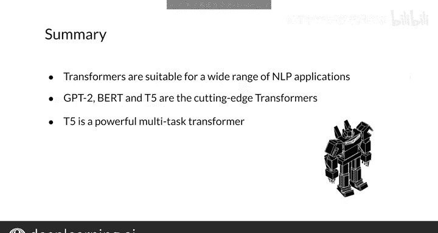

#  158：Transformer 应用 🚀

在本节课中，我们将学习 Transformer 模型在自然语言处理（NLP）及其他领域的广泛应用。我们将了解其最流行的应用场景，并深入探讨几个强大的 Transformer 模型，特别是 T5 模型的多任务处理能力。

---

## Transformer 的广泛应用

Transformer 是最通用的深度学习模型之一。它已成功应用于 NLP 内外的众多任务。

上一节我们介绍了 Transformer 的基本概念，本节中我们来看看它在 NLP 中的具体应用。由于 Transformer 和 RNN 一样，可以普遍应用于任何序列任务，因此它在 NLP 领域得到了广泛使用。

以下是 Transformer 在 NLP 中的一些非常有趣且流行的应用：
*   自动文本摘要
*   自动补全
*   命名实体识别
*   自动问答
*   机器翻译
*   聊天机器人
*   情感分析和市场情报等其他许多 NLP 任务

---

## 先进的 Transformer 模型

许多 Transformer 的变体被用于 NLP，研究人员通常会给他们的模型起独特的名字。

以下是几个著名的先进 Transformer 模型：
*   **GPT-2**：代表“Generative Pre-training for Transformer”，是由 OpenAI 创建的预训练 Transformer。它非常擅长生成文本。
*   **BERT**：代表“Bidirectional Encoder Representations from Transformers”，由 Google AI 语言团队推出，是另一个用于学习文本表示的著名 Transformer。
*   **T5**：代表“Text-to-Text Transfer Transformer”，同样由 Google 创建，是一个可以执行多种任务的多任务 Transformer。

---

## 深入探索 T5 模型

一个单一的 T5 模型可以学习执行多个不同的任务，这是一个相当重大的进步。

例如，假设你想执行翻译、分类和问答等任务。通常，你需要设计并训练一个模型来执行翻译，再设计并训练第二个模型来执行分类，然后设计并训练第三个模型来执行问答。但使用 Transformer，你可以训练一个能够执行所有这些任务的单一模型。

为了告诉 T5 模型你想要执行某个特定任务，你需要给模型一个输入文本字符串，其中包含你希望它执行的任务以及执行该任务所需的数据。

以下是 T5 模型处理不同任务的示例：

**1. 翻译任务**
输入字符串格式为：`translate English to French: [待翻译的英文句子]`
例如：
输入：`translate English to French: I am happy.`
输出：`Je suis content.`

**2. 分类任务**
输入字符串以 `cola sentence:` 开头，模型会将其后的句子分类为“可接受”或“不可接受”。
例如：
输入：`cola sentence: He bought fruits and`
输出：`unacceptable`
输入：`cola sentence: He bought fruits and vegetables.`
输出：`acceptable`

**3. 问答任务**
输入字符串以 `question:` 开头。
例如：
输入：`question: Which volcano in Tanzania is the highest mountain in Africa?`
输出：`Mount Kilimanjaro`

请记住，所有这些任务都由同一个模型完成，除了输入句子外，无需任何修改。

---

## T5 的其他任务能力

T5 还能执行回归和摘要总结任务。

**1. 回归任务**
回归模型输出一个连续的数值。以下是一个相似度测量的例子，输入以 `stsb` 开头，表示模型应测量两个句子之间的相似度。输出范围是 0 到 5 之间的任何数值，0 表示句子完全不相似，5 表示句子非常相似。
例如：
输入：`stsb sentence1: Cats and dogs are mammals. sentence2: These are four known forces in nature: gravity, electromagnetic, weak and strong.`
输出：`0`
输入：`stsb sentence1: Cats and dogs are mammals. sentence2: Cats and dogs and cows are domesticated.`
输出：`2.6`

**2. 摘要任务**
以下是一个摘要总结的例子，它将一篇关于密西西比州恶劣天气的长篇报道总结为一句话。
输入：`summarize: [长篇文章内容]`
输出：`Six people hospitalized after a storm in Attala County.`

---

## 总结

本节课中我们一起学习了 Transformer 在 NLP 中的应用，其范围从翻译到摘要总结。一些先进的 Transformer 模型包括 GPT-2、BERT 和 T5。我们还看到了 T5 模型是多么通用和强大，因为它可以使用文本表示来执行多项任务。现在你知道了为什么我们需要 Transformer 以及它可以应用在何处。

一个模型能够处理如此多样的任务，这令人惊叹。希望你现在渴望了解 Transformer 的工作原理，而这正是我接下来要展示的内容。让我们进入下一个视频。😊