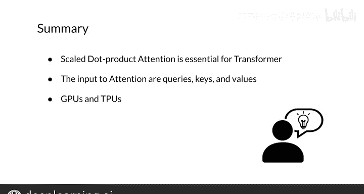

#  159：缩放点积注意力机制 🧠

在本节课中，我们将要学习Transformer模型的核心操作——**缩放点积注意力**。我们将回顾其工作原理、数学公式以及涉及的矩阵维度，并理解它为何如此高效。

---

## 概述

缩放点积注意力机制是Transformer架构的基石。它接收查询、键和值矩阵作为输入，通过计算查询与键的相似度来为值分配权重，最终输出每个查询对应的上下文向量。其高效性源于仅依赖于矩阵乘法和Softmax函数。

---

## 缩放点积注意力公式回顾

首先，我们来回顾缩放点积注意力的核心公式：

**Attention(Q, K, V) = softmax( (Q * K^T) / sqrt(d_k) ) * V**

其中：
*   **Q** 代表查询矩阵。
*   **K** 代表键矩阵。
*   **V** 代表值矩阵。
*   **d_k** 是键向量的维度。
*   **softmax** 函数确保所有权重之和为1。
*   **除以 sqrt(d_k)** 是为了在训练时稳定梯度，提升模型性能。

这个机制非常高效，因为它只依赖于矩阵乘法和Softmax操作，可以轻松在GPU或TPU上并行加速训练。

---

## 查询、键、值矩阵的构建

要应用上述公式，我们首先需要从输入序列中构建查询、键和值矩阵。

### 查询矩阵的构建

假设我们的查询源句子是 “just do it”。我们需要获取每个单词的词嵌入向量：
1.  获取单词 “just” 的嵌入向量。
2.  获取单词 “do” 的嵌入向量。
3.  获取单词 “it” 的嵌入向量。

然后，将这些嵌入向量作为行堆叠起来，就形成了查询矩阵 **Q**。矩阵的尺寸由词嵌入的维度和序列的长度决定。

### 键与值矩阵的构建

假设我们的键/值源句子是 “I am happy”。同样地：
1.  获取单词 “I” 的嵌入向量。
2.  获取单词 “am” 的嵌入向量。
3.  获取单词 “happy” 的嵌入向量。

将这些向量作为行堆叠，形成键矩阵 **K**。通常，值矩阵 **V** 使用与键矩阵相同的向量集（但也可以先进行一个额外的变换）。需要注意的是，用于构建键矩阵和值矩阵的向量数量必须相同。

---

## 矩阵维度与计算过程详解

现在，让我们结合公式，详细看看每一步计算中矩阵的维度变化。

首先，计算查询矩阵 **Q** 与键矩阵 **K** 的转置的乘积：
`Q * K^T`

然后，将结果除以键向量维度 **d_k** 的平方根进行缩放：
`(Q * K^T) / sqrt(d_k)`

接着，对缩放后的结果应用 **softmax** 函数。这个计算会得到一个权重矩阵，其中的每个元素代表了对于某个特定查询，分配给每个键的权重。

因此，这个权重矩阵的总元素数等于 **查询数量 × 键数量**。例如，该矩阵第二行第三列的元素，就对应着**第二个查询**分配给**第三个键**的权重。

最后，将这个权重矩阵与值矩阵 **V** 相乘：
`softmax(...) * V`

相乘的结果是一个矩阵，其每一行就是对应每个查询的**上下文向量**。这个结果矩阵的列数等于值向量的维度，通常与词嵌入的维度相同。

---

## 总结

本节课中，我们一起深入学习了**缩放点积注意力机制**。我们回顾了其核心公式，理解了如何从输入序列构建查询、键和值矩阵，并逐步分析了计算过程中矩阵维度的变化。该机制因其仅基于矩阵运算而具备的高效性，成为了Transformer模型强大性能的关键。

在Transformer的解码器部分，我们需要使用一个扩展版本，称为**掩码自注意力机制**。我们将在下一个视频中学习它。