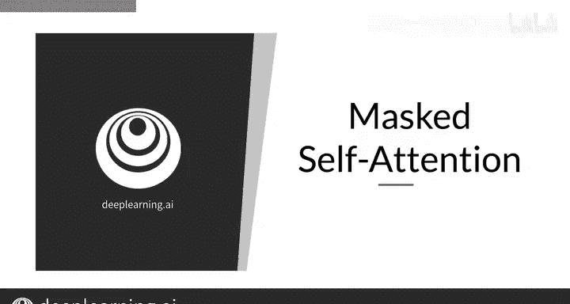
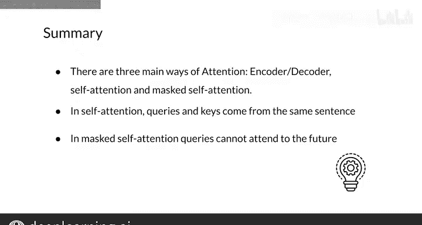

#  160：Transformer中的注意力机制 🧠


在本节课中，我们将学习Transformer模型中的三种主要注意力机制，并重点掌握**掩码自注意力**的计算方法。

---



## 概述

Transformer模型的核心是注意力机制，它使模型能够专注于输入序列中最相关的部分。我们将介绍三种主要的注意力类型：编码器-解码器注意力、自注意力和掩码自注意力。本节课的重点是理解并计算**掩码自注意力**。

---

## 三种主要的注意力机制

上一节我们概述了课程内容，本节中我们来看看Transformer模型中三种核心的注意力机制。

以下是三种主要的注意力类型：

1.  **编码器-解码器注意力**
    *   在这种机制中，一个句子中的词关注另一个句子中的所有词。
    *   具体来说，查询（Queries）来自一个句子，而键（Keys）和值（Values）来自另一个句子。
    *   你在上周的翻译任务中已经使用过这种注意力，例如，法语句子中的词关注英语句子中的词。

2.  **自注意力**
    *   在自注意力中，查询、键和值都来自同一个句子。
    *   因此，序列中的每个词都会关注序列中的其他所有词。
    *   这种注意力让你能获得词语的上下文表示，换句话说，自注意力提供了每个词在句子中的含义表示。

3.  **掩码自注意力**
    *   在掩码自注意力中，查询、键和值同样来自同一个句子。
    *   但每个查询**不能**关注未来位置的键。
    *   这种注意力机制存在于Transformer模型的解码器中，确保每个位置的预测仅依赖于已知的输出。

---

## 深入理解掩码自注意力

了解了三种注意力机制的区别后，本节我们重点探讨掩码自注意力的工作原理。

从数学上讲，自注意力的计算与编码器-解码器注意力完全相同，唯一的区别在于每种机制的输入来源不同。因此，让我们聚焦于掩码自注意力。

回忆一下，缩放点积注意力需要计算查询矩阵与键矩阵转置的缩放点积的Softmax。

**公式表示如下：**
`注意力权重 = Softmax( (Q * K^T) / sqrt(d_k) )`

而对于掩码自注意力，你需要在Softmax内部添加一个掩码矩阵。这个掩码矩阵在其所有位置上的值都是0，除了对角线以上的元素，这些元素被设置为负无穷大（在实践中是一个极大的负数）。

**代码逻辑描述如下：**
```python
# 假设 QK^T 是查询和键的点积结果矩阵
scores = QK^T / sqrt(d_k)
# 创建掩码矩阵（下三角为0，上三角为负无穷）
mask = np.triu(np.ones(scores.shape), k=1) * -np.inf
# 应用掩码
masked_scores = scores + mask
# 计算注意力权重
attention_weights = softmax(masked_scores)
```

在应用Softmax之后，这种加法操作确保了在权重矩阵中，对于查询位置之后的所有键，其对应的注意力权重均为0。

最后，与其他类型的注意力一样，你将权重矩阵与值矩阵相乘，从而得到每个查询的上下文向量。

**总结其核心：** 你只需要在Softmax函数内部添加一个矩阵，就能确保查询不会关注到未来的位置。

---



## 总结与预告

本节课中，我们一起学习了Transformer中的三种主要注意力机制：**编码器-解码器注意力**、**自注意力**和**掩码自注意力**。在掩码自注意力中，查询和键包含在同一句子中，但查询不能关注未来的位置。

到目前为止，你已经见识了许多类型的注意力机制。在下一个视频中，我将向你展示**多头注意力**。这是一种非常强大的注意力形式，它允许并行计算，能显著提升模型的表达能力。