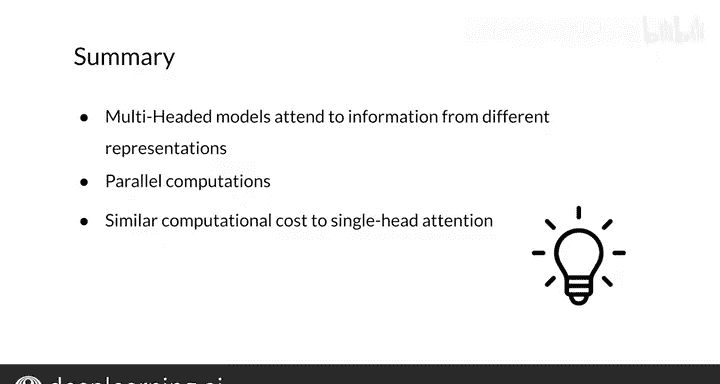

#  161：多头注意力机制 🧠

在本节课中，我们将学习Transformer模型中的一个核心组件——多头注意力机制。你已经掌握了注意力机制的基础知识，但为了构建性能更优、运行更快、效果更好的模型，多头注意力是必不可少的一环。我们将首先了解其背后的直观思想，然后深入探讨其数学原理和实现细节。

## 多头注意力的直观理解

上一节我们介绍了基础的缩放点积注意力。本节中，我们来看看如何通过多头注意力让模型同时关注来自不同表示子空间的信息。

在多头注意力中，模型会并行地应用多次注意力机制。每一次应用都使用一组通过线性变换得到的、不同于原始嵌入的查询、键和值矩阵。模型并行应用注意力机制的次数，就称为“头”的数量。

例如，在一个双头注意力模型中，你需要两组查询、键和值。第一组表示用于第一个注意力头，第二组不同的表示则用于第二个注意力头。通过为模型中的每个头使用不同的线性变换矩阵（记作 **W^Q**、**W^K**、**W^V**），我们可以从原始词嵌入中得到这些不同的表示。

使用不同的表示集合，使得模型能够学习查询和键矩阵中词语之间的多种关系。

## 多头注意力工作原理

理解了基本概念后，现在我们来详细看看多头注意力是如何工作的。其输入是值矩阵（V）、键矩阵（K）和查询矩阵（Q）。

以下是多头注意力计算的主要步骤：

第一步，将每个输入矩阵（Q, K, V）通过线性变换投影到多个向量空间。每个矩阵的变换次数等于模型中的头数。

第二步，对每一组变换后的值、键和查询表示，并行地应用缩放点积注意力机制。应用次数同样等于头数。

第三步，将每个注意力头计算出的结果矩阵在水平方向上进行拼接，形成一个单一的矩阵。

第四步，对这个拼接后的矩阵施加一次最终的线性变换（**W^O**），得到输出的上下文向量。

需要注意的是，多头注意力中的每一次线性变换都包含一组可学习的参数。

## 详细步骤与维度分析

让我们以一个双头模型为例，更细致地分析每一步的维度变化。

多头注意力层的输入是查询、键和值矩阵。这些矩阵的列数等于嵌入维度 **d_model**，行数则由用于构建矩阵的序列词数决定。

第一步是使用每个头独有的矩阵 **W^Q**、**W^K**、**W^V** 对 Q、K、V 进行变换。变换矩阵 **W^Q** 和 **W^K** 的列数是一个超参数 **d_k**，**W^V** 的列数是一个超参数 **d_v**。它们的行数均为 **d_model**。

在原始的Transformer论文中，作者建议设置 **d_k = d_v = d_model / h**，其中 **h** 是头的数量。这种尺寸选择能确保多头注意力的总计算成本不会显著超过单头注意力。

对每个头得到变换后的 Q、K、V 矩阵后，便可以并行应用注意力机制。每个头会输出一个矩阵，其列维度为 **d_v**，行数与原始查询矩阵相同。

接着，将所有注意力头的输出矩阵水平拼接。你会得到一个列数为 **d_v * h** 的矩阵。

最后，对这个拼接矩阵应用线性变换 **W^O**。**W^O** 的列数为 **d_model**。如果按照上述建议设置了 **d_v**，那么 **W^O** 的行数也将是 **d_model**。与单头注意力一样，最终你会得到一个矩阵，其中包含了每个原始查询的、维度为 **d_model** 的上下文向量。

## 总结

本节课中，我们一起学习了多头注意力机制的工作原理，并了解了其计算过程中涉及的参数矩阵维度。

多头注意力的核心在于：对查询、键和值的多组不同表示并行应用注意力机制，然后将每个注意力计算的结果拼接起来，再通过一次线性变换得到最终的上下文向量。

通过合理的变换矩阵尺寸选择，多头注意力的总计算时间与单头注意力相近，却能显著提升模型捕捉信息的能力。在过去的三个视频中，我们学习了基础的点积注意力、因果注意力以及多头注意力。现在，你已经准备好构建自己的Transformer解码器了，这将是我们在下一个视频中要完成的任务。