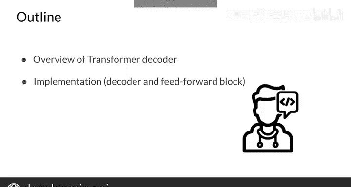
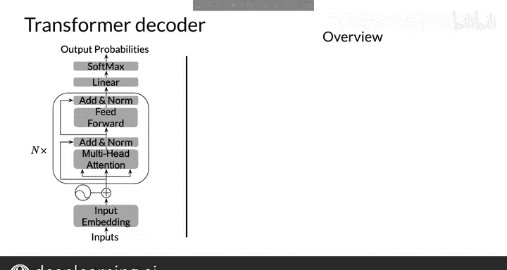
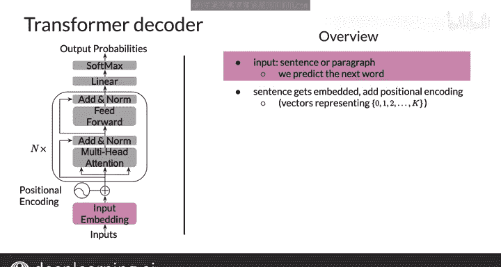
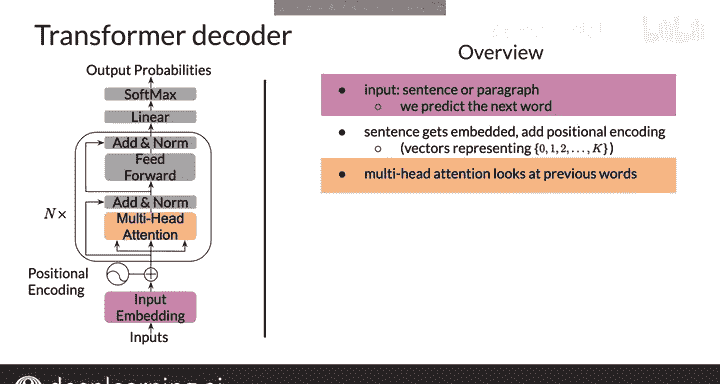
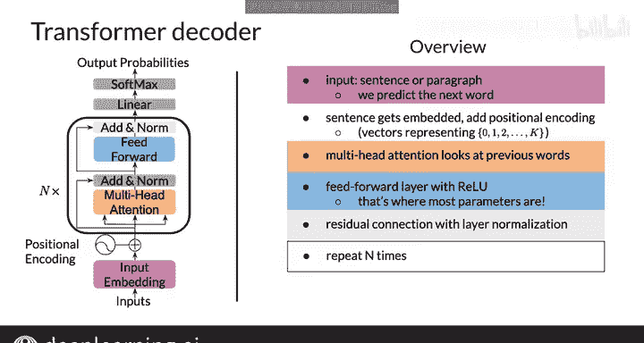
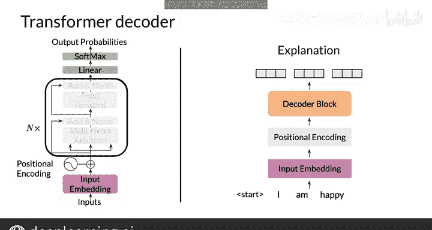
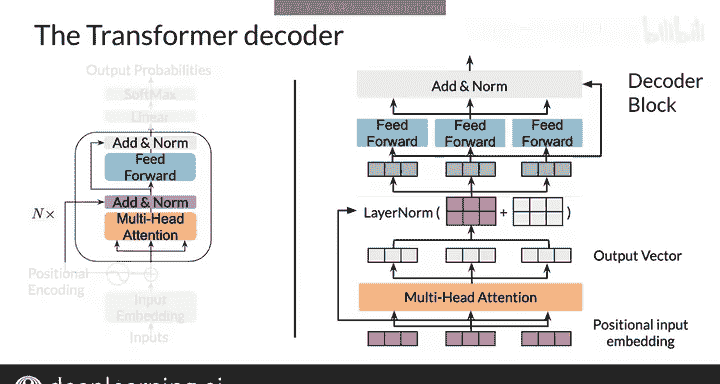
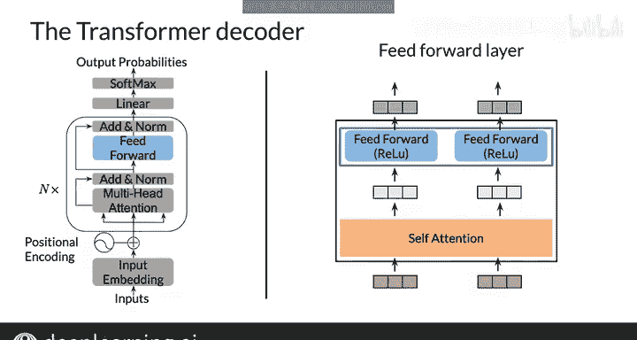
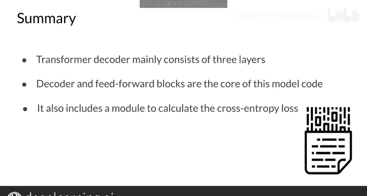

#  162：Transformer解码器 🧠

在本节课中，我们将学习如何构建一个Transformer解码器模型，也被称为GPT-2。一旦理解了注意力机制，这个模型的结构就相对简单明了。让我们开始吧。

---

## 概述

本节课我们将深入探讨Transformer解码器的基本结构。我们将了解Transformer的定义，并学习如何实现解码器块和前馈神经网络块。

---

## Transformer解码器结构

Transformer解码器的输入是一个经过分词的句子，即一个整数向量。

句子首先通过词嵌入层进行嵌入。然后，我们为这些嵌入向量添加位置信息。

位置信息是通过学习得到的向量来表示的，这些向量代表位置1、2、3……直到模型设定的最大长度。因此，第一个词的嵌入向量会加上代表位置1的向量，第二个词的嵌入向量会加上代表位置2的向量，依此类推。

现在，这构成了第一个多头注意力层的输入。在注意力层之后，是一个前馈神经网络层。

前馈层独立地对每个位置进行操作。在每个注意力层和前馈层之后，会有一个残差连接（或称跳跃连接），即将该层的输入加到其输出上，然后执行层归一化。

注意力层和前馈层会重复N次。原始模型设定N=6，但现在的Transformer模型可能达到100层甚至更多。

最后，是一个用于输出的全连接层和一个Softmax层。这就是Transformer解码器的基本结构。

如果一次没有完全理解，请不要担心。接下来我们将结合代码再次梳理整个结构，并解释所有细节。

---

## 模型核心组件

现在，让我们看看Transformer模型的核心部分。模型开头有三层。

“右移”操作只是引入了起始标记，模型将使用这个标记来预测下一个词。然后是嵌入层，它训练词到向量的嵌入。接着是位置编码层，它训练代表位置1、2……等的向量，如前所述。

如果模型的输入是一个形状为 `[batch_size, sequence_length]` 的张量，那么在经过嵌入层后，它将变成形状为 `[batch_size, sequence_length, d_model]` 的张量。其中，`d_model` 是嵌入向量的维度，通常设置为512、1024，现在甚至可以达到10K或更高。

在这些初始层之后，是N个解码器块。然后是一个全连接层，输出形状为 `[batch_size, sequence_length, vocab_size]` 的张量。最后使用Log Softmax函数来计算交叉熵损失。

---

## 解码器块详解

解码器块以一组向量作为输入序列开始，这些向量会与相应的位置编码向量相加，产生所谓的“位置输入嵌入”。

嵌入后，输入序列通过一个多头注意力模型。当这个模型处理输入序列中的每个词（每个位置）时，注意力机制本身会搜索序列中的其他位置，以帮助识别词之间的关系。

序列中的每个词都会被赋予一个权重。然后，在注意力层的每一层，都有一个围绕它的残差连接，随后是一个层归一化步骤，以加速训练并显著减少总体处理时间。

接着，每个词会通过一个前馈神经网络层。也就是说，嵌入向量被送入一个神经网络。最后，为了正则化，会有一个Dropout层。

接下来，层归一化步骤会重复N次。最终，得到解码器块的输出。

---

## 前馈神经网络的作用

在注意力机制和归一化步骤之后，通过包含全连接的前馈神经网络层引入了非线性变换。

对于每个输入，使用简单但非线性的ReLU激活函数。为了效率，参数是共享的。前馈神经网络的输出向量本质上将取代原始RNN解码器中的隐藏状态。

---

## 总结

在本节课中，我们一起学习了用于实现Transformer解码器的构建模块。

我们了解到它包含三个初始层。还有一个用于计算Log Softmax的模块，该模块利用了交叉熵损失函数。我们还详细了解了解码器块和前馈神经网络块的结构。

现在，你已经构建了自己的第一个Transformer模型。恭喜！如果能看看它的实际运行效果，那该多好。😊