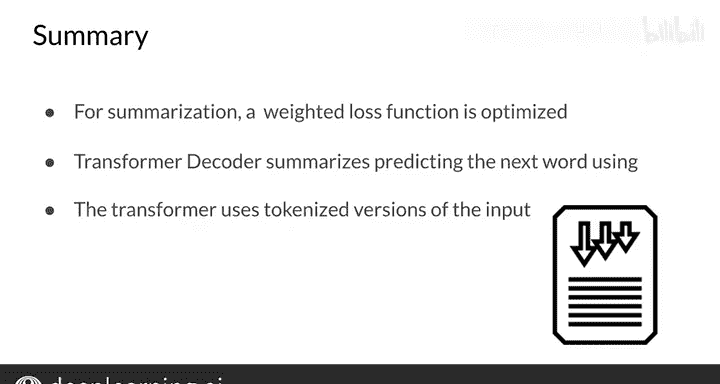

#  163：Transformer摘要生成器 📝


在本节课中，我们将学习如何利用Transformer模型构建一个文本摘要生成器。我们将从模型代码概览开始，接着探讨用于摘要任务的数据处理技术细节，最后了解如何使用训练好的语言模型进行推理。

---

## 模型与任务概述

首先，我们来看看本周作业中需要解决的问题。模型的输入是一整篇新闻文章，而模型的输出则是这篇文章的摘要，即概括文章核心思想的几句话。

为了实现这个目标，我们将使用在前几节课程中介绍过的Transformer模型。但有一个关键点可能立刻会引起你的注意：Transformer模型只接受文本作为输入，并预测输出。对于摘要任务，解决方案其实很简单：只需要将输入（即文章）和摘要拼接在一起。下面我来具体说明。

---

## 输入特征构建

以下是利用文章及其摘要来构建Transformer训练输入特征的示例。

模型的输入是一个长文本，它以新闻文章开头，接着是 `EOS` 标记，然后是摘要，最后是另一个 `EOS` 标记。与往常一样，输入会被分词并转换为整数序列。在这个序列中，`0` 代表填充，`1` 代表 `EOS`，其他数字则代表不同单词的标记。

**输入序列结构示例：**
```
[文章内容] + [EOS] + [摘要内容] + [EOS]
```

当Transformer在这个输入上运行时，它会根据之前的所有单词来预测下一个单词。但你不希望仅仅因为模型无法正确预测文章部分的内容而产生巨大的损失。这就是为什么必须使用加权损失函数。

---

## 加权损失函数

在计算整个序列中每个单词的损失时，我们不进行平均，而是对文章部分的单词损失赋予权重 `0`，对摘要部分的单词损失赋予权重 `1`。这样，模型就能将注意力完全集中在生成摘要上。

然而，当摘要的训练数据量很少时，给文章部分的损失赋予一个非零的权重（例如 `0.2`、`0.5` 甚至 `1`）实际上是有益的。通过这种方式，模型能够学习到新闻文章中常见的词语关系。虽然在本周的作业中你不需要这样做，但了解这一点对你未来的应用开发很有帮助。

另一种理解上述内容的方式是查看损失函数。该函数对批次中每个样本 `i` 的摘要部分的所有单词 `j` 的损失进行求和。因此，这个交叉熵损失函数会忽略待摘要的文章部分。

**损失函数公式：**
```
Loss = Σ_i Σ_j_in_summary CrossEntropy(y_hat_ij, y_ij)
```

---

## 模型训练与推理

现在你知道了如何构建输入和模型，接下来就可以训练你的Transformer摘要生成器了。请再次回忆，Transformer是预测下一个单词的模型，而你的输入是新闻文章。

在测试或推理阶段，你需要将文章连同 `EOS` 标记一起输入模型，并请求它预测下一个单词，这个单词就是摘要的第一个词。然后，你继续请求下一个词，如此反复，直到模型输出 `EOS` 标记为止。

当运行Transformer模型时，它会生成一个覆盖所有可能单词的概率分布。你需要从这个分布中进行采样，因此每次运行这个过程，都可能得到一个不同的摘要。我相信你会在编程练习中享受实验这一过程的乐趣。

---

## 本节总结

在本节视频中，你学习了如何实现一个用于摘要任务的Transformer解码器。关键点在于，该模型旨在优化一个加权的交叉熵损失函数，该函数专注于摘要部分。摘要任务本质上就是以整篇文章为输入的文本生成任务。



---

## 课程回顾与展望 🚀

本周，你已经学会了如何构建自己的Transformer模型，并利用它创建了一个摘要生成器。我希望你享受了这个学习过程。Transformer是一个非常强大且不难理解的模型。

下周，我将向你展示如何获得更好的结果。我们将使用一个更强大的、经过预训练的Transformer版本。敬请期待，不要错过！