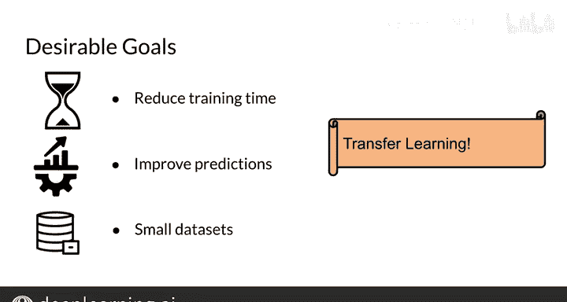

#  166：第3周概述 🚀

在本节课中，我们将要学习自然语言处理（NLP）中两个重要的高级概念：**迁移学习** 和 **问答系统**。我们将了解这些概念如何提升模型性能，并探索BERT和T5等先进模型的工作原理。

## 本周内容概览 📚

在课程第四部分的第3周，我们将涵盖自然语言处理的多种不同应用。

我们将首先关注**问答系统**。具体来说，给定一个问题和一个上下文，模型需要找出该上下文中的答案。

我们还将深入探讨**迁移学习**。这个概念指的是，在一个特定任务上训练获得的知识，如何被利用并应用到另一个不同的任务中。

我们将学习**BERT模型**，它被称为双向编码器表示，并利用了Transformer架构。你将看到如何利用双向性来提升模型性能。

接着，我们将了解**T5模型**。这个模型的特点是，它可以处理多种可能的输入。例如，输入一个问题，它输出一个答案；输入一篇评论，它输出一个评分。所有这些功能都集成在一个模型中。

## 问答系统详解 ❓

现在，让我们具体看看问答系统。

这里有两种主要类型：**基于上下文的问答** 和 **闭卷式问答**。

基于上下文的问答需要同时接收问题和一段上下文，然后模型会指出答案在该上下文中的具体位置。例如，图中高亮部分就是模型找到的答案。

闭卷式问答则只接收问题，模型需要在不依赖外部上下文的情况下，自行生成答案。

## 迁移学习：提升性能的新途径 🔄

之前我们已经看到，模型架构的创新和数据准备的方法都能提升性能。

本节中，我们将看到**训练方式的创新**同样能显著改善性能，而迁移学习正是这样一个关键创新。

以下是传统的训练方式，你可能已经很熟悉了：输入一篇课程评论，经过模型处理，预测出一个评分。整个过程没有变化。

现在，让我们通过一个例子来理解迁移学习。

假设你有一个在电影评论上预训练好的模型，用于预测电影评分。当你想训练一个预测课程评分的模型时，迁移学习的做法是：**不再从零开始初始化模型权重，而是使用从电影评论任务中学到的权重作为起点**，然后在此基础上，用课程评论数据继续训练。

训练完成后，进行推理的方式不变：输入课程评论，模型输出预测评分。

迁移学习也可以应用于完全不同的任务。

这是另一个例子：一个模型输入评分和评论，输出情感分类。你可以将这个模型的初始权重，用于训练一个下游的问答任务模型。例如，模型学会回答“圆周率日是哪天？”（答案是3月14日）。但如果你问它“我的生日是哪天？”，它并不知道答案。这个例子展示了如何将迁移学习用于跨任务的知识迁移。

## 探索BERT：双向上下文的力量 ↔️

上一节我们介绍了迁移学习的概念，本节中我们来看看BERT模型，它利用了**双向上下文**。

假设我们有句子：“Learning from DeepLearning.AI is like watching the sunset with my best friend.” 在传统的语言模型中，要预测下一个词“DeepLearning.AI”，模型只能看它前面的上下文。

而**双向表示**则同时考虑目标词左侧和右侧的上下文信息，来预测中间的词。这是双向性的一个主要优势。

## 单任务模型 vs. 多任务模型：T5的整合之道 🤖

之前我们讨论了BERT的双向架构，现在我们来对比单任务模型和多任务模型。

在单任务模型中，一个模型专门用于输入评论并预测评分；另一个独立的模型则专门用于输入问题并预测答案。每个任务对应一个模型。

而**T5模型**实现了多任务学习。它是同一个模型，既可以处理评论来预测评分，也可以处理问题来预测答案。因此，你不需要两个独立的模型，只需要一个整合的模型。

## T5模型与数据规模 📊

关于T5模型，一个主要的结论是：**通常，数据越多，性能越好**。

例如，英文维基百科数据集大约有13GB，而T5模型训练所使用的C4（Colossal Clean Crawled Corpus）数据集大约有800GB。这个对比直观地展示了C4数据集的规模之大。

## 迁移学习的优势总结 🎯

以下是迁移学习希望达成的理想目标：

首先，**减少训练时间**。因为你已经有了一个预训练模型，使用迁移学习通常能实现更快的收敛。

其次，**提升预测性能**。模型从其他任务中学到的知识，可能对当前训练任务的预测有所帮助。

最后，**可能减少数据需求**。由于模型已经从其他任务中学到了很多，对于当前任务，可能不需要那么大量的数据。

因此，如果你拥有的数据集较小，迁移学习可能会对你大有裨益。

---

**本节课总结**

在本节课中，我们一起学习了自然语言处理第3周的核心内容概述。我们介绍了**问答系统**的两种形式，深入探讨了**迁移学习**的原理与优势，了解了**BERT模型**如何利用双向上下文，并认识了**T5模型**如何整合多任务学习。我们还讨论了数据规模对模型性能的影响，并总结了迁移学习在减少训练时间、提升性能和数据需求方面的价值。这些概念为后续深入学习具体的模型和算法奠定了坚实的基础。