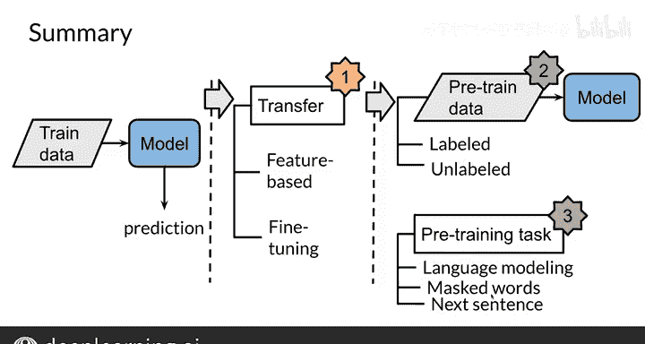

#  167：吴恩达《自然语言处理》P167 - 27. NLP中的迁移学习 🚀

在本节课中，我们将要学习自然语言处理中的迁移学习。我们将探讨其基本概念、两种主要形式（基于特征的学习与微调），并了解如何利用有标签和无标签数据来提升模型性能。

---

## 什么是迁移学习？🤔

迁移学习是一种机器学习方法，其核心思想是将从一个任务中学到的知识应用到另一个相关任务上。在NLP中，这通常意味着利用在大规模文本上预训练的模型，来帮助我们解决数据量较小的特定任务。

## 迁移学习的两种形式

上一节我们介绍了迁移学习的概念，本节中我们来看看它的两种基本实现形式。

以下是两种主要的迁移学习方法：

1.  **基于特征的学习**：这种方法利用从其他任务中学到的**特征**（例如词向量）作为新模型的输入。模型的其他部分需要从头开始训练。
    *   **公式/概念**：`新任务输入 = 预训练的词嵌入(原始文本)`
2.  **微调**：这种方法直接使用一个**预训练好的模型**及其权重，然后针对特定任务，用新数据对这个模型的全部或部分参数进行小幅调整。
    *   **公式/概念**：`微调后模型 = 预训练模型权重 + Δ权重（基于新任务数据）`

## 具体示例：特征学习 vs. 微调

为了更清晰地理解这两种形式，让我们看一个具体的对比。

以下是两种方法的工作流程示意图：

*   **基于特征**：
    1.  原始文本通过预训练的词嵌入模型，得到词向量。
    2.  这些词向量作为输入特征，送入一个**全新的、为当前任务设计的模型**。
    3.  新模型输出预测结果。

*   **微调**：
    1.  加载一个完整的预训练模型。
    2.  将当前任务的数据输入该模型。
    3.  在训练过程中，根据损失函数**更新预训练模型本身的权重**，使其适应新任务。
    4.  使用调整后的模型进行预测。

## 微调实践：添加新网络层

在实际操作中，微调常采用一种策略：冻结大部分预训练层，仅训练新增的层。

假设我们有一个在电影评论上预训练的模型，现在要将其用于课程评论的情感分析（预测1星、2星或3星）。

以下是操作步骤：
1.  保持预训练模型的所有原始权重**固定（冻结）**。
2.  在模型的末端**添加一个新的前馈神经网络层**。
3.  只使用课程评论数据来**训练这个新添加的网络层**。

## 数据的影响：数量与类型

模型性能很大程度上受数据影响。通常，数据越多，模型越大，性能就越好。

在NLP领域，无标签文本数据（如网页、书籍）的数量远远超过有标签数据（如带有情感标签的评论）。

## 无标签数据的利用：自监督学习

既然无标签数据如此丰富，我们如何利用它们呢？答案是**自监督学习**。

在自监督任务中，我们从无标签数据中自动生成“伪标签”来训练模型。例如，在语言建模中，我们遮盖一个词，然后让模型预测它。

以下是其工作流程：
1.  **输入**：从句子“learning from deep learning AI is like watching the sunset with my best friend”中，我们遮盖“friend”，得到“...with my best [MASK]”。
2.  **目标**：模型需要预测被遮盖的词是“friend”。
3.  **训练**：模型输出预测，计算与真实词“friend”的损失，并用此损失更新模型参数。

## 下游任务中的微调

在预训练完成后（例如通过掩码语言建模或下一句预测），我们可以将模型应用到各种下游任务中。

你可以使用同一个预训练模型，通过微调来适应不同的任务，例如：
*   机器翻译
*   文本摘要
*   问答系统

## 本章总结 📝

本节课中我们一起学习了NLP中的迁移学习。我们了解到：
*   迁移学习包括**基于特征的学习**和**微调**两种形式。
*   可以利用丰富的**无标签数据**通过自监督任务（如语言建模）进行预训练。
*   预训练模型可以通过微调，高效地适配到多种具体的**下游任务**（如翻译、摘要等），从而节省数据和计算资源，提升模型性能。