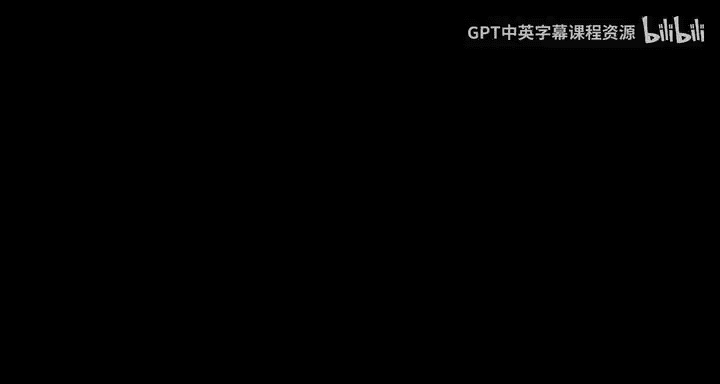
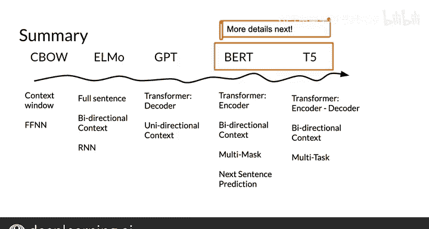

#  168：自然语言处理模型演进史 📚



## 概述

在本节课中，我们将按照时间顺序，学习几种重要的自然语言处理模型。我们将了解每个模型的核心思想、优势与不足，以及它们如何逐步解决前代模型面临的问题。课程将涵盖连续词袋模型、ELMo、GPT、BERT和T5。

---

## 1. 模型演进时间线 🗺️

以下是课程将要介绍的主要模型及其出现顺序。

*   连续词袋模型
*   ELMo
*   GPT
*   BERT
*   T5

这并非一个涵盖所有相关模型和研究成果的完整历史，但有助于我们看清每个模型解决了什么问题，以及带来了哪些新挑战。

---

## 2. 上下文的重要性与早期模型

理解一个词的含义，关键在于其上下文。我们可以查看这个词前后的内容，这正是我们训练词嵌入的基础。

上一节我们介绍了模型演进的时间线，本节中我们来看看如何利用上下文。

### 连续词袋模型

在连续词袋模型中，我们有一个中心词，例如“right”。传统做法是，我们取一个固定大小的窗口（例如前后各两个词），将这些上下文词输入神经网络，来预测中心词“right”。

**公式/代码示例：**
`预测目标：P(中心词 | 上下文词1, 上下文词2, ...)`

这种方法的问题是，如果我们想利用的不仅仅是固定窗口内的词，而是句子中所有前后的词，该怎么办？

---

## 3. 引入更广泛上下文的模型

为了使用全部的上下文信息，研究人员探索了以下方法。

以下是利用循环神经网络来捕获双向上下文的方法。

*   使用从左到右和从右到左的两个循环神经网络。
*   使用双向LSTM（一种循环神经网络的变体）。

将两个方向的网络输出结合，就能预测中心词“right”，从而得到该词的词嵌入。

---

## 4. 基于Transformer架构的模型

我们熟悉的Transformer架构包含编码器和解码器堆栈。随后出现的模型对此进行了不同的利用。

上一节我们看到了如何用RNN捕获双向上下文，本节中我们来看看基于Transformer的模型如何做得更好。

### GPT模型

GPT模型**仅使用解码器堆栈**。在Transformer中，解码器采用因果注意力机制，这意味着每个词只能关注它自身及之前的词，不能“窥视”未来的词。

**核心概念：** GPT = **仅使用Transformer解码器堆栈** + **单向上下文（仅左）**

### BERT模型

BERT模型则**仅使用编码器堆栈**。编码器允许每个词关注句子中的所有其他词，包括它后面的词，从而实现真正的双向上下文理解。

**核心概念：** BERT = **仅使用Transformer编码器堆栈** + **双向上下文**

例如，在句子“立法者相信他们站在历史的\_\_\_一边，因此他们修改了法律”中，BERT可以利用整个句子的双向上下文来预测空白处的词（如“正确”）。

---

## 5. BERT的预训练任务

BERT通过特定的预训练任务来学习语言表示。

以下是BERT使用的两个关键预训练任务。

*   **掩码语言建模**：随机遮盖句子中的一些词，让模型预测这些被遮盖的词。
*   **下一句预测**：给定两个句子A和B，让模型判断B是否是A的下一句。

---

## 6. 编码器-解码器架构的回归与多任务学习

T5模型测试了使用完整编码器-解码器架构（即原始Transformer模型）的性能。研究人员发现，同时包含编码器和解码器堆栈的模型表现更好。

上一节我们了解了BERT的双向编码器，本节中我们来看看完整的编码器-解码器架构如何用于多任务。

### T5的多任务训练策略

T5采用“文本到文本”的框架。为了让同一个模型能区分不同的任务（如分类、摘要、问答），我们在输入前添加一个任务前缀。

**代码示例：**
```
输入: “分类：深度学习.ai很棒。” -> 输出: “五星”
输入: “摘要：深度学习.ai很棒。” -> 输出: “它很不错。”
输入: “问题：什么是深度学习？” -> 输出: “一门学科。”
```

通过这种方式，模型能根据前缀自动识别并执行相应任务。

---

## 总结



本节课中我们一起学习了自然语言处理关键模型的演进历程。

*   我们始于**连续词袋模型**，它使用固定大小的上下文窗口。
*   接着是**ELMo**，它利用双向LSTM来捕获更长的上下文。
*   然后是**GPT**，它仅使用Transformer解码器堆栈，专注于单向（从左到右）的上下文。
*   **BERT**则仅使用Transformer编码器堆栈，实现了双向上下文理解，并采用了掩码语言建模和下一句预测任务。
*   最后是**T5**，它回归完整的编码器-解码器架构，并通过添加任务前缀实现了强大的多任务学习能力。

你现在已经对这些模型有了一个概览，也看到了文本到文本模型如何通过前缀让同一个模型解决多种任务。在下一个视频中，我们将更详细地探讨BERT模型。