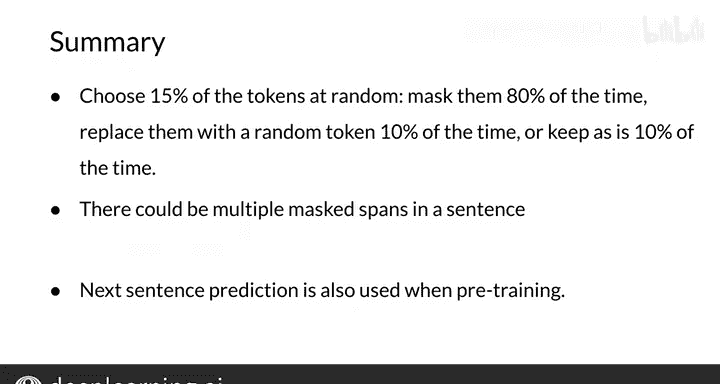

#  169：29_Transformer的双向编码器表示（BERT）📚

在本节课中，我们将要学习BERT模型的核心概念、工作原理及其预训练与微调过程。BERT是一种基于Transformer架构的双向编码器表示模型，它通过同时考虑文本的左右上下文来理解语言，在多项自然语言处理任务中取得了突破性成果。

---

## BERT模型概述与架构 🏗️

BERT的全称是“来自Transformer的双向编码器表示”。它利用了迁移学习和预训练技术。

BERT模型通常从输入嵌入开始，即 `E1, E2, ..., EN`。然后，这些嵌入会经过多个Transformer块进行处理。如下图所示，每个蓝色圆圈代表一个Transformer块。经过层层处理后，最终得到输出 `T1, T2, ..., TN`。

BERT框架主要包含两个步骤：**预训练**和**微调**。在预训练阶段，模型使用无标签数据在不同的预训练任务上进行训练。在微调阶段，BERT模型首先用预训练的参数进行初始化，然后使用下游任务的有标签数据对所有参数进行微调。例如，在上图中，你得到相应的嵌入，让其通过几个Transformer块，然后进行预测。

以下是BERT的一些关键参数：
*   BERT是一个多层的双向Transformer模型。
*   它使用了位置嵌入。
*   著名的BERT-base模型有12层（即12个Transformer块）、12个注意力头和1.1亿个参数。如今的新模型（如GPT-3）拥有远多于BERT的参数和层数。

---

## BERT的预训练过程 🔍

上一节我们介绍了BERT的整体架构，本节中我们来看看其核心的预训练过程是如何工作的。

在将词序列输入BERT模型之前，我们会遮盖（Mask）其中15%的单词。训练数据生成器会随机选择15%的位置用于预测。

如果第 `i` 个词被选中，我们按以下规则处理：
*   80%的概率，用 `[MASK]` 标记替换该词。
*   10%的概率，用一个随机词替换该词。
*   10%的概率，保持该词不变。

在这种情况下，上一张幻灯片中提到的输出 `Ti` 将被用来预测原始的词，损失函数为交叉熵。这被称为**掩码语言模型**。

例如，在句子“After school Lucas does his **blank** in the library”中，BERT模型需要预测被遮盖的词（可能是“work”或“homework”）。为了实现预测，通常在 `Ti` 输出后添加一个全连接层，用于分类。具体做法是将编码器的输出向量乘以嵌入矩阵，将其转换为词汇表维度，最后加上一个Softmax层。

另一个例子是：“After school **blank** his homework in the **blank**.” 模型需要预测“Lucas does”和“library”。

以下是预训练步骤的总结：
*   随机选择15%的词元。
*   其中80%被遮盖，10%被替换为随机词，10%保持不变。
*   注意，一个句子中可能存在多个被遮盖的片段。
*   BERT在预训练中还使用了**下一句预测**任务。给定两个句子，模型需要判断它们是否在原文中前后相连。

---

## 总结 📝

本节课中我们一起学习了BERT模型。你现在已经对这个模型有了直观的理解。你看到BERT利用了下一句预测和掩码语言建模两种预训练任务，这使得模型能够获得对语言的一般性感知。在下一个视频中，我们将形式化这些概念，并向你展示BERT的损失函数。请继续观看下一讲。