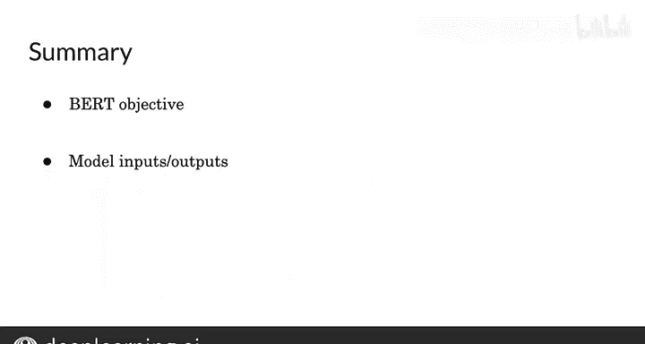

#  170：BERT 目标 🎯

在本节课中，我们将学习 BERT 模型的目标函数。你将了解模型试图最小化的具体目标。特别是，我们将展示如何将词嵌入、句子嵌入和位置嵌入组合作为模型的输入。让我们来看看具体如何实现。

你将学习 BERT 模型的输入是如何馈入的，以及不同类型的输入及其结构。接着，我们将可视化模型的输出。最后，你将学习 BERT 的目标函数。

## 输入的形式化表示

这是 BERT 的输入表示形式。

首先，你需要**位置嵌入**。它用于指示句子中每个词的位置，即每个词在对应句子中的具体位置。

其次，是**片段嵌入**。它用于指示当前片段是属于句子 A 还是句子 B，因为在 BERT 中我们还使用了下一句预测任务。

然后，是**词元嵌入**，也称为输入嵌入。

此外，还有一个特殊的 **`[CLS]` 词元**，用于表示句子的开始；以及一个 **`[SEP]` 词元**，用于表示句子的结束。

最后，你将词元嵌入、片段嵌入和位置嵌入三者相加，就得到了模型的新输入。

在上图中，你可以看到被掩码的句子 A 和句子 B。它们被转换为词元，并在最前面添加了特殊的分类符号 `[CLS]`，句子之间用特殊的分隔符 `[SEP]` 隔开。这些词元被转换为嵌入向量，然后送入 Transformer 编码块。

在输出端，你会得到 `T1` 到 `Tn` 以及 `T1‘` 到 `Tn’`。每个 `T` 嵌入向量将通过一个简单的 softmax 层，用于预测被掩码的词。同时，你还会得到一个 `C` 嵌入向量，它可以用于下一句预测任务。

## BERT 的目标函数

现在，让我们来看 BERT 的目标函数。

对于**掩码语言模型**任务，模型使用交叉熵损失来预测被掩码的词。

对于**下一句预测**任务，模型使用二元损失来判断两个句子是否连续。

总的目标函数是这两个损失的和。

用公式可以表示为：
**总损失 = 掩码语言模型损失 + 下一句预测损失**

## 总结

本节课中，我们一起学习了 BERT 模型的目标函数，并了解了模型的输入和输出表示。

在下一个视频中，我将展示如何对这个预训练模型进行微调。具体来说，我会演示如何将其用于你自己的项目任务中。请继续观看下一个视频。