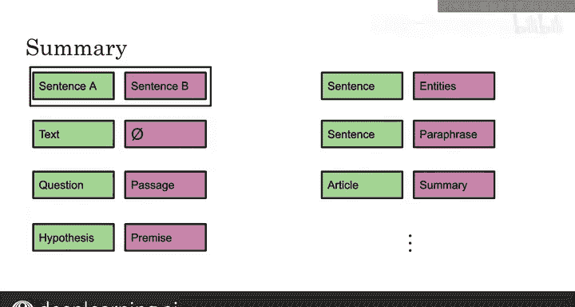

#  171：31_微调BERT 🎯

在本节课中，我们将学习如何对预训练的BERT模型进行微调，使其能够适应并解决我们自己的特定任务和数据集。微调是迁移学习的关键步骤，能让BERT在多种下游任务上取得优异表现。

## 概述 📋

BERT模型通过在大规模语料上进行预训练，学习了丰富的语言表示。然而，要让它解决具体的实际问题，如情感分析、命名实体识别或问答，我们需要在特定任务的数据集上对其进行额外的训练，这个过程就称为“微调”。

上一节我们介绍了BERT的预训练过程，本节中我们来看看如何将预训练好的BERT模型应用到不同的具体任务上。

## 微调BERT的输入格式 🔧

微调的核心在于根据不同的任务，为BERT模型准备合适的输入。BERT预训练时使用了“句子A”和“句子B”的格式，并配合了下一句预测和掩码语言模型任务。

在微调阶段，我们需要将特定任务的数据转换成这种格式。

以下是几种常见任务对应的输入构建方法：

*   **文本分类（如情感分析）**：将待分类的文本放入“句子A”的位置，“句子B”的位置可以留空或使用特殊符号（如`[CLS]`）。模型最终基于`[CLS]`标记的输出来判断类别（如“积极”或“消极”）。
*   **自然语言推理（MNLI）**：将“假设”文本作为句子A，将“前提”文本作为句子B输入模型。
*   **命名实体识别（NER）**：将待标注的完整句子作为句子A输入，模型需要为句子中的每个词元预测其对应的实体标签。
*   **问答任务（如SQuAD）**：将问题文本作为句子A，将包含答案的段落文本作为句子B输入。模型需要预测答案在段落中的开始和结束位置。
*   **文本摘要**：可以将原文作为句子A，将摘要作为句子B，用于训练生成式或抽取式摘要模型。

如图所示，对于问答任务，输入是问题和段落，输出是答案的起始和结束位置。对于NER任务，输入是句子，输出是每个单词的命名实体标签。对于MNLI任务，输入则是假设和前提。

总而言之，通过灵活地填充“句子A”和“句子B”的位置，我们可以让BERT模型适配分类、问答、推理、序列标注等多种任务。这只是微调过程中对模型输入的处理。

## 总结与展望 🚀

本节课中我们一起学习了微调BERT模型的核心思想与操作方法。我们了解到，微调的本质是将预训练模型的知识迁移到新任务上，关键在于根据任务类型构建正确的输入格式（句子A和句子B）。

现在你已经知道如何在分类、问答、摘要等任务上微调你的模型了。接下来，我们将把学习提升到一个新的水平，向你介绍一个名为T5的新模型。请继续观看下一个视频来了解T5模型。