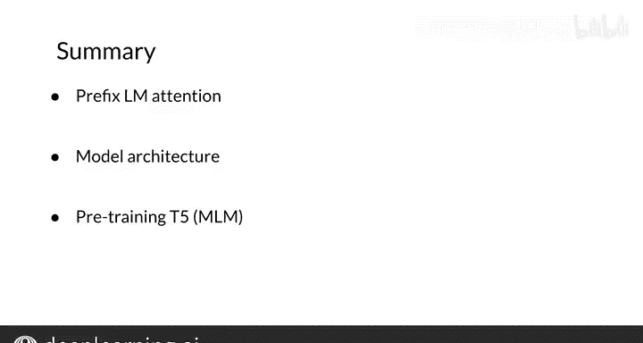

#  172：T5 Transformer模型 🧠

在本节课中，我们将学习T5模型。T5是一个强大的文本到文本转换模型，可以应用于多种自然语言处理任务。我们将了解它的工作原理、使用的注意力机制类型以及其模型架构的概览。

---

## T5模型简介与应用

T5模型可用于多种自然语言处理任务。它采用了与BERT类似的训练策略，利用了迁移学习和掩码语言建模技术。T5模型在训练时同样使用了Transformer架构。接下来，我们看看如何在自己的应用中使用这个模型。

T5被称为“文本到文本转换器”。它可以用于以下任务：
*   **文本分类**
*   **问答系统**：用于回答问题
*   **机器翻译**
*   **文本摘要**
*   **情感分析**

T5还可用于其他应用，但本节课我们将重点讨论以上这些。

---

## 预训练方法与模型架构

首先，我们来看模型的预训练方式。假设有一段原始文本，例如：“Thank you for inviting me to your party last week.”

在预训练时，我们会掩码某些词，比如“for inviting”和“last”。然后，我们用特殊的标记（如 `[X]`、`[Y]`）来替换这些被掩码的部分。因此，`[X]` 对应“for inviting”，`[Y]` 对应“last”。

模型的目标输出就是这些标记及其对应的原词，即“`[X]` for inviting `[Y]` last”。这些括号标记会按顺序递增，例如接下来可能是 `[Z]`、`[A]`、`[B]` 等，每个标记都对应一个特定的目标词。

---

## 注意力机制变体

在注意力机制部分，我们将考虑几种不同的Transformer架构变体。

我们从基本的编码器-解码器表示开始。在编码器中，使用的是**完全可见注意力**；在解码器中，使用的是**因果注意力**。在通用表示中，浅灰色线代表因果掩码，深灰色线代表完全可见掩码。

左侧是标准的编码器-解码器架构。

中间是**语言模型**架构。它由单个Transformer层堆栈组成，接收输入和目标文本的拼接。如图所示，它全程使用因果掩码（所有线条均为灰色）。`x1` 输入模型，然后是 `x2`、`x3`，依此类推。

右侧是**前缀语言模型**架构。它在输入部分允许完全可见掩码（如深色箭头所示），而在其余部分使用因果掩码。

---

## T5架构细节

T5模型架构使用了编码器-解码器堆栈。它包含12个Transformer块（可以想象成“一打鸡蛋”），共计约2.2亿个参数。

---

## 总结与预告

总结一下，本节课我们介绍了前缀语言模型注意力机制，了解了T5的模型架构，并看到了其预训练方式（与BERT类似，但这里使用的是掩码语言建模）。

现在，你对Transformer模型有了一个概览，知道了如何训练它，也看到了它可以应用于多种任务。

在下一个视频中，我将讨论针对此模型的几种训练策略。我们下节课见。