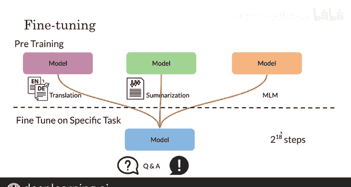

#  173：多任务训练策略 🧠

在本节课中，我们将要学习如何训练一个单一的模型，使其能够在多个自然语言处理任务上同时取得优异的表现。我们将探讨多任务训练的基本策略、输入输出格式、数据混合方法以及两种关键的微调技术。

---

## 概述

多任务训练策略的核心目标是训练一个模型，使其能够处理多种不同的NLP任务，例如机器翻译、问答、摘要和情感分析。为实现这一目标，我们通常会在输入前添加一个特定的任务前缀标签，以告知模型当前正在执行何种任务。

---

## 多任务训练的工作原理

多任务训练策略的工作流程如下：对于每一个不同的任务，我们在输入文本前添加一个特定的指令前缀，模型则根据这个前缀来理解并执行相应的任务。

以下是不同任务的具体输入输出格式示例：

*   **机器翻译**：要完成从英语到德语的翻译，你需要在句子前添加前缀 `translate English to German:`。
    *   **输入**：`translate English to German: The course is jumping well.`
    *   **输出**：模型会生成对应的德语翻译。
*   **文本相似度**：若要判断两个句子的相似性，可以使用 `STSB sentence1:` 和 `sentence2:` 的格式。
    *   **输入**：`STSB sentence1: [句子1] sentence2: [句子2]`
    *   **输出**：模型会给出一个表示相似度的分数。
*   **文本摘要**：要进行文本摘要，则添加 `summarize:` 前缀。
    *   **输入**：`summarize: [需要摘要的长文本]`
    *   **输出**：模型会生成该文本的摘要。

通过这种方式，模型能够学习到不同任务的整体结构。例如，在自然语言推理任务中：

*   **输入**：`MNLI premise: I hate pigeons. hypothesis: My feelings towards pigeons are filled with animosity.`
*   **输出**：`entailment`

模型在看到了任务前缀 `MNLI` 和完整的输入后，其任务就是输出正确的类别标签（如 `entailment`）。这种格式使得模型更容易根据前缀学习预测对应的类别。

---

## 数据混合策略

在同时使用多个数据集进行训练时，如何混合这些数据是一个关键问题。主要有以下三种策略：

*   **比例混合**：从每个数据集中抽取相同比例（例如10%）的样本进行混合。这样，大型数据集贡献的绝对样本数会更多。
*   **等量混合**：不考虑每个数据集的大小，从每个数据集中抽取绝对数量相等的样本进行混合。
*   **温度缩放混合**：这是一种折中的方法，通过调整参数来控制混合比例，使其介于“比例混合”和“等量混合”之间。

---

## 模型微调技术

上一节我们介绍了如何混合数据，本节中我们来看看两种在微调预训练模型时常用的技术，它们能有效防止在特定任务上“遗忘”预训练时学到的通用知识。

以下是两种核心的微调方法：

*   **渐进解冻**：这种方法不是一次性微调所有网络层。首先，你只解冻并微调模型的最后一层，同时冻结其他所有层。然后，逐步解冻并微调更前面的层，一次解冻一层。这有助于稳定训练过程。
*   **适配器层**：这种方法不直接修改原始Transformer模型的主要参数。相反，它在Transformer的每个前馈网络块中插入一个小的、新的神经网络模块（适配器层）。这个适配器层被设计成输入和输出维度相同，因此可以无缝插入。在微调时，**只更新这些新添加的适配器层和层归一化参数**，而保持原始庞大的预训练模型参数基本不变。

---

## 总结

本节课中我们一起学习了多任务训练的核心思想。我们了解到，通过为不同任务设计统一的前缀格式，可以训练一个共享大部分参数的单一模型来处理多种NLP任务。我们还探讨了混合不同任务数据的策略，并介绍了**渐进解冻**和**适配器层**这两种重要的微调技术，它们有助于在适应新任务的同时保留模型的通用能力。

现在你已经了解了如何训练这样的多任务模型，接下来需要一个标准的方法来评估它的性能。紧接着，我们将使用 **GLUE（通用语言理解评估）基准** 来进行评估。