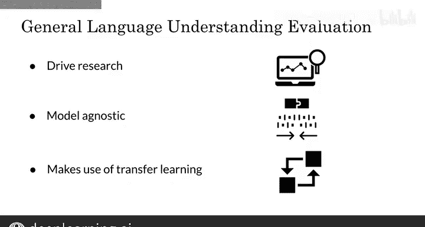

#  174：吴恩达《自然语言处理》第34讲 - GLUE基准 🎯

在本节课中，我们将要学习自然语言处理领域最常用的基准测试之一——GLUE基准。我们将了解它的构成、用途以及它在推动NLP研究发展中的重要作用。

---

## 什么是GLUE基准？ 📊

上一节我们介绍了自然语言处理的基本概念，本节中我们来看看一个关键的评估工具。

GLUE基准的全称是**通用语言理解评估**。它本质上是一个用于训练、评估和分析自然语言理解系统的数据集集合。

该基准包含大量数据集，每个数据集都涵盖多种文体，并具有不同的规模和难度等级。

以下是GLUE基准涵盖的一些主要任务类型：

*   **指代消解**：确定代词所指代的具体名词。
*   **情感分析**：判断文本所表达的情感倾向。
*   **问答系统**：根据给定文本回答问题。
*   **文本相似度**：判断两个句子在语义上是否相似。
*   **自然语言推理**：判断一个句子是否蕴含、矛盾或中立于另一个句子。

## GLUE基准的用途与特点 🚀

了解了GLUE基准的构成后，本节我们来看看它的具体用途和重要特性。

GLUE基准通常与排行榜结合使用。研究人员可以使用这些数据集测试他们的模型，并在排行榜上比较与其他模型的性能优劣。

它所评估的任务非常多样，例如：

*   判断句子是否合乎语法。
*   分析文本的情感。
*   对文本进行复述。
*   判断两个问题是否重复。
*   判断问题是否可回答。
*   判断文本间是蕴含、矛盾还是中立关系。
*   解决**Winograd模式**挑战，即准确判断代词所指代的名词。

GLUE基准的核心价值在于推动研究发展。研究人员通常将其作为衡量模型性能的标准。

它是一个**模型无关**的基准，这意味着无论你使用何种模型架构，都可以在GLUE上评估其表现。

最后，它促进了**迁移学习**的应用。因为你可以访问多个数据集，并从中学习不同方面的知识，这些知识将帮助你在GLUE内的全新数据集上取得更好的评估效果。

现在，你不仅知道如何实现最先进的模型，还知道了如何系统地评估它们。

---

## 总结与展望 📝

本节课中，我们一起学习了GLUE基准。我们了解到它是一个综合性的自然语言理解评估集合，包含多种任务和数据集，用于训练、评估和比较不同模型的性能。它的模型无关性和对迁移学习的支持，使其成为推动NLP领域进步的重要工具。

在下一讲中，我将探讨问答系统，并向你展示如何运用这些模型构建一个复杂的问答系统。我们下一讲见。😊