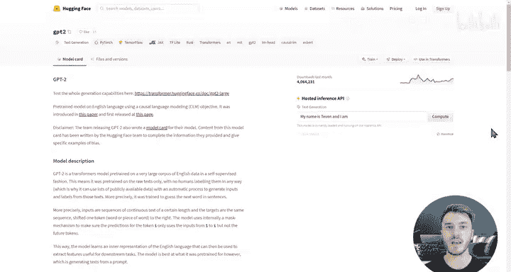

#  175：🤗 Hugging Face 介绍

在本节课中，我们将学习Hugging Face平台及其生态系统。Hugging Face致力于通过开源和开放科学，让机器学习技术变得尽可能易于获取和使用。我们将了解其核心工具、模型与数据集中心，以及它们如何共同构成一个强大的机器学习协作平台。

我是Hugging Face开源团队的Lyander。在Hugging Face，我们专注于实现机器学习的民主化。我们坚信，实现这一目标的唯一途径就是通过开源和开放科学。

我们为机器学习社区开发和创建工具与中心。这些工具构成了Hugging Face生态系统，并通过Hugging Face Hub平台连接起来。Hub是一个用于在模型和数据集上进行协作的平台。

在开始本实验部署之前，让我先向您介绍Hub，您将在后续视频中利用它。

## 模型中心 (Model Hub)

模型中心托管了超过15000个由社区贡献的模型。它提供了一种根据任务、库、训练数据集、特定语言或给定许可证来筛选模型的方式。

以下是模型中心的主要特点：
*   模型可以来自Hugging Face Transformers库，但不限于此。任何库都可以轻松添加Hub支持，例如Spacey或AllenNLP等库已经这样做了。
*   我们提供工具来推送您自己的模型和权重，对所使用的库没有要求。
*   模型可以通过其模型卡片进一步描述。
*   社区的其他成员可以使用托管的推理API来试用模型。

## 数据集中心 (Dataset Hub)

数据集中心与模型中心类似，同样托管了数千个主要由社区贡献的数据集。

以下是数据集中心的主要特点：
*   这些数据集可以根据任务、语言、示例数量和许可证进行筛选。
*   这些数据集提供全面的数据集卡片，解释数据是如何设计的、数据来源，以及使用数据时需要考虑的社会影响和偏见等问题。
*   此外，它还提供了快速链接，指向在这些数据集上微调或训练的模型。

我们非常高兴能与DeepLearning.AI在本专注于Transformer的课程中合作。在接下来的实验中，您将有机会练习使用一些Hugging Face工具，例如Transformers库、Datasets库以及Hugging Face Hub来寻找预训练模型。

祝您学习愉快，并期待看到您微调后的模型。

---

本节课中，我们一起学习了Hugging Face的使命及其核心生态系统。我们介绍了旨在简化机器学习流程的Transformers、Datasets等工具库，并重点了解了作为协作中心的Model Hub和Dataset Hub。这些工具和平台共同降低了机器学习的门槛，为开发者提供了强大的支持。