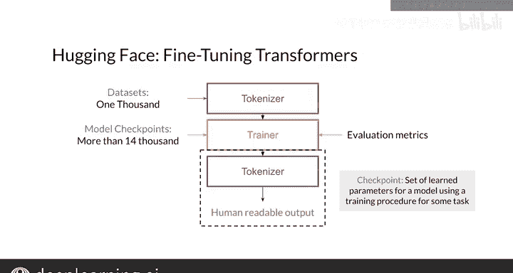

#  176：Hugging Face 入门教程 🚀

在本节课中，我们将要学习 Hugging Face 平台及其核心的 Transformers 库。我们将了解它能提供什么，以及如何在你的项目中利用它。

---

## 概述

Hugging Face 平台提供了丰富的解决方案，构建了社区，并拥有协作研究工具。本教程将重点介绍其 Transformers Python 库，这是一个在你的项目中使用 Transformer 模型的绝佳工具。

## 什么是 Hugging Face Transformers 库？🤖

Hugging Face 的 Transformers 库可以与 PyTorch、TensorFlow 或 Flax 一起使用。这意味着你可以利用 Hugging Face 提供的一切功能，而无需更换你喜欢的深度学习框架。该库对基于 JAX 的神经网络库 Flax 的支持也在日益增长。

你可以使用 Hugging Face Transformers 库主要做两件事：
1.  直接应用最先进的 Transformer 模型处理各种 NLP 任务。
2.  使用你自己的数据集或 Hugging Face 提供的数据集，对预训练模型进行微调。

## 使用 Pipeline 快速上手 🛠️

上一节我们介绍了 Transformers 库的基本用途，本节中我们来看看如何通过 `pipeline` 对象轻松使用模型。

Transformers 库中的 `pipeline` 对象封装了在示例上运行模型所需的一切。通过 pipelines，你可以轻松地“开箱即用”，为不同的 NLP 任务直接应用最先进的 Transformer 模型。

以下是 `pipeline` 的主要功能：
*   **预处理**：自动处理你的输入数据。
*   **运行模型**：调用模型进行计算。
*   **后处理**：将模型的输出处理成人类可读的结果。

此外，如果你不确定为你的任务使用哪个模型，也无需担心，因为每个 pipeline 都有一个默认模型。例如，对于问答任务，你只需要指定 pipeline 的任务类型，并提供上下文和问题。pipeline 会处理其余所有事情，并给出人类可读的答案。

因此，借助 Hugging Face 的 pipelines，你几乎可以将 Transformer 模型用于任何 NLP 任务。

## 微调预训练模型 🔧

如果你希望对预训练模型进行微调，Transformers 库也提供了不同的工具，且过程并不复杂。

Hugging Face 拥有一个不断增长的模型库，包含超过 15,000 个预训练模型检查点，你可以使用它们来微调最流行的 Transformer 架构。

**模型检查点** 是指针对特定任务（如问答），使用特定数据集训练某个模型后，所学习到的那一组参数。

你可以从某个检查点开始，使用 Hugging Face 上可用的数千个数据集之一，或使用你自己的数据，来微调一个问答模型。

以下是微调过程涉及的关键组件：
*   **分词器**：Transformers 库为每个检查点提供了关联的分词器，用于预处理数据。分词器通过将你的文本翻译成模型可读的输入，为你完成繁重的工作。
*   **训练工具**：如果使用 PyTorch，你可以使用 Transformers 库内置的 `Trainer` 或创建自定义训练器。如果使用 TensorFlow，则推荐使用传统的 Keras 方法，如 `fit`。
*   **评估指标**：Hugging Face 还提供了像 `evaluate` 库这样的指标，可以无缝集成到训练过程中，用于评估你的模型。

当你拥有一个微调好的模型后，可以运行它来获得输出，分词器可以帮助你将输出转换回人类可读的文本。

## 总结

本节课中，我们一起学习了 Hugging Face 平台及其 Transformers 库的核心功能。我们了解到，该库通过 `pipeline` 让应用最先进的模型变得非常简单，同时也为模型微调提供了完整的工具链，包括分词器、训练接口和评估指标。Hugging Face 和 Transformers 库为你微调一个 Transformer 模型提供了所需的一切，当然，你也可以自定义其中的任何步骤。