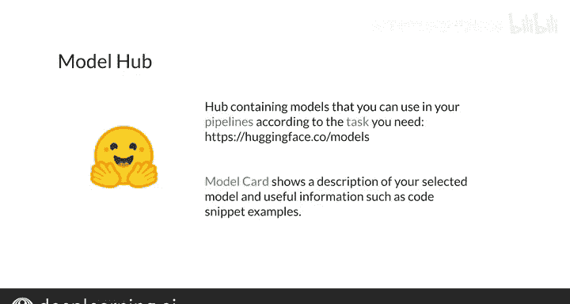

#  177：P177）

## 📖 概述

在本节课中，我们将学习如何使用 Hugging Face 的 Transformers 库中的 `pipeline` 对象。我们将了解 `pipeline` 如何简化自然语言处理任务，以及如何为不同任务选择和初始化合适的模型。

---

## 🔄 快速回顾

上一节我们介绍了 Transformers 库的基本概念。本节中我们来看看其核心工具 `pipeline`。

Transformers 库提供了一个 `pipeline` 对象，你可以用它来应用最先进的 Transformer 模型处理不同的 NLP 任务。

`pipeline` 会为你处理输入的预处理、模型的运行以及输出的后处理，使其易于人类阅读。

---

## 🛠️ 理解 Pipeline 的工作原理

`pipeline` 是为特定 NLP 任务构建的对象。例如，对于问答任务，你可以使用一个 Transformer 模型来回答给定上下文中的不同问题。

要使用 Transformer 模型，你只需要指明你的 `pipeline` 需要执行的任务。

初始化一个 `pipeline` 时，你只需要传入任务名称。但如果你需要，也可以指定你想要使用的模型检查点。

使用一个已初始化的 `pipeline` 时，你只需要提供该任务所需的适当输入。

---

## 🌐 Hugging Face 支持的任务

Hugging Face 支持最流行的 NLP 任务，但其应用不仅限于 NLP。它还支持其他领域的任务，例如计算机视觉中的图像分类和目标检测，以及自动语音识别等。

以下是几个常见的 NLP 任务示例：

*   **情感分析**：如果你的目标是将一个句子分类为正面或负面，你可以使用这个任务。该 `pipeline` 的输入是一个句子，输出是该句子所属的类别。
*   **问答**：如果你需要一个能从你提供的上下文中提取信息并回答问题的模型，可以创建此任务的 `pipeline`。这里的输入是上下文和一系列问题，模型会输出相应的答案（如果找到的话）。
*   **填充掩码**：当你需要模型填充文本中的空白处时，可以使用此任务。该 `pipeline` 需要你提供想要填充的句子以及需要填充的确切位置。它会输出一系列可能的句子补全方式。

你可以在 Hugging Face 网站上找到更多可直接使用的任务。

---

## 🧠 选择模型检查点

正如之前提到的，你可以为你的 `pipeline` 选择特定的模型检查点。Hugging Face 提供了大量的检查点，其中一些使用海量数据集进行了微调，能在特定任务上提供出色的结果。

然而，最好记住并非每个检查点都适合每项任务。因此，你应该查看预训练模型的描述，以选择合适的检查点，或者直接使用 `pipeline` 默认的模型。

---

## 🔍 在模型中心寻找模型

你可能会问，我在哪里可以找到适合我任务的模型并使用这些检查点？

为此，Hugging Face 在 `huggingface.co` 上提供了一个模型中心。在那里，你会找到许多预训练模型。你可以按所需的任务、甚至需要使用的数据集或框架进行筛选。

一旦选择了更符合你需求的模型，你将看到模型卡片界面。模型卡片会显示所选模型的信息，例如模型描述和一些代码片段，这些代码片段提供了如何使用所选模型的示例。

---

## ✅ 总结

本节课中我们一起学习了 Hugging Face Transformers 库中 `pipeline` 的核心用法。我们了解到 `pipeline` 如何封装预处理、模型推理和后处理流程，从而让开发者能够轻松地将最先进的 Transformer 模型应用于各种 NLP 乃至跨模态的任务。我们还探讨了如何根据任务需求选择和初始化模型，并介绍了在 Hugging Face 模型中心寻找合适资源的方法。